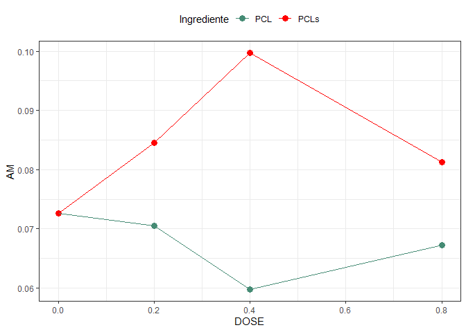

<!-- README.md is generated from README.Rmd. Please edit that file -->

# Análise Doutorado Débora

## Biorigin

### Carregando pacotes

``` r
library(tidyverse)
library(ExpDes.pt)
library(lme4)
library(agricolae)
library(readxl)
library(janitor)
library(MASS)
library(car)
```

### Entrada de dados

``` r
## Lendo os dados
dados <- read_xlsx("data/dados_01.xlsx",
          sheet = "Análises Fezes") %>% 
  clean_names() %>% 
  mutate(
    dose = case_when(
      tr == 1 ~ 0,
      tr == 2 | tr == 5 ~ 0.2,
      tr == 3 | tr == 6 ~ 0.4,
      tr == 4 | tr == 7 ~ 0.8
    ),
    ingrediente = ifelse(tr==1,"PCL",
                         ifelse(tr > 1 & tr<=4 ,"PCL","PCLs")),
    
    # transformação dos dados
    mo = log(mo),
    fibra_in = log(fibra_in),
    ee_in = log(ee_in),
    amido_in = log(amido_in),
    ph=ph^(-2),
    am=am^2
  )

#extraindo o controle
da <- dados %>% filter(dose==0) %>% 
  mutate(
    ingrediente="PCLs"
  )

#duplicando o controle
dados <- rbind(dados,da)
```

### Vislumbre

``` r
glimpse(dados)
#> Rows: 64
#> Columns: 31
#> $ cao         <chr> "Zulu", "Lilás", "Amêndoa", "Maia", "Major", "Aurora", "Ne~
#> $ tr          <dbl> 1, 1, 1, 1, 1, 1, 1, 1, 2, 2, 2, 2, 2, 2, 2, 2, 3, 3, 3, 3~
#> $ bl          <dbl> 1, 1, 1, 1, 2, 2, 2, 2, 1, 1, 1, 1, 2, 2, 2, 2, 1, 1, 1, 1~
#> $ mm          <dbl> 29.69652, 30.10801, 28.71755, 28.65898, 28.64619, 27.68278~
#> $ mo          <dbl> 4.252821, 4.246951, 4.266650, 4.267471, 4.267651, 4.281062~
#> $ ee          <dbl> 8.144940, 7.690260, 8.065103, 7.818093, 7.822882, 8.007406~
#> $ pb          <dbl> 25.74069, 26.28684, 26.16885, 26.58215, 25.75865, 28.95122~
#> $ am          <dbl> 0.049773006, 0.110735262, 0.058014426, 0.099756271, 0.0811~
#> $ fb          <dbl> 13.68760, 13.67271, 12.80728, 12.53250, 13.60551, 12.91738~
#> $ eb          <dbl> 3717.751, 3758.580, 3735.262, 3776.294, 3774.567, 3865.065~
#> $ d_ms        <dbl> 84.38131, 85.87391, 82.77157, 84.03706, 83.41780, 82.09041~
#> $ d_mm        <dbl> 24.893497, 31.129777, 19.883795, 25.920002, 23.080513, 19.~
#> $ d_mo        <dbl> 88.29678, 89.47715, 86.91083, 87.86231, 87.38918, 86.19581~
#> $ d_ee        <dbl> 92.30688, 93.43049, 91.59717, 92.45284, 92.15526, 91.32744~
#> $ d_pb        <dbl> 84.68726, 85.85677, 82.82809, 83.83815, 83.73127, 80.25120~
#> $ d_am        <dbl> 99.90784, 99.87567, 99.89025, 99.86665, 99.87505, 99.96496~
#> $ d_fb        <dbl> 38.91930, 44.81660, 36.95733, 42.84126, 35.54022, 33.90144~
#> $ d_eb        <dbl> 87.96825, 88.99856, 86.66569, 87.50943, 87.03080, 85.65680~
#> $ ms_in       <dbl> 167.3840, 161.9562, 150.1691, 184.0309, 185.6728, 174.6911~
#> $ mo_in       <dbl> 157.0472, 151.9546, 140.8954, 172.6661, 174.2065, 163.9031~
#> $ pb_in       <dbl> 43.94665, 42.52158, 39.42689, 48.31730, 48.74837, 45.86513~
#> $ fibra_in    <dbl> 1.767883, 1.734919, 1.659355, 1.862697, 1.871579, 1.810612~
#> $ ee_in       <dbl> 3.320660, 3.287695, 3.212131, 3.415473, 3.424355, 3.363388~
#> $ amido_in    <dbl> 4.147659, 4.114695, 4.039131, 4.242473, 4.251355, 4.190388~
#> $ fezesmn     <dbl> 60.730, 50.342, 59.544, 62.802, 70.714, 69.870, 47.096, 46~
#> $ fezesms     <dbl> 26.14319, 22.87808, 25.87178, 29.37674, 30.78864, 31.28646~
#> $ msfezes     <dbl> 43.04824, 45.44532, 43.44986, 46.77676, 43.53966, 44.77810~
#> $ score       <dbl> 4, 4, 4, 4, 4, 4, 4, 4, 4, 4, 4, 4, 4, 4, 4, 4, 4, 4, 4, 4~
#> $ ph          <dbl> 0.02366864, 0.02192621, 0.02309661, 0.01899003, 0.02261292~
#> $ dose        <dbl> 0.0, 0.0, 0.0, 0.0, 0.0, 0.0, 0.0, 0.0, 0.2, 0.2, 0.2, 0.2~
#> $ ingrediente <chr> "PCL", "PCL", "PCL", "PCL", "PCL", "PCL", "PCL", "PCL", "P~
```

## Normalidade de Homocedasticidade

``` r
variaveis <- dados %>% 
  dplyr::select(mm:ph,-score)

# for(i in seq_along(variaveis)){
#   nome <- names(variaveis[i])
#   print("====================================")
#   print(str_to_upper(nome))
#   print("====================================")
#   
#   daux <- variaveis[i]
#   names(daux) <- "y" ### <-
#   y <- daux$y ### <- 
#   bl <- dados$bl %>% as_factor()
#   tr <- dados$tr %>% as_factor()
#   
#   mod <- aov(y ~ tr + bl)
#   rs <- mod %>% rstudent()
#   hist(rs, main = paste("Resíduo ", str_to_upper(nome)) )
#   
#   print(shapiro.test(rs))
#   
#   plot(y ~ tr)
#   
#   boxcox(mod,seq(-10,10,.5))
#   abline(v=1,col="red",lty=2)
#   
#   preditos <- predict(mod)
#   plot(preditos,rs,
#        main=paste("Estudos de Outliers: ", str_to_upper(nome)))
#   abline(h=c(3,-3),col="red")
#   cat("\n")
# }
```

## Análise de variância

``` r
for(i in seq_along(variaveis)){
  nome <- names(variaveis[i])
  print("====================================")
  print(str_to_upper(nome))
  print("====================================")
  
  daux <- variaveis[i]
  names(daux) <- "y" ### <-
  y <- daux$y ### <- 
  ingred <- dados$ingrediente %>% as_factor()
  dose <- dados$dose
  bl <- dados$bl %>% as_factor()
  
  fat2.dbc(ingred,dose,bl,y,quali=c(TRUE,FALSE),
           fac.names = c("Ingred.","Dose"))
  
  my_plot<-tibble(dose,ingred,y) %>%
    group_by(dose,ingred) %>% 
    summarise(y=mean(y)) %>% 
    ggplot(aes(x=dose,y=y,color=ingred)) +
    geom_point(size=3) +
    geom_line() +
    #facet_wrap(~ingred,nrow = 2)+
    theme_bw() +
    labs(y=str_to_upper(nome),x="DOSE",color="Ingrediente")+
    theme(legend.position = "top")+
    scale_color_manual(values = c("aquamarine4","red")) 
  print(my_plot)
  cat("\n")
}
#> [1] "===================================="
#> [1] "MM"
#> [1] "===================================="
#> ------------------------------------------------------------------------
#> Legenda:
#> FATOR 1:  Ingred. 
#> FATOR 2:  Dose 
#> ------------------------------------------------------------------------
#> 
#> 
#> Quadro da analise de variancia
#> ------------------------------------------------------------------------
#>              GL     SQ QM      Fc   Pr>Fc
#> Bloco         1  0.505  2  0.7104 0.40297
#> Ingred.       1  8.924  5 12.5651 0.00081
#> Dose          3 29.904  6 14.0344 0.00000
#> Ingred.*Dose  3  4.698  4  2.2048 0.09781
#> Residuo      55 39.064  3                
#> Total        63 83.095  1                
#> ------------------------------------------------------------------------
#> CV = 2.96 %
#> 
#> ------------------------------------------------------------------------
#> Teste de normalidade dos residuos (Shapiro-Wilk)
#> valor-p:  0.05651648 
#> De acordo com o teste de Shapiro-Wilk a 5% de significancia, os residuos podem ser considerados normais.
#> ------------------------------------------------------------------------
#> 
#> Interacao nao significativa: analisando os efeitos simples
#> ------------------------------------------------------------------------
#> Ingred.
#> Teste de Tukey
#> ------------------------------------------------------------------------
#> Grupos Tratamentos Medias
#> a     PCL     28.80649 
#>  b    PCLs    28.05964 
#> ------------------------------------------------------------------------
#> 
#> Dose
#> Ajuste de modelos polinomiais de regressao
#> ------------------------------------------------------------------------
#> 
#> Modelo Linear
#> ==========================================
#>    Estimativa Erro.padrao    tc    valor.p
#> ------------------------------------------
#> b0  29.1589     0.1632    178.6685    0   
#> b1  -2.0737     0.3561    -5.8228     0   
#> ------------------------------------------
#> 
#> R2 do modelo linear
#> --------
#> 0.805289
#> --------
#> 
#> Analise de variancia do modelo linear
#> =====================================================
#>                      GL   SQ      QM     Fc   valor.p
#> -----------------------------------------------------
#> Efeito linear        1  24.0814 24.0814 33.91    0   
#> Desvios de Regressao 2  5.8226  2.9113   4.1  0.02191
#> Residuos             55 39.0640 0.7102               
#> -----------------------------------------------------
#> ------------------------------------------------------------------------
#> 
#> Modelo quadratico
#> ==========================================
#>    Estimativa Erro.padrao    tc    valor.p
#> ------------------------------------------
#> b0  29.1306     0.2019    144.2908    0   
#> b1  -1.7814     1.2814    -1.3902  0.1701 
#> b2  -0.3528     1.4856    -0.2375  0.8132 
#> ------------------------------------------
#> 
#> R2 do modelo quadratico
#> --------
#> 0.806629
#> --------
#> 
#> Analise de variancia do modelo quadratico
#> =====================================================
#>                      GL   SQ      QM     Fc   valor.p
#> -----------------------------------------------------
#> Efeito linear        1  24.0814 24.0814 33.91    0   
#> Efeito quadratico    1  0.0401  0.0401  0.06  0.81316
#> Desvios de Regressao 1  5.7826  5.7826  8.14  0.00609
#> Residuos             55 39.0640 0.7102               
#> -----------------------------------------------------
#> ------------------------------------------------------------------------
#> 
#> Modelo cubico
#> ==========================================
#>    Estimativa Erro.padrao    tc    valor.p
#> ------------------------------------------
#> b0  28.9587     0.2107    137.4459    0   
#> b1   7.5809     3.5225     2.1521  0.0358 
#> b2  -37.9689    13.2666   -2.8620  0.0059 
#> b3  32.8395     11.5091    2.8533  0.0061 
#> ------------------------------------------
#> 
#> R2 do modelo cubico
#> -
#> 1
#> -
#> 
#> Analise de variancia do modelo cubico
#> =====================================================
#>                      GL   SQ      QM     Fc   valor.p
#> -----------------------------------------------------
#> Efeito linear        1  24.0814 24.0814 33.91    0   
#> Efeito quadratico    1  0.0401  0.0401  0.06  0.81316
#> Efeito cubico        1  5.7826  5.7826  8.14  0.00609
#> Desvios de Regressao 0     0       0      0      1   
#> Residuos             55 39.0640 0.7102               
#> -----------------------------------------------------
#> ------------------------------------------------------------------------
```

<!-- -->

    #> 
    #> [1] "===================================="
    #> [1] "MO"
    #> [1] "===================================="
    #> ------------------------------------------------------------------------
    #> Legenda:
    #> FATOR 1:  Ingred. 
    #> FATOR 2:  Dose 
    #> ------------------------------------------------------------------------
    #> 
    #> 
    #> Quadro da analise de variancia
    #> ------------------------------------------------------------------------
    #>              GL        SQ QM      Fc   Pr>Fc
    #> Bloco         1 0.0000923  6  0.6605 0.41990
    #> Ingred.       1 0.0017175  4 12.2967 0.00091
    #> Dose          3 0.0058161  5 13.8801 0.00000
    #> Ingred.*Dose  3 0.0008962  3  2.1387 0.10578
    #> Residuo      55 0.0076822  2                
    #> Total        63 0.0162043  1                
    #> ------------------------------------------------------------------------
    #> CV = 0.28 %
    #> 
    #> ------------------------------------------------------------------------
    #> Teste de normalidade dos residuos (Shapiro-Wilk)
    #> valor-p:  0.04817748 
    #> ATENCAO: a 5% de significancia, os residuos nao podem ser considerados normais!
    #> ------------------------------------------------------------------------
    #> 
    #> Interacao nao significativa: analisando os efeitos simples
    #> ------------------------------------------------------------------------
    #> Ingred.
    #> Teste de Tukey
    #> ------------------------------------------------------------------------
    #> Grupos Tratamentos Medias
    #> a     PCLs    4.275687 
    #>  b    PCL     4.265326 
    #> ------------------------------------------------------------------------
    #> 
    #> Dose
    #> Ajuste de modelos polinomiais de regressao
    #> ------------------------------------------------------------------------
    #> 
    #> Modelo Linear
    #> ============================================
    #>    Estimativa Erro.padrao     tc     valor.p
    #> --------------------------------------------
    #> b0   4.2604     0.0023    1,861.5430    0   
    #> b1   0.0289     0.0050      5.7867      0   
    #> --------------------------------------------
    #> 
    #> R2 do modelo linear
    #> --------
    #> 0.804169
    #> --------
    #> 
    #> Analise de variancia do modelo linear
    #> ===================================================
    #>                      GL   SQ     QM    Fc   valor.p
    #> ---------------------------------------------------
    #> Efeito linear        1  0.0047 0.0047 33.49    0   
    #> Desvios de Regressao 2  0.0011 0.0006 4.08  0.02233
    #> Residuos             55 0.0077 0.0001              
    #> ---------------------------------------------------
    #> ------------------------------------------------------------------------
    #> 
    #> Modelo quadratico
    #> ============================================
    #>    Estimativa Erro.padrao     tc     valor.p
    #> --------------------------------------------
    #> b0   4.2608     0.0028    1,504.9670    0   
    #> b1   0.0246     0.0180      1.3678   0.1769 
    #> b2   0.0052     0.0208      0.2503   0.8033 
    #> --------------------------------------------
    #> 
    #> R2 do modelo quadratico
    #> --------
    #> 0.805674
    #> --------
    #> 
    #> Analise de variancia do modelo quadratico
    #> =====================================================
    #>                      GL   SQ      QM     Fc   valor.p
    #> -----------------------------------------------------
    #> Efeito linear        1  0.0047  0.0047  33.49    0   
    #> Efeito quadratico    1  0.00001 0.00001 0.06  0.80326
    #> Desvios de Regressao 1  0.0011  0.0011  8.09  0.00623
    #> Residuos             55 0.0077  0.0001               
    #> -----------------------------------------------------
    #> ------------------------------------------------------------------------
    #> 
    #> Modelo cubico
    #> ============================================
    #>    Estimativa Erro.padrao     tc     valor.p
    #> --------------------------------------------
    #> b0   4.2632     0.0030    1,442.9000    0   
    #> b1  -0.1063     0.0494     -2.1521   0.0358 
    #> b2   0.5311     0.1860      2.8548   0.0061 
    #> b3  -0.4591     0.1614     -2.8446   0.0062 
    #> --------------------------------------------
    #> 
    #> R2 do modelo cubico
    #> -
    #> 1
    #> -
    #> 
    #> Analise de variancia do modelo cubico
    #> =====================================================
    #>                      GL   SQ      QM     Fc   valor.p
    #> -----------------------------------------------------
    #> Efeito linear        1  0.0047  0.0047  33.49    0   
    #> Efeito quadratico    1  0.00001 0.00001 0.06  0.80326
    #> Efeito cubico        1  0.0011  0.0011  8.09  0.00623
    #> Desvios de Regressao 0     0       0      0      1   
    #> Residuos             55 0.0077  0.0001               
    #> -----------------------------------------------------
    #> ------------------------------------------------------------------------

<!-- -->

    #> 
    #> [1] "===================================="
    #> [1] "EE"
    #> [1] "===================================="
    #> ------------------------------------------------------------------------
    #> Legenda:
    #> FATOR 1:  Ingred. 
    #> FATOR 2:  Dose 
    #> ------------------------------------------------------------------------
    #> 
    #> 
    #> Quadro da analise de variancia
    #> ------------------------------------------------------------------------
    #>              GL      SQ QM     Fc   Pr>Fc
    #> Bloco         1  0.0005  2 0.0036 0.95252
    #> Ingred.       1  0.2967  5 2.1026 0.15273
    #> Dose          3  2.2803  6 5.3867 0.00253
    #> Ingred.*Dose  3  0.5997  4 1.4167 0.24769
    #> Residuo      55  7.7608  3               
    #> Total        63 10.9381  1               
    #> ------------------------------------------------------------------------
    #> CV = 4.56 %
    #> 
    #> ------------------------------------------------------------------------
    #> Teste de normalidade dos residuos (Shapiro-Wilk)
    #> valor-p:  0.2160121 
    #> De acordo com o teste de Shapiro-Wilk a 5% de significancia, os residuos podem ser considerados normais.
    #> ------------------------------------------------------------------------
    #> 
    #> Interacao nao significativa: analisando os efeitos simples
    #> ------------------------------------------------------------------------
    #> Ingred.
    #> De acordo com o teste F, as medias desse fator sao estatisticamente iguais.
    #> ------------------------------------------------------------------------
    #>   Niveis   Medias
    #> 1    PCL 8.314474
    #> 2   PCLs 8.178302
    #> ------------------------------------------------------------------------
    #> Dose
    #> Ajuste de modelos polinomiais de regressao
    #> ------------------------------------------------------------------------
    #> 
    #> Modelo Linear
    #> ==========================================
    #>    Estimativa Erro.padrao    tc    valor.p
    #> ------------------------------------------
    #> b0   8.0581     0.0727    110.7751    0   
    #> b1   0.5380     0.1587     3.3895  0.0013 
    #> ------------------------------------------
    #> 
    #> R2 do modelo linear
    #> --------
    #> 0.710941
    #> --------
    #> 
    #> Analise de variancia do modelo linear
    #> ===================================================
    #>                      GL   SQ     QM    Fc   valor.p
    #> ---------------------------------------------------
    #> Efeito linear        1  1.6212 1.6212 11.49 0.0013 
    #> Desvios de Regressao 2  0.6591 0.3296 2.34  0.10627
    #> Residuos             55 7.7608 0.1411              
    #> ---------------------------------------------------
    #> ------------------------------------------------------------------------
    #> 
    #> Modelo quadratico
    #> =========================================
    #>    Estimativa Erro.padrao   tc    valor.p
    #> -----------------------------------------
    #> b0   8.0234     0.0900    89.1620    0   
    #> b1   0.8974     0.5712    1.5712  0.1219 
    #> b2  -0.4337     0.6622    -0.6550 0.5152 
    #> -----------------------------------------
    #> 
    #> R2 do modelo quadratico
    #> --------
    #> 0.737486
    #> --------
    #> 
    #> Analise de variancia do modelo quadratico
    #> ===================================================
    #>                      GL   SQ     QM    Fc   valor.p
    #> ---------------------------------------------------
    #> Efeito linear        1  1.6212 1.6212 11.49 0.0013 
    #> Efeito quadratico    1  0.0605 0.0605 0.43  0.51522
    #> Desvios de Regressao 1  0.5986 0.5986 4.24  0.04417
    #> Residuos             55 7.7608 0.1411              
    #> ---------------------------------------------------
    #> ------------------------------------------------------------------------
    #> 
    #> Modelo cubico
    #> =========================================
    #>    Estimativa Erro.padrao   tc    valor.p
    #> -----------------------------------------
    #> b0   7.9681     0.0939    84.8474    0   
    #> b1   3.9096     1.5701    2.4901  0.0158 
    #> b2  -12.5365    5.9132    -2.1201 0.0385 
    #> b3  10.5660     5.1299    2.0597  0.0442 
    #> -----------------------------------------
    #> 
    #> R2 do modelo cubico
    #> -
    #> 1
    #> -
    #> 
    #> Analise de variancia do modelo cubico
    #> ===================================================
    #>                      GL   SQ     QM    Fc   valor.p
    #> ---------------------------------------------------
    #> Efeito linear        1  1.6212 1.6212 11.49 0.0013 
    #> Efeito quadratico    1  0.0605 0.0605 0.43  0.51522
    #> Efeito cubico        1  0.5986 0.5986 4.24  0.04417
    #> Desvios de Regressao 0    0      0      0      1   
    #> Residuos             55 7.7608 0.1411              
    #> ---------------------------------------------------
    #> ------------------------------------------------------------------------

<!-- -->

    #> 
    #> [1] "===================================="
    #> [1] "PB"
    #> [1] "===================================="
    #> ------------------------------------------------------------------------
    #> Legenda:
    #> FATOR 1:  Ingred. 
    #> FATOR 2:  Dose 
    #> ------------------------------------------------------------------------
    #> 
    #> 
    #> Quadro da analise de variancia
    #> ------------------------------------------------------------------------
    #>              GL     SQ QM     Fc   Pr>Fc
    #> Bloco         1  6.134  6 4.3705 0.04120
    #> Ingred.       1  6.114  5 4.3561 0.04152
    #> Dose          3  0.346  2 0.0822 0.96943
    #> Ingred.*Dose  3  5.693  4 1.3520 0.26707
    #> Residuo      55 77.194  3               
    #> Total        63 95.482  1               
    #> ------------------------------------------------------------------------
    #> CV = 4.43 %
    #> 
    #> ------------------------------------------------------------------------
    #> Teste de normalidade dos residuos (Shapiro-Wilk)
    #> valor-p:  0.01108368 
    #> ATENCAO: a 5% de significancia, os residuos nao podem ser considerados normais!
    #> ------------------------------------------------------------------------
    #> 
    #> Interacao nao significativa: analisando os efeitos simples
    #> ------------------------------------------------------------------------
    #> Ingred.
    #> Teste de Tukey
    #> ------------------------------------------------------------------------
    #> Grupos Tratamentos Medias
    #> a     PCL     27.06552 
    #>  b    PCLs    26.44737 
    #> ------------------------------------------------------------------------
    #> 
    #> Dose
    #> De acordo com o teste F, as medias desse fator sao estatisticamente iguais.
    #> 
    #> ------------------------------------------------------------------------
    #>   Niveis   Medias
    #> 1      0 26.74547
    #> 2    0.2 26.76962
    #> 3    0.4 26.65204
    #> 4    0.8 26.85865
    #> ------------------------------------------------------------------------

<!-- -->

    #> 
    #> [1] "===================================="
    #> [1] "AM"
    #> [1] "===================================="
    #> ------------------------------------------------------------------------
    #> Legenda:
    #> FATOR 1:  Ingred. 
    #> FATOR 2:  Dose 
    #> ------------------------------------------------------------------------
    #> 
    #> 
    #> Quadro da analise de variancia
    #> ------------------------------------------------------------------------
    #>              GL       SQ QM     Fc   Pr>Fc
    #> Bloco         1 0.000231  3 0.2833 0.59671
    #> Ingred.       1 0.004625  6 5.6640 0.02081
    #> Dose          3 0.000497  2 0.2029 0.89395
    #> Ingred.*Dose  3 0.003329  5 1.3592 0.26487
    #> Residuo      55 0.044907  4               
    #> Total        63 0.053589  1               
    #> ------------------------------------------------------------------------
    #> CV = 37.58 %
    #> 
    #> ------------------------------------------------------------------------
    #> Teste de normalidade dos residuos (Shapiro-Wilk)
    #> valor-p:  0.0340401 
    #> ATENCAO: a 5% de significancia, os residuos nao podem ser considerados normais!
    #> ------------------------------------------------------------------------
    #> 
    #> Interacao nao significativa: analisando os efeitos simples
    #> ------------------------------------------------------------------------
    #> Ingred.
    #> Teste de Tukey
    #> ------------------------------------------------------------------------
    #> Grupos Tratamentos Medias
    #> a     PCLs    0.08452968 
    #>  b    PCL     0.0675287 
    #> ------------------------------------------------------------------------
    #> 
    #> Dose
    #> De acordo com o teste F, as medias desse fator sao estatisticamente iguais.
    #> 
    #> ------------------------------------------------------------------------
    #>   Niveis     Medias
    #> 1      0 0.07260562
    #> 2    0.2 0.07754448
    #> 3    0.4 0.07974244
    #> 4    0.8 0.07422423
    #> ------------------------------------------------------------------------

<!-- -->

    #> 
    #> [1] "===================================="
    #> [1] "FB"
    #> [1] "===================================="
    #> ------------------------------------------------------------------------
    #> Legenda:
    #> FATOR 1:  Ingred. 
    #> FATOR 2:  Dose 
    #> ------------------------------------------------------------------------
    #> 
    #> 
    #> Quadro da analise de variancia
    #> ------------------------------------------------------------------------
    #>              GL     SQ QM     Fc    Pr>Fc
    #> Bloco         1  1.409  4 4.2811 0.043251
    #> Ingred.       1  3.043  6 9.2465 0.003610
    #> Dose          3  7.948  5 8.0517 0.000154
    #> Ingred.*Dose  3  1.913  3 1.9381 0.134130
    #> Residuo      55 18.098  2                
    #> Total        63 32.410  1                
    #> ------------------------------------------------------------------------
    #> CV = 4.2 %
    #> 
    #> ------------------------------------------------------------------------
    #> Teste de normalidade dos residuos (Shapiro-Wilk)
    #> valor-p:  0.07010748 
    #> De acordo com o teste de Shapiro-Wilk a 5% de significancia, os residuos podem ser considerados normais.
    #> ------------------------------------------------------------------------
    #> 
    #> Interacao nao significativa: analisando os efeitos simples
    #> ------------------------------------------------------------------------
    #> Ingred.
    #> Teste de Tukey
    #> ------------------------------------------------------------------------
    #> Grupos Tratamentos Medias
    #> a     PCLs    13.88795 
    #>  b    PCL     13.45188 
    #> ------------------------------------------------------------------------
    #> 
    #> Dose
    #> Ajuste de modelos polinomiais de regressao
    #> ------------------------------------------------------------------------
    #> 
    #> Modelo Linear
    #> ==========================================
    #>    Estimativa Erro.padrao    tc    valor.p
    #> ------------------------------------------
    #> b0  13.2614     0.1111    119.3839    0   
    #> b1   1.1672     0.2424     4.8150  0.00001
    #> ------------------------------------------
    #> 
    #> R2 do modelo linear
    #> --------
    #> 0.959792
    #> --------
    #> 
    #> Analise de variancia do modelo linear
    #> ====================================================
    #>                      GL   SQ      QM    Fc   valor.p
    #> ----------------------------------------------------
    #> Efeito linear        1  7.6286  7.6286 23.18  1e-05 
    #> Desvios de Regressao 2  0.3196  0.1598 0.49  0.61793
    #> Residuos             55 18.0975 0.3290              
    #> ----------------------------------------------------
    #> ------------------------------------------------------------------------
    #> 
    #> Modelo quadratico
    #> =========================================
    #>    Estimativa Erro.padrao   tc    valor.p
    #> -----------------------------------------
    #> b0  13.1915     0.1374    95.9976    0   
    #> b1   1.8915     0.8722    2.1687  0.0344 
    #> b2  -0.8742     1.0111    -0.8645 0.3911 
    #> -----------------------------------------
    #> 
    #> R2 do modelo quadratico
    #> --------
    #> 0.990734
    #> --------
    #> 
    #> Analise de variancia do modelo quadratico
    #> ====================================================
    #>                      GL   SQ      QM    Fc   valor.p
    #> ----------------------------------------------------
    #> Efeito linear        1  7.6286  7.6286 23.18  1e-05 
    #> Efeito quadratico    1  0.2459  0.2459 0.75  0.39106
    #> Desvios de Regressao 1  0.0736  0.0736 0.22  0.63801
    #> Residuos             55 18.0975 0.3290              
    #> ----------------------------------------------------
    #> ------------------------------------------------------------------------
    #> 
    #> Modelo cubico
    #> =========================================
    #>    Estimativa Erro.padrao   tc    valor.p
    #> -----------------------------------------
    #> b0  13.2109     0.1434    92.1220    0   
    #> b1   0.8349     2.3976    0.3482  0.7290 
    #> b2   3.3710     9.0299    0.3733  0.7104 
    #> b3  -3.7061     7.8336    -0.4731 0.6380 
    #> -----------------------------------------
    #> 
    #> R2 do modelo cubico
    #> -
    #> 1
    #> -
    #> 
    #> Analise de variancia do modelo cubico
    #> ====================================================
    #>                      GL   SQ      QM    Fc   valor.p
    #> ----------------------------------------------------
    #> Efeito linear        1  7.6286  7.6286 23.18  1e-05 
    #> Efeito quadratico    1  0.2459  0.2459 0.75  0.39106
    #> Efeito cubico        1  0.0736  0.0736 0.22  0.63801
    #> Desvios de Regressao 0     0      0      0      1   
    #> Residuos             55 18.0975 0.3290              
    #> ----------------------------------------------------
    #> ------------------------------------------------------------------------

<!-- -->

    #> 
    #> [1] "===================================="
    #> [1] "EB"
    #> [1] "===================================="
    #> ------------------------------------------------------------------------
    #> Legenda:
    #> FATOR 1:  Ingred. 
    #> FATOR 2:  Dose 
    #> ------------------------------------------------------------------------
    #> 
    #> 
    #> Quadro da analise de variancia
    #> ------------------------------------------------------------------------
    #>              GL     SQ QM     Fc   Pr>Fc
    #> Bloco         1   1914  2 0.4000 0.52971
    #> Ingred.       1  23640  3 4.9417 0.03035
    #> Dose          3 110084  4 7.6707 0.00023
    #> Ingred.*Dose  3  23817  6 1.6596 0.18634
    #> Residuo      55 263105  5               
    #> Total        63 422559  1               
    #> ------------------------------------------------------------------------
    #> CV = 1.81 %
    #> 
    #> ------------------------------------------------------------------------
    #> Teste de normalidade dos residuos (Shapiro-Wilk)
    #> valor-p:  0.1260179 
    #> De acordo com o teste de Shapiro-Wilk a 5% de significancia, os residuos podem ser considerados normais.
    #> ------------------------------------------------------------------------
    #> 
    #> Interacao nao significativa: analisando os efeitos simples
    #> ------------------------------------------------------------------------
    #> Ingred.
    #> Teste de Tukey
    #> ------------------------------------------------------------------------
    #> Grupos Tratamentos Medias
    #> a     PCLs    3831.815 
    #>  b    PCL     3793.377 
    #> ------------------------------------------------------------------------
    #> 
    #> Dose
    #> Ajuste de modelos polinomiais de regressao
    #> ------------------------------------------------------------------------
    #> 
    #> Modelo Linear
    #> ==========================================
    #>    Estimativa Erro.padrao    tc    valor.p
    #> ------------------------------------------
    #> b0 3,764.6970   13.3936   281.0809    0   
    #> b1  136.8560    29.2273    4.6825  0.00002
    #> ------------------------------------------
    #> 
    #> R2 do modelo linear
    #> --------
    #> 0.952777
    #> --------
    #> 
    #> Analise de variancia do modelo linear
    #> ===============================================================
    #>                      GL      SQ           QM       Fc   valor.p
    #> ---------------------------------------------------------------
    #> Efeito linear        1  104,885.6000 104,885.6000 21.93  2e-05 
    #> Desvios de Regressao 2   5,198.4970   2,599.2480  0.54  0.58388
    #> Residuos             55 263,104.9000  4,783.7250               
    #> ---------------------------------------------------------------
    #> ------------------------------------------------------------------------
    #> 
    #> Modelo quadratico
    #> ==========================================
    #>    Estimativa Erro.padrao    tc    valor.p
    #> ------------------------------------------
    #> b0 3,769.7040   16.5687   227.5201    0   
    #> b1  84.9928    105.1616    0.8082  0.4224 
    #> b2  62.5936    121.9188    0.5134  0.6097 
    #> ------------------------------------------
    #> 
    #> R2 do modelo quadratico
    #> --------
    #> 0.964231
    #> --------
    #> 
    #> Analise de variancia do modelo quadratico
    #> ===============================================================
    #>                      GL      SQ           QM       Fc   valor.p
    #> ---------------------------------------------------------------
    #> Efeito linear        1  104,885.6000 104,885.6000 21.93  2e-05 
    #> Efeito quadratico    1   1,260.9100   1,260.9100  0.26  0.60973
    #> Desvios de Regressao 1   3,937.5870   3,937.5870  0.82  0.36823
    #> Residuos             55 263,104.9000  4,783.7250               
    #> ---------------------------------------------------------------
    #> ------------------------------------------------------------------------
    #> 
    #> Modelo cubico
    #> ==========================================
    #>    Estimativa Erro.padrao    tc    valor.p
    #> ------------------------------------------
    #> b0 3,774.1920   17.2911   218.2734    0   
    #> b1 -159.3129   289.0845   -0.5511  0.5838 
    #> b2 1,044.1790 1,088.7700   0.9590  0.3417 
    #> b3 -856.9396   944.5354   -0.9073  0.3682 
    #> ------------------------------------------
    #> 
    #> R2 do modelo cubico
    #> -
    #> 1
    #> -
    #> 
    #> Analise de variancia do modelo cubico
    #> ===============================================================
    #>                      GL      SQ           QM       Fc   valor.p
    #> ---------------------------------------------------------------
    #> Efeito linear        1  104,885.6000 104,885.6000 21.93  2e-05 
    #> Efeito quadratico    1   1,260.9100   1,260.9100  0.26  0.60973
    #> Efeito cubico        1   3,937.5870   3,937.5870  0.82  0.36823
    #> Desvios de Regressao 0       0            0         0      1   
    #> Residuos             55 263,104.9000  4,783.7250               
    #> ---------------------------------------------------------------
    #> ------------------------------------------------------------------------

<!-- -->

    #> 
    #> [1] "===================================="
    #> [1] "D_MS"
    #> [1] "===================================="
    #> ------------------------------------------------------------------------
    #> Legenda:
    #> FATOR 1:  Ingred. 
    #> FATOR 2:  Dose 
    #> ------------------------------------------------------------------------
    #> 
    #> 
    #> Quadro da analise de variancia
    #> ------------------------------------------------------------------------
    #>              GL      SQ QM     Fc   Pr>Fc
    #> Bloco         1   2.232  3 0.8776 0.35296
    #> Ingred.       1   8.542  6 3.3585 0.07228
    #> Dose          3   6.469  2 0.8477 0.47376
    #> Ingred.*Dose  3   9.388  5 1.2304 0.30745
    #> Residuo      55 139.896  4               
    #> Total        63 166.527  1               
    #> ------------------------------------------------------------------------
    #> CV = 1.9 %
    #> 
    #> ------------------------------------------------------------------------
    #> Teste de normalidade dos residuos (Shapiro-Wilk)
    #> valor-p:  0.4204632 
    #> De acordo com o teste de Shapiro-Wilk a 5% de significancia, os residuos podem ser considerados normais.
    #> ------------------------------------------------------------------------
    #> 
    #> Interacao nao significativa: analisando os efeitos simples
    #> ------------------------------------------------------------------------
    #> Ingred.
    #> De acordo com o teste F, as medias desse fator sao estatisticamente iguais.
    #> ------------------------------------------------------------------------
    #>   Niveis   Medias
    #> 1    PCL 83.53865
    #> 2   PCLs 84.26934
    #> ------------------------------------------------------------------------
    #> Dose
    #> De acordo com o teste F, as medias desse fator sao estatisticamente iguais.
    #> 
    #> ------------------------------------------------------------------------
    #>   Niveis   Medias
    #> 1      0 83.73293
    #> 2    0.2 84.45445
    #> 3    0.4 83.71977
    #> 4    0.8 83.70883
    #> ------------------------------------------------------------------------

<!-- -->

    #> 
    #> [1] "===================================="
    #> [1] "D_MM"
    #> [1] "===================================="
    #> ------------------------------------------------------------------------
    #> Legenda:
    #> FATOR 1:  Ingred. 
    #> FATOR 2:  Dose 
    #> ------------------------------------------------------------------------
    #> 
    #> 
    #> Quadro da analise de variancia
    #> ------------------------------------------------------------------------
    #>              GL     SQ QM      Fc   Pr>Fc
    #> Bloco         1   81.6  6 1.59863 0.21143
    #> Ingred.       1   53.1  4 1.04004 0.31228
    #> Dose          3   92.4  2 0.60351 0.61550
    #> Ingred.*Dose  3  160.8  5 1.05000 0.37787
    #> Residuo      55 2807.1  3                
    #> Total        63 3194.9  1                
    #> ------------------------------------------------------------------------
    #> CV = 29 %
    #> 
    #> ------------------------------------------------------------------------
    #> Teste de normalidade dos residuos (Shapiro-Wilk)
    #> valor-p:  0.06658798 
    #> De acordo com o teste de Shapiro-Wilk a 5% de significancia, os residuos podem ser considerados normais.
    #> ------------------------------------------------------------------------
    #> 
    #> Interacao nao significativa: analisando os efeitos simples
    #> ------------------------------------------------------------------------
    #> Ingred.
    #> De acordo com o teste F, as medias desse fator sao estatisticamente iguais.
    #> ------------------------------------------------------------------------
    #>   Niveis   Medias
    #> 1    PCL 23.72159
    #> 2   PCLs 25.54301
    #> ------------------------------------------------------------------------
    #> Dose
    #> De acordo com o teste F, as medias desse fator sao estatisticamente iguais.
    #> 
    #> ------------------------------------------------------------------------
    #>   Niveis   Medias
    #> 1      0 23.83639
    #> 2    0.2 25.96502
    #> 3    0.4 23.09471
    #> 4    0.8 25.63308
    #> ------------------------------------------------------------------------

<!-- -->

    #> 
    #> [1] "===================================="
    #> [1] "D_MO"
    #> [1] "===================================="
    #> ------------------------------------------------------------------------
    #> Legenda:
    #> FATOR 1:  Ingred. 
    #> FATOR 2:  Dose 
    #> ------------------------------------------------------------------------
    #> 
    #> 
    #> Quadro da analise de variancia
    #> ------------------------------------------------------------------------
    #>              GL      SQ QM      Fc   Pr>Fc
    #> Bloco         1   1.030  2 0.64366 0.42584
    #> Ingred.       1   3.511  6 2.19289 0.14436
    #> Dose          3   6.708  5 1.39681 0.25351
    #> Ingred.*Dose  3   5.312  4 1.10615 0.35451
    #> Residuo      55  88.047  3                
    #> Total        63 104.609  1                
    #> ------------------------------------------------------------------------
    #> CV = 1.44 %
    #> 
    #> ------------------------------------------------------------------------
    #> Teste de normalidade dos residuos (Shapiro-Wilk)
    #> valor-p:  0.5374832 
    #> De acordo com o teste de Shapiro-Wilk a 5% de significancia, os residuos podem ser considerados normais.
    #> ------------------------------------------------------------------------
    #> 
    #> Interacao nao significativa: analisando os efeitos simples
    #> ------------------------------------------------------------------------
    #> Ingred.
    #> De acordo com o teste F, as medias desse fator sao estatisticamente iguais.
    #> ------------------------------------------------------------------------
    #>   Niveis   Medias
    #> 1    PCL 87.49854
    #> 2   PCLs 87.96695
    #> ------------------------------------------------------------------------
    #> Dose
    #> De acordo com o teste F, as medias desse fator sao estatisticamente iguais.
    #> 
    #> ------------------------------------------------------------------------
    #>   Niveis   Medias
    #> 1      0 87.67530
    #> 2    0.2 88.27352
    #> 3    0.4 87.54906
    #> 4    0.8 87.43310
    #> ------------------------------------------------------------------------

<!-- -->

    #> 
    #> [1] "===================================="
    #> [1] "D_EE"
    #> [1] "===================================="
    #> ------------------------------------------------------------------------
    #> Legenda:
    #> FATOR 1:  Ingred. 
    #> FATOR 2:  Dose 
    #> ------------------------------------------------------------------------
    #> 
    #> 
    #> Quadro da analise de variancia
    #> ------------------------------------------------------------------------
    #>              GL     SQ QM     Fc   Pr>Fc
    #> Bloco         1  0.546  2 0.5973 0.44292
    #> Ingred.       1  3.790  6 4.1433 0.04663
    #> Dose          3  4.437  5 1.6169 0.19595
    #> Ingred.*Dose  3  2.891  4 1.0535 0.37636
    #> Residuo      55 50.311  3               
    #> Total        63 61.976  1               
    #> ------------------------------------------------------------------------
    #> CV = 1.04 %
    #> 
    #> ------------------------------------------------------------------------
    #> Teste de normalidade dos residuos (Shapiro-Wilk)
    #> valor-p:  0.3058441 
    #> De acordo com o teste de Shapiro-Wilk a 5% de significancia, os residuos podem ser considerados normais.
    #> ------------------------------------------------------------------------
    #> 
    #> Interacao nao significativa: analisando os efeitos simples
    #> ------------------------------------------------------------------------
    #> Ingred.
    #> Teste de Tukey
    #> ------------------------------------------------------------------------
    #> Grupos Tratamentos Medias
    #> a     PCLs    92.12388 
    #>  b    PCL     91.63717 
    #> ------------------------------------------------------------------------
    #> 
    #> Dose
    #> De acordo com o teste F, as medias desse fator sao estatisticamente iguais.
    #> 
    #> ------------------------------------------------------------------------
    #>   Niveis   Medias
    #> 1      0 92.15598
    #> 2    0.2 91.98798
    #> 3    0.4 91.93051
    #> 4    0.8 91.44763
    #> ------------------------------------------------------------------------

<!-- -->

    #> 
    #> [1] "===================================="
    #> [1] "D_PB"
    #> [1] "===================================="
    #> ------------------------------------------------------------------------
    #> Legenda:
    #> FATOR 1:  Ingred. 
    #> FATOR 2:  Dose 
    #> ------------------------------------------------------------------------
    #> 
    #> 
    #> Quadro da analise de variancia
    #> ------------------------------------------------------------------------
    #>              GL      SQ QM     Fc   Pr>Fc
    #> Bloco         1   0.009  2 0.0025 0.96016
    #> Ingred.       1  22.038  4 5.8899 0.01853
    #> Dose          3   8.368  3 0.7455 0.52961
    #> Ingred.*Dose  3  21.283  6 1.8960 0.14097
    #> Residuo      55 205.793  5               
    #> Total        63 257.492  1               
    #> ------------------------------------------------------------------------
    #> CV = 2.31 %
    #> 
    #> ------------------------------------------------------------------------
    #> Teste de normalidade dos residuos (Shapiro-Wilk)
    #> valor-p:  0.6187615 
    #> De acordo com o teste de Shapiro-Wilk a 5% de significancia, os residuos podem ser considerados normais.
    #> ------------------------------------------------------------------------
    #> 
    #> Interacao nao significativa: analisando os efeitos simples
    #> ------------------------------------------------------------------------
    #> Ingred.
    #> Teste de Tukey
    #> ------------------------------------------------------------------------
    #> Grupos Tratamentos Medias
    #> a     PCLs    84.23684 
    #>  b    PCL     83.06322 
    #> ------------------------------------------------------------------------
    #> 
    #> Dose
    #> De acordo com o teste F, as medias desse fator sao estatisticamente iguais.
    #> 
    #> ------------------------------------------------------------------------
    #>   Niveis   Medias
    #> 1      0 83.39175
    #> 2    0.2 84.23727
    #> 3    0.4 83.31623
    #> 4    0.8 83.65487
    #> ------------------------------------------------------------------------

<!-- -->

    #> 
    #> [1] "===================================="
    #> [1] "D_AM"
    #> [1] "===================================="
    #> ------------------------------------------------------------------------
    #> Legenda:
    #> FATOR 1:  Ingred. 
    #> FATOR 2:  Dose 
    #> ------------------------------------------------------------------------
    #> 
    #> 
    #> Quadro da analise de variancia
    #> ------------------------------------------------------------------------
    #>              GL       SQ QM      Fc   Pr>Fc
    #> Bloco         1 0.000083  6 0.10245 0.75012
    #> Ingred.       1 0.000770  4 0.95459 0.33283
    #> Dose          3 0.000567  2 0.23430 0.87209
    #> Ingred.*Dose  3 0.000836  3 0.34543 0.79256
    #> Residuo      55 0.044365  5                
    #> Total        63 0.046621  1                
    #> ------------------------------------------------------------------------
    #> CV = 0.03 %
    #> 
    #> ------------------------------------------------------------------------
    #> Teste de normalidade dos residuos (Shapiro-Wilk)
    #> valor-p:  3.387009e-05 
    #> ATENCAO: a 5% de significancia, os residuos nao podem ser considerados normais!
    #> ------------------------------------------------------------------------
    #> 
    #> Interacao nao significativa: analisando os efeitos simples
    #> ------------------------------------------------------------------------
    #> Ingred.
    #> De acordo com o teste F, as medias desse fator sao estatisticamente iguais.
    #> ------------------------------------------------------------------------
    #>   Niveis   Medias
    #> 1    PCL 99.89003
    #> 2   PCLs 99.88309
    #> ------------------------------------------------------------------------
    #> Dose
    #> De acordo com o teste F, as medias desse fator sao estatisticamente iguais.
    #> 
    #> ------------------------------------------------------------------------
    #>   Niveis   Medias
    #> 1      0 99.89048
    #> 2    0.2 99.88839
    #> 3    0.4 99.88353
    #> 4    0.8 99.88382
    #> ------------------------------------------------------------------------

<!-- -->

    #> 
    #> [1] "===================================="
    #> [1] "D_FB"
    #> [1] "===================================="
    #> ------------------------------------------------------------------------
    #> Legenda:
    #> FATOR 1:  Ingred. 
    #> FATOR 2:  Dose 
    #> ------------------------------------------------------------------------
    #> 
    #> 
    #> Quadro da analise de variancia
    #> ------------------------------------------------------------------------
    #>              GL      SQ QM     Fc   Pr>Fc
    #> Bloco         1  127.99  4 3.3756 0.07157
    #> Ingred.       1   11.62  2 0.3066 0.58202
    #> Dose          3  362.49  3 3.1869 0.03074
    #> Ingred.*Dose  3   41.41  5 0.3641 0.77917
    #> Residuo      55 2085.34  6               
    #> Total        63 2628.86  1               
    #> ------------------------------------------------------------------------
    #> CV = 16.55 %
    #> 
    #> ------------------------------------------------------------------------
    #> Teste de normalidade dos residuos (Shapiro-Wilk)
    #> valor-p:  0.6607382 
    #> De acordo com o teste de Shapiro-Wilk a 5% de significancia, os residuos podem ser considerados normais.
    #> ------------------------------------------------------------------------
    #> 
    #> Interacao nao significativa: analisando os efeitos simples
    #> ------------------------------------------------------------------------
    #> Ingred.
    #> De acordo com o teste F, as medias desse fator sao estatisticamente iguais.
    #> ------------------------------------------------------------------------
    #>   Niveis   Medias
    #> 1    PCL 36.79068
    #> 2   PCLs 37.64305
    #> ------------------------------------------------------------------------
    #> Dose
    #> Ajuste de modelos polinomiais de regressao
    #> ------------------------------------------------------------------------
    #> 
    #> Modelo Linear
    #> =========================================
    #>    Estimativa Erro.padrao   tc    valor.p
    #> -----------------------------------------
    #> b0  39.6072     1.1924    33.2163    0   
    #> b1  -6.8296     2.6020    -2.6247 0.0112 
    #> -----------------------------------------
    #> 
    #> R2 do modelo linear
    #> --------
    #> 0.720577
    #> --------
    #> 
    #> Analise de variancia do modelo linear
    #> ========================================================
    #>                      GL     SQ        QM     Fc  valor.p
    #> --------------------------------------------------------
    #> Efeito linear        1   261.2047  261.2047 6.89 0.01121
    #> Desvios de Regressao 2   101.2892  50.6446  1.34 0.27136
    #> Residuos             55 2,085.3400 37.9153              
    #> --------------------------------------------------------
    #> ------------------------------------------------------------------------
    #> 
    #> Modelo quadratico
    #> =========================================
    #>    Estimativa Erro.padrao   tc    valor.p
    #> -----------------------------------------
    #> b0  39.4120     1.4751    26.7188    0   
    #> b1  -4.8075     9.3623    -0.5135 0.6097 
    #> b2  -2.4405     10.8541   -0.2248 0.8229 
    #> -----------------------------------------
    #> 
    #> R2 do modelo quadratico
    #> --------
    #> 0.725865
    #> --------
    #> 
    #> Analise de variancia do modelo quadratico
    #> ========================================================
    #>                      GL     SQ        QM     Fc  valor.p
    #> --------------------------------------------------------
    #> Efeito linear        1   261.2047  261.2047 6.89 0.01121
    #> Efeito quadratico    1    1.9168    1.9168  0.05 0.82293
    #> Desvios de Regressao 1   99.3723   99.3723  2.62 0.11119
    #> Residuos             55 2,085.3400 37.9153              
    #> --------------------------------------------------------
    #> ------------------------------------------------------------------------
    #> 
    #> Modelo cubico
    #> =========================================
    #>    Estimativa Erro.padrao   tc    valor.p
    #> -----------------------------------------
    #> b0  38.6991     1.5394    25.1394    0   
    #> b1  34.0032     25.7365   1.3212  0.1919 
    #> b2 -158.3763    96.9304   -1.6339 0.1080 
    #> b3  136.1344    84.0896   1.6189  0.1112 
    #> -----------------------------------------
    #> 
    #> R2 do modelo cubico
    #> -
    #> 1
    #> -
    #> 
    #> Analise de variancia do modelo cubico
    #> ========================================================
    #>                      GL     SQ        QM     Fc  valor.p
    #> --------------------------------------------------------
    #> Efeito linear        1   261.2047  261.2047 6.89 0.01121
    #> Efeito quadratico    1    1.9168    1.9168  0.05 0.82293
    #> Efeito cubico        1   99.3723   99.3723  2.62 0.11119
    #> Desvios de Regressao 0      0         0      0      1   
    #> Residuos             55 2,085.3400 37.9153              
    #> --------------------------------------------------------
    #> ------------------------------------------------------------------------

<!-- -->

    #> 
    #> [1] "===================================="
    #> [1] "D_EB"
    #> [1] "===================================="
    #> ------------------------------------------------------------------------
    #> Legenda:
    #> FATOR 1:  Ingred. 
    #> FATOR 2:  Dose 
    #> ------------------------------------------------------------------------
    #> 
    #> 
    #> Quadro da analise de variancia
    #> ------------------------------------------------------------------------
    #>              GL      SQ QM     Fc   Pr>Fc
    #> Bloco         1   1.040  2 0.5903 0.44559
    #> Ingred.       1   4.556  6 2.5864 0.11351
    #> Dose          3   5.319  4 1.0066 0.39689
    #> Ingred.*Dose  3   6.735  5 1.2746 0.29213
    #> Residuo      55  96.877  3               
    #> Total        63 114.527  1               
    #> ------------------------------------------------------------------------
    #> CV = 1.52 %
    #> 
    #> ------------------------------------------------------------------------
    #> Teste de normalidade dos residuos (Shapiro-Wilk)
    #> valor-p:  0.6042644 
    #> De acordo com o teste de Shapiro-Wilk a 5% de significancia, os residuos podem ser considerados normais.
    #> ------------------------------------------------------------------------
    #> 
    #> Interacao nao significativa: analisando os efeitos simples
    #> ------------------------------------------------------------------------
    #> Ingred.
    #> De acordo com o teste F, as medias desse fator sao estatisticamente iguais.
    #> ------------------------------------------------------------------------
    #>   Niveis   Medias
    #> 1    PCL 87.14719
    #> 2   PCLs 87.68079
    #> ------------------------------------------------------------------------
    #> Dose
    #> De acordo com o teste F, as medias desse fator sao estatisticamente iguais.
    #> 
    #> ------------------------------------------------------------------------
    #>   Niveis   Medias
    #> 1      0 87.27155
    #> 2    0.2 87.91071
    #> 3    0.4 87.27324
    #> 4    0.8 87.20045
    #> ------------------------------------------------------------------------

<!-- -->

    #> 
    #> [1] "===================================="
    #> [1] "MS_IN"
    #> [1] "===================================="
    #> ------------------------------------------------------------------------
    #> Legenda:
    #> FATOR 1:  Ingred. 
    #> FATOR 2:  Dose 
    #> ------------------------------------------------------------------------
    #> 
    #> 
    #> Quadro da analise de variancia
    #> ------------------------------------------------------------------------
    #>              GL      SQ QM      Fc   Pr>Fc
    #> Bloco         1    37.9  4 0.07958 0.77893
    #> Ingred.       1   653.2  6 1.37266 0.24641
    #> Dose          3   339.1  2 0.23754 0.86980
    #> Ingred.*Dose  3   401.3  3 0.28108 0.83882
    #> Residuo      55 26171.8  5                
    #> Total        63 27603.2  1                
    #> ------------------------------------------------------------------------
    #> CV = 12.88 %
    #> 
    #> ------------------------------------------------------------------------
    #> Teste de normalidade dos residuos (Shapiro-Wilk)
    #> valor-p:  0.05319403 
    #> De acordo com o teste de Shapiro-Wilk a 5% de significancia, os residuos podem ser considerados normais.
    #> ------------------------------------------------------------------------
    #> 
    #> Interacao nao significativa: analisando os efeitos simples
    #> ------------------------------------------------------------------------
    #> Ingred.
    #> De acordo com o teste F, as medias desse fator sao estatisticamente iguais.
    #> ------------------------------------------------------------------------
    #>   Niveis   Medias
    #> 1    PCL 166.2335
    #> 2   PCLs 172.6229
    #> ------------------------------------------------------------------------
    #> Dose
    #> De acordo com o teste F, as medias desse fator sao estatisticamente iguais.
    #> 
    #> ------------------------------------------------------------------------
    #>   Niveis   Medias
    #> 1      0 165.6326
    #> 2    0.2 171.3638
    #> 3    0.4 169.5486
    #> 4    0.8 171.1678
    #> ------------------------------------------------------------------------

<!-- -->

    #> 
    #> [1] "===================================="
    #> [1] "MO_IN"
    #> [1] "===================================="
    #> ------------------------------------------------------------------------
    #> Legenda:
    #> FATOR 1:  Ingred. 
    #> FATOR 2:  Dose 
    #> ------------------------------------------------------------------------
    #> 
    #> 
    #> Quadro da analise de variancia
    #> ------------------------------------------------------------------------
    #>              GL      SQ QM      Fc   Pr>Fc
    #> Bloco         1    33.4  4 0.07946 0.77909
    #> Ingred.       1   675.3  6 1.60664 0.21031
    #> Dose          3   320.2  2 0.25393 0.85821
    #> Ingred.*Dose  3   383.2  3 0.30387 0.82246
    #> Residuo      55 23118.6  5                
    #> Total        63 24530.7  1                
    #> ------------------------------------------------------------------------
    #> CV = 12.88 %
    #> 
    #> ------------------------------------------------------------------------
    #> Teste de normalidade dos residuos (Shapiro-Wilk)
    #> valor-p:  0.05358321 
    #> De acordo com o teste de Shapiro-Wilk a 5% de significancia, os residuos podem ser considerados normais.
    #> ------------------------------------------------------------------------
    #> 
    #> Interacao nao significativa: analisando os efeitos simples
    #> ------------------------------------------------------------------------
    #> Ingred.
    #> De acordo com o teste F, as medias desse fator sao estatisticamente iguais.
    #> ------------------------------------------------------------------------
    #>   Niveis   Medias
    #> 1    PCL 155.9086
    #> 2   PCLs 162.4054
    #> ------------------------------------------------------------------------
    #> Dose
    #> De acordo com o teste F, as medias desse fator sao estatisticamente iguais.
    #> 
    #> ------------------------------------------------------------------------
    #>   Niveis   Medias
    #> 1      0 155.4039
    #> 2    0.2 160.8722
    #> 3    0.4 159.5018
    #> 4    0.8 160.8501
    #> ------------------------------------------------------------------------

<!-- -->

    #> 
    #> [1] "===================================="
    #> [1] "PB_IN"
    #> [1] "===================================="
    #> ------------------------------------------------------------------------
    #> Legenda:
    #> FATOR 1:  Ingred. 
    #> FATOR 2:  Dose 
    #> ------------------------------------------------------------------------
    #> 
    #> 
    #> Quadro da analise de variancia
    #> ------------------------------------------------------------------------
    #>              GL     SQ QM     Fc   Pr>Fc
    #> Bloco         1    1.2  2  0.075 0.78553
    #> Ingred.       1   15.4  3  0.999 0.32203
    #> Dose          3 2947.8  6 63.781 0.00000
    #> Ingred.*Dose  3   13.3  5  0.287 0.83434
    #> Residuo      55  847.3  4               
    #> Total        63 3825.0  1               
    #> ------------------------------------------------------------------------
    #> CV = 12.37 %
    #> 
    #> ------------------------------------------------------------------------
    #> Teste de normalidade dos residuos (Shapiro-Wilk)
    #> valor-p:  0.3771592 
    #> De acordo com o teste de Shapiro-Wilk a 5% de significancia, os residuos podem ser considerados normais.
    #> ------------------------------------------------------------------------
    #> 
    #> Interacao nao significativa: analisando os efeitos simples
    #> ------------------------------------------------------------------------
    #> Ingred.
    #> De acordo com o teste F, as medias desse fator sao estatisticamente iguais.
    #> ------------------------------------------------------------------------
    #>   Niveis   Medias
    #> 1    PCL 31.24486
    #> 2   PCLs 32.22542
    #> ------------------------------------------------------------------------
    #> Dose
    #> Ajuste de modelos polinomiais de regressao
    #> ------------------------------------------------------------------------
    #> 
    #> Modelo Linear
    #> =========================================
    #>    Estimativa Erro.padrao   tc    valor.p
    #> -----------------------------------------
    #> b0  37.2726     0.7601    49.0375    0   
    #> b1  -15.8213    1.6586    -9.5387    0   
    #> -----------------------------------------
    #> 
    #> R2 do modelo linear
    #> --------
    #> 0.475519
    #> --------
    #> 
    #> Analise de variancia do modelo linear
    #> ===========================================================
    #>                      GL     SQ         QM      Fc   valor.p
    #> -----------------------------------------------------------
    #> Efeito linear        1  1,401.7580 1,401.7580 90.99    0   
    #> Desvios de Regressao 2  1,546.0890  773.0446  50.18    0   
    #> Residuos             55  847.3316   15.4060                
    #> -----------------------------------------------------------
    #> ------------------------------------------------------------------------
    #> 
    #> Modelo quadratico
    #> ==========================================
    #>    Estimativa Erro.padrao    tc    valor.p
    #> ------------------------------------------
    #> b0  42.1395     0.9403    44.8167     0   
    #> b1  -66.2284    5.9679    -11.0975    0   
    #> b2  60.8361     6.9188     8.7928     0   
    #> ------------------------------------------
    #> 
    #> R2 do modelo quadratico
    #> --------
    #> 0.879576
    #> --------
    #> 
    #> Analise de variancia do modelo quadratico
    #> ===========================================================
    #>                      GL     SQ         QM      Fc   valor.p
    #> -----------------------------------------------------------
    #> Efeito linear        1  1,401.7580 1,401.7580 90.99    0   
    #> Efeito quadratico    1  1,191.0970 1,191.0970 77.31    0   
    #> Desvios de Regressao 1   354.9920   354.9920  23.04  1e-05 
    #> Residuos             55  847.3316   15.4060                
    #> -----------------------------------------------------------
    #> ------------------------------------------------------------------------
    #> 
    #> Modelo cubico
    #> =========================================
    #>    Estimativa Erro.padrao   tc    valor.p
    #> -----------------------------------------
    #> b0  43.4868     0.9813    44.3172    0   
    #> b1 -139.5830    16.4054   -8.5084    0   
    #> b2  355.5647    61.7872   5.7547     0   
    #> b3 -257.3027    53.6019   -4.8002 0.00001
    #> -----------------------------------------
    #> 
    #> R2 do modelo cubico
    #> -
    #> 1
    #> -
    #> 
    #> Analise de variancia do modelo cubico
    #> ===========================================================
    #>                      GL     SQ         QM      Fc   valor.p
    #> -----------------------------------------------------------
    #> Efeito linear        1  1,401.7580 1,401.7580 90.99    0   
    #> Efeito quadratico    1  1,191.0970 1,191.0970 77.31    0   
    #> Efeito cubico        1   354.9920   354.9920  23.04  1e-05 
    #> Desvios de Regressao 0      0          0        0      1   
    #> Residuos             55  847.3316   15.4060                
    #> -----------------------------------------------------------
    #> ------------------------------------------------------------------------

<!-- -->

    #> 
    #> [1] "===================================="
    #> [1] "FIBRA_IN"
    #> [1] "===================================="
    #> ------------------------------------------------------------------------
    #> Legenda:
    #> FATOR 1:  Ingred. 
    #> FATOR 2:  Dose 
    #> ------------------------------------------------------------------------
    #> 
    #> 
    #> Quadro da analise de variancia
    #> ------------------------------------------------------------------------
    #>              GL     SQ QM      Fc   Pr>Fc
    #> Bloco         1  0.001  2    0.05 0.82164
    #> Ingred.       1  0.026  5    1.60 0.21059
    #> Dose          3 50.331  6 1048.40 0.00000
    #> Ingred.*Dose  3  0.020  3    0.41 0.74797
    #> Residuo      55  0.880  4                
    #> Total        63 51.257  1                
    #> ------------------------------------------------------------------------
    #> CV = 3.85 %
    #> 
    #> ------------------------------------------------------------------------
    #> Teste de normalidade dos residuos (Shapiro-Wilk)
    #> valor-p:  0.07756398 
    #> De acordo com o teste de Shapiro-Wilk a 5% de significancia, os residuos podem ser considerados normais.
    #> ------------------------------------------------------------------------
    #> 
    #> Interacao nao significativa: analisando os efeitos simples
    #> ------------------------------------------------------------------------
    #> Ingred.
    #> De acordo com o teste F, as medias desse fator sao estatisticamente iguais.
    #> ------------------------------------------------------------------------
    #>   Niveis   Medias
    #> 1    PCL 3.268898
    #> 2   PCLs 3.308959
    #> ------------------------------------------------------------------------
    #> Dose
    #> Ajuste de modelos polinomiais de regressao
    #> ------------------------------------------------------------------------
    #> 
    #> Modelo Linear
    #> ==========================================
    #>    Estimativa Erro.padrao    tc    valor.p
    #> ------------------------------------------
    #> b0   2.5666     0.0245    104.7719    0   
    #> b1   2.0639     0.0535    38.6092     0   
    #> ------------------------------------------
    #> 
    #> R2 do modelo linear
    #> --------
    #> 0.473951
    #> --------
    #> 
    #> Analise de variancia do modelo linear
    #> =======================================================
    #>                      GL   SQ      QM      Fc    valor.p
    #> -------------------------------------------------------
    #> Efeito linear        1  23.8542 23.8542 1490.67    0   
    #> Desvios de Regressao 2  26.4764 13.2382 827.27     0   
    #> Residuos             55 0.8801  0.0160                 
    #> -------------------------------------------------------
    #> ------------------------------------------------------------------------
    #> 
    #> Modelo quadratico
    #> ==========================================
    #>    Estimativa Erro.padrao    tc    valor.p
    #> ------------------------------------------
    #> b0   1.9269     0.0303    63.5848     0   
    #> b1   8.6895     0.1923    45.1780     0   
    #> b2  -7.9964     0.2230    -35.8603    0   
    #> ------------------------------------------
    #> 
    #> R2 do modelo quadratico
    #> --------
    #> 0.882814
    #> --------
    #> 
    #> Analise de variancia do modelo quadratico
    #> =======================================================
    #>                      GL   SQ      QM      Fc    valor.p
    #> -------------------------------------------------------
    #> Efeito linear        1  23.8542 23.8542 1490.67    0   
    #> Efeito quadratico    1  20.5783 20.5783 1285.96    0   
    #> Desvios de Regressao 1  5.8981  5.8981  368.58     0   
    #> Residuos             55 0.8801  0.0160                 
    #> -------------------------------------------------------
    #> ------------------------------------------------------------------------
    #> 
    #> Modelo cubico
    #> ==========================================
    #>    Estimativa Erro.padrao    tc    valor.p
    #> ------------------------------------------
    #> b0   1.7532     0.0316    55.4366     0   
    #> b1  18.1447     0.5287    34.3176     0   
    #> b2  -45.9862    1.9913    -23.0932    0   
    #> b3  33.1657     1.7275    19.1983     0   
    #> ------------------------------------------
    #> 
    #> R2 do modelo cubico
    #> -
    #> 1
    #> -
    #> 
    #> Analise de variancia do modelo cubico
    #> =======================================================
    #>                      GL   SQ      QM      Fc    valor.p
    #> -------------------------------------------------------
    #> Efeito linear        1  23.8542 23.8542 1490.67    0   
    #> Efeito quadratico    1  20.5783 20.5783 1285.96    0   
    #> Efeito cubico        1  5.8981  5.8981  368.58     0   
    #> Desvios de Regressao 0     0       0       0       1   
    #> Residuos             55 0.8801  0.0160                 
    #> -------------------------------------------------------
    #> ------------------------------------------------------------------------

<!-- -->

    #> 
    #> [1] "===================================="
    #> [1] "EE_IN"
    #> [1] "===================================="
    #> ------------------------------------------------------------------------
    #> Legenda:
    #> FATOR 1:  Ingred. 
    #> FATOR 2:  Dose 
    #> ------------------------------------------------------------------------
    #> 
    #> 
    #> Quadro da analise de variancia
    #> ------------------------------------------------------------------------
    #>              GL     SQ QM      Fc   Pr>Fc
    #> Bloco         1 0.0008  2   0.051 0.82164
    #> Ingred.       1 0.0524  5   3.272 0.07592
    #> Dose          3 8.6887  6 180.988 0.00000
    #> Ingred.*Dose  3 0.0200  3   0.417 0.74179
    #> Residuo      55 0.8801  4                
    #> Total        63 9.6420  1                
    #> ------------------------------------------------------------------------
    #> CV = 3.21 %
    #> 
    #> ------------------------------------------------------------------------
    #> Teste de normalidade dos residuos (Shapiro-Wilk)
    #> valor-p:  0.07756398 
    #> De acordo com o teste de Shapiro-Wilk a 5% de significancia, os residuos podem ser considerados normais.
    #> ------------------------------------------------------------------------
    #> 
    #> Interacao nao significativa: analisando os efeitos simples
    #> ------------------------------------------------------------------------
    #> Ingred.
    #> De acordo com o teste F, as medias desse fator sao estatisticamente iguais.
    #> ------------------------------------------------------------------------
    #>   Niveis   Medias
    #> 1    PCL 3.915152
    #> 2   PCLs 3.972361
    #> ------------------------------------------------------------------------
    #> Dose
    #> Ajuste de modelos polinomiais de regressao
    #> ------------------------------------------------------------------------
    #> 
    #> Modelo Linear
    #> ==========================================
    #>    Estimativa Erro.padrao    tc    valor.p
    #> ------------------------------------------
    #> b0   3.6573     0.0245    149.2961    0   
    #> b1   0.8186     0.0535    15.3130     0   
    #> ------------------------------------------
    #> 
    #> R2 do modelo linear
    #> --------
    #> 0.431864
    #> --------
    #> 
    #> Analise de variancia do modelo linear
    #> ====================================================
    #>                      GL   SQ     QM     Fc   valor.p
    #> ----------------------------------------------------
    #> Efeito linear        1  3.7523 3.7523 234.49    0   
    #> Desvios de Regressao 2  4.9364 2.4682 154.24    0   
    #> Residuos             55 0.8801 0.0160               
    #> ----------------------------------------------------
    #> ------------------------------------------------------------------------
    #> 
    #> Modelo quadratico
    #> ==========================================
    #>    Estimativa Erro.padrao    tc    valor.p
    #> ------------------------------------------
    #> b0   3.3774     0.0303    111.4508    0   
    #> b1   3.7174     0.1923    19.3272     0   
    #> b2  -3.4985     0.2230    -15.6895    0   
    #> ------------------------------------------
    #> 
    #> R2 do modelo quadratico
    #> --------
    #> 0.885227
    #> --------
    #> 
    #> Analise de variancia do modelo quadratico
    #> ====================================================
    #>                      GL   SQ     QM     Fc   valor.p
    #> ----------------------------------------------------
    #> Efeito linear        1  3.7523 3.7523 234.49    0   
    #> Efeito quadratico    1  3.9391 3.9391 246.16    0   
    #> Desvios de Regressao 1  0.9972 0.9972 62.32     0   
    #> Residuos             55 0.8801 0.0160               
    #> ----------------------------------------------------
    #> ------------------------------------------------------------------------
    #> 
    #> Modelo cubico
    #> ==========================================
    #>    Estimativa Erro.padrao    tc    valor.p
    #> ------------------------------------------
    #> b0   3.3060     0.0316    104.5362    0   
    #> b1   7.6053     0.5287    14.3841     0   
    #> b2  -19.1196    1.9913    -9.6014     0   
    #> b3  13.6374     1.7275     7.8942     0   
    #> ------------------------------------------
    #> 
    #> R2 do modelo cubico
    #> -
    #> 1
    #> -
    #> 
    #> Analise de variancia do modelo cubico
    #> ====================================================
    #>                      GL   SQ     QM     Fc   valor.p
    #> ----------------------------------------------------
    #> Efeito linear        1  3.7523 3.7523 234.49    0   
    #> Efeito quadratico    1  3.9391 3.9391 246.16    0   
    #> Efeito cubico        1  0.9972 0.9972 62.32     0   
    #> Desvios de Regressao 0    0      0      0       1   
    #> Residuos             55 0.8801 0.0160               
    #> ----------------------------------------------------
    #> ------------------------------------------------------------------------

<!-- -->

    #> 
    #> [1] "===================================="
    #> [1] "AMIDO_IN"
    #> [1] "===================================="
    #> ------------------------------------------------------------------------
    #> Legenda:
    #> FATOR 1:  Ingred. 
    #> FATOR 2:  Dose 
    #> ------------------------------------------------------------------------
    #> 
    #> 
    #> Quadro da analise de variancia
    #> ------------------------------------------------------------------------
    #>              GL     SQ QM      Fc   Pr>Fc
    #> Bloco         1  0.001  2    0.05 0.82164
    #> Ingred.       1  0.021  5    1.34 0.25211
    #> Dose          3 66.483  6 1384.85 0.00000
    #> Ingred.*Dose  3  0.013  3    0.27 0.84438
    #> Residuo      55  0.880  4                
    #> Total        63 67.398  1                
    #> ------------------------------------------------------------------------
    #> CV = 5.34 %
    #> 
    #> ------------------------------------------------------------------------
    #> Teste de normalidade dos residuos (Shapiro-Wilk)
    #> valor-p:  0.07756398 
    #> De acordo com o teste de Shapiro-Wilk a 5% de significancia, os residuos podem ser considerados normais.
    #> ------------------------------------------------------------------------
    #> 
    #> Interacao nao significativa: analisando os efeitos simples
    #> ------------------------------------------------------------------------
    #> Ingred.
    #> De acordo com o teste F, as medias desse fator sao estatisticamente iguais.
    #> ------------------------------------------------------------------------
    #>   Niveis   Medias
    #> 1    PCL 2.349357
    #> 2   PCLs 2.385959
    #> ------------------------------------------------------------------------
    #> Dose
    #> Ajuste de modelos polinomiais de regressao
    #> ------------------------------------------------------------------------
    #> 
    #> Modelo Linear
    #> ==========================================
    #>    Estimativa Erro.padrao    tc    valor.p
    #> ------------------------------------------
    #> b0   3.1904     0.0245    130.2363    0   
    #> b1  -2.3506     0.0535    -43.9718    0   
    #> ------------------------------------------
    #> 
    #> R2 do modelo linear
    #> --------
    #> 0.465397
    #> --------
    #> 
    #> Analise de variancia do modelo linear
    #> =======================================================
    #>                      GL   SQ      QM      Fc    valor.p
    #> -------------------------------------------------------
    #> Efeito linear        1  30.9408 30.9408 1933.52    0   
    #> Desvios de Regressao 2  35.5418 17.7709 1110.52    0   
    #> Residuos             55 0.8801  0.0160                 
    #> -------------------------------------------------------
    #> ------------------------------------------------------------------------
    #> 
    #> Modelo quadratico
    #> ==========================================
    #>    Estimativa Erro.padrao    tc    valor.p
    #> ------------------------------------------
    #> b0   3.9426     0.0303    130.1025    0   
    #> b1  -10.1415    0.1923    -52.7276    0   
    #> b2   9.4029     0.2230    42.1680     0   
    #> ------------------------------------------
    #> 
    #> R2 do modelo quadratico
    #> --------
    #> 0.893394
    #> --------
    #> 
    #> Analise de variancia do modelo quadratico
    #> =======================================================
    #>                      GL   SQ      QM      Fc    valor.p
    #> -------------------------------------------------------
    #> Efeito linear        1  30.9408 30.9408 1933.52    0   
    #> Efeito quadratico    1  28.4543 28.4543 1778.14    0   
    #> Desvios de Regressao 1  7.0875  7.0875   442.9     0   
    #> Residuos             55 0.8801  0.0160                 
    #> -------------------------------------------------------
    #> ------------------------------------------------------------------------
    #> 
    #> Modelo cubico
    #> ==========================================
    #>    Estimativa Erro.padrao    tc    valor.p
    #> ------------------------------------------
    #> b0   4.1330     0.0316    130.6863    0   
    #> b1  -20.5064    0.5287    -38.7844    0   
    #> b2  51.0475     1.9913    25.6348     0   
    #> b3  -36.3564    1.7275    -21.0453    0   
    #> ------------------------------------------
    #> 
    #> R2 do modelo cubico
    #> -
    #> 1
    #> -
    #> 
    #> Analise de variancia do modelo cubico
    #> =======================================================
    #>                      GL   SQ      QM      Fc    valor.p
    #> -------------------------------------------------------
    #> Efeito linear        1  30.9408 30.9408 1933.52    0   
    #> Efeito quadratico    1  28.4543 28.4543 1778.14    0   
    #> Efeito cubico        1  7.0875  7.0875   442.9     0   
    #> Desvios de Regressao 0     0       0       0       1   
    #> Residuos             55 0.8801  0.0160                 
    #> -------------------------------------------------------
    #> ------------------------------------------------------------------------

<!-- -->

    #> 
    #> [1] "===================================="
    #> [1] "FEZESMN"
    #> [1] "===================================="
    #> ------------------------------------------------------------------------
    #> Legenda:
    #> FATOR 1:  Ingred. 
    #> FATOR 2:  Dose 
    #> ------------------------------------------------------------------------
    #> 
    #> 
    #> Quadro da analise de variancia
    #> ------------------------------------------------------------------------
    #>              GL     SQ QM      Fc   Pr>Fc
    #> Bloco         1  119.6  2 0.75263 0.38941
    #> Ingred.       1   12.1  3 0.07634 0.78336
    #> Dose          3  231.4  6 0.48526 0.69391
    #> Ingred.*Dose  3   78.4  5 0.16448 0.91984
    #> Residuo      55 8742.9  4                
    #> Total        63 9184.6  1                
    #> ------------------------------------------------------------------------
    #> CV = 21.27 %
    #> 
    #> ------------------------------------------------------------------------
    #> Teste de normalidade dos residuos (Shapiro-Wilk)
    #> valor-p:  0.01192624 
    #> ATENCAO: a 5% de significancia, os residuos nao podem ser considerados normais!
    #> ------------------------------------------------------------------------
    #> 
    #> Interacao nao significativa: analisando os efeitos simples
    #> ------------------------------------------------------------------------
    #> Ingred.
    #> De acordo com o teste F, as medias desse fator sao estatisticamente iguais.
    #> ------------------------------------------------------------------------
    #>   Niveis   Medias
    #> 1    PCL 59.69812
    #> 2   PCLs 58.82725
    #> ------------------------------------------------------------------------
    #> Dose
    #> De acordo com o teste F, as medias desse fator sao estatisticamente iguais.
    #> 
    #> ------------------------------------------------------------------------
    #>   Niveis   Medias
    #> 1      0 58.46700
    #> 2    0.2 56.82700
    #> 3    0.4 59.72150
    #> 4    0.8 62.03525
    #> ------------------------------------------------------------------------

<!-- -->

    #> 
    #> [1] "===================================="
    #> [1] "FEZESMS"
    #> [1] "===================================="
    #> ------------------------------------------------------------------------
    #> Legenda:
    #> FATOR 1:  Ingred. 
    #> FATOR 2:  Dose 
    #> ------------------------------------------------------------------------
    #> 
    #> 
    #> Quadro da analise de variancia
    #> ------------------------------------------------------------------------
    #>              GL      SQ QM       Fc   Pr>Fc
    #> Bloco         1    3.24  5 0.150906 0.69917
    #> Ingred.       1    1.91  3 0.088725 0.76693
    #> Dose          3   16.68  6 0.258621 0.85487
    #> Ingred.*Dose  3    5.02  2 0.077802 0.97175
    #> Residuo      55 1182.12  4                 
    #> Total        63 1208.96  1                 
    #> ------------------------------------------------------------------------
    #> CV = 16.99 %
    #> 
    #> ------------------------------------------------------------------------
    #> Teste de normalidade dos residuos (Shapiro-Wilk)
    #> valor-p:  0.255088 
    #> De acordo com o teste de Shapiro-Wilk a 5% de significancia, os residuos podem ser considerados normais.
    #> ------------------------------------------------------------------------
    #> 
    #> Interacao nao significativa: analisando os efeitos simples
    #> ------------------------------------------------------------------------
    #> Ingred.
    #> De acordo com o teste F, as medias desse fator sao estatisticamente iguais.
    #> ------------------------------------------------------------------------
    #>   Niveis   Medias
    #> 1    PCL 27.46157
    #> 2   PCLs 27.11634
    #> ------------------------------------------------------------------------
    #> Dose
    #> De acordo com o teste F, as medias desse fator sao estatisticamente iguais.
    #> 
    #> ------------------------------------------------------------------------
    #>   Niveis   Medias
    #> 1      0 26.92400
    #> 2    0.2 26.67375
    #> 3    0.4 27.62061
    #> 4    0.8 27.93746
    #> ------------------------------------------------------------------------

<!-- -->

    #> 
    #> [1] "===================================="
    #> [1] "MSFEZES"
    #> [1] "===================================="
    #> ------------------------------------------------------------------------
    #> Legenda:
    #> FATOR 1:  Ingred. 
    #> FATOR 2:  Dose 
    #> ------------------------------------------------------------------------
    #> 
    #> 
    #> Quadro da analise de variancia
    #> ------------------------------------------------------------------------
    #>              GL     SQ QM      Fc   Pr>Fc
    #> Bloco         1 148.25  4 12.4771 0.00084
    #> Ingred.       1   0.13  2  0.0110 0.91668
    #> Dose          3  22.47  6  0.6302 0.59860
    #> Ingred.*Dose  3  10.90  5  0.3057 0.82114
    #> Residuo      55 653.51  3                
    #> Total        63 835.26  1                
    #> ------------------------------------------------------------------------
    #> CV = 7.41 %
    #> 
    #> ------------------------------------------------------------------------
    #> Teste de normalidade dos residuos (Shapiro-Wilk)
    #> valor-p:  0.08349228 
    #> De acordo com o teste de Shapiro-Wilk a 5% de significancia, os residuos podem ser considerados normais.
    #> ------------------------------------------------------------------------
    #> 
    #> Interacao nao significativa: analisando os efeitos simples
    #> ------------------------------------------------------------------------
    #> Ingred.
    #> De acordo com o teste F, as medias desse fator sao estatisticamente iguais.
    #> ------------------------------------------------------------------------
    #>   Niveis   Medias
    #> 1    PCL 46.49661
    #> 2   PCLs 46.58718
    #> ------------------------------------------------------------------------
    #> Dose
    #> De acordo com o teste F, as medias desse fator sao estatisticamente iguais.
    #> 
    #> ------------------------------------------------------------------------
    #>   Niveis   Medias
    #> 1      0 46.46022
    #> 2    0.2 47.30962
    #> 3    0.4 46.73399
    #> 4    0.8 45.66375
    #> ------------------------------------------------------------------------

<!-- -->

    #> 
    #> [1] "===================================="
    #> [1] "PH"
    #> [1] "===================================="
    #> ------------------------------------------------------------------------
    #> Legenda:
    #> FATOR 1:  Ingred. 
    #> FATOR 2:  Dose 
    #> ------------------------------------------------------------------------
    #> 
    #> 
    #> Quadro da analise de variancia
    #> ------------------------------------------------------------------------
    #>              GL         SQ QM      Fc   Pr>Fc
    #> Bloco         1 1.8030e-06  5 1.21458 0.27523
    #> Ingred.       1 1.5220e-06  4 1.02500 0.31577
    #> Dose          3 2.3330e-06  6 0.52383 0.66772
    #> Ingred.*Dose  3 3.8250e-06  2 0.85899 0.46792
    #> Residuo      55 8.1645e-05  3                
    #> Total        63 9.1128e-05  1                
    #> ------------------------------------------------------------------------
    #> CV = 5.6 %
    #> 
    #> ------------------------------------------------------------------------
    #> Teste de normalidade dos residuos (Shapiro-Wilk)
    #> valor-p:  0.2533306 
    #> De acordo com o teste de Shapiro-Wilk a 5% de significancia, os residuos podem ser considerados normais.
    #> ------------------------------------------------------------------------
    #> 
    #> Interacao nao significativa: analisando os efeitos simples
    #> ------------------------------------------------------------------------
    #> Ingred.
    #> De acordo com o teste F, as medias desse fator sao estatisticamente iguais.
    #> ------------------------------------------------------------------------
    #>   Niveis     Medias
    #> 1    PCL 0.02192561
    #> 2   PCLs 0.02161723
    #> ------------------------------------------------------------------------
    #> Dose
    #> De acordo com o teste F, as medias desse fator sao estatisticamente iguais.
    #> 
    #> ------------------------------------------------------------------------
    #>   Niveis     Medias
    #> 1      0 0.02175126
    #> 2    0.2 0.02156983
    #> 3    0.4 0.02168209
    #> 4    0.8 0.02208251
    #> ------------------------------------------------------------------------

<!-- -->
