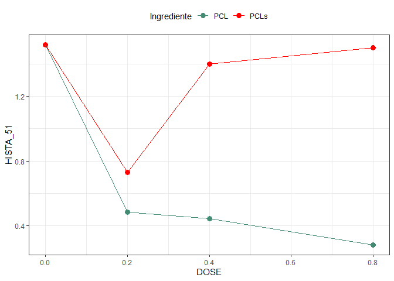

<!-- README.md is generated from README.Rmd. Please edit that file -->

# Análise Doutorado Débora

## Biorigin

### Carregando pacotes

``` r
library(tidyverse)
library(ExpDes.pt)
library(lme4)
library(agricolae)
library(readxl)
library(janitor)
library(MASS)
library(car)
```

### Entrada de dados

``` r
## Lendo os dados
dados <- read_xlsx("data/dados_01.xlsx",
          sheet = "Análises Fezes") %>% 
  clean_names() %>% 
  mutate(
    dose = case_when(
      tr == 1 ~ 0,
      tr == 2 | tr == 5 ~ 0.2,
      tr == 3 | tr == 6 ~ 0.4,
      tr == 4 | tr == 7 ~ 0.8
    ),
    ingrediente = ifelse(tr==1,"PCL",
                         ifelse(tr > 1 & tr<=4 ,"PCL","PCLs")),
    
    # transformação dos dados
    mo = log(mo),
    fibra_in = log(fibra_in),
    ee_in = log(ee_in),
    amido_in = log(amido_in),
    ph=ph^(-2),
    am=am^2
  )

#extraindo o controle
da <- dados %>% filter(dose==0) %>% 
  mutate(
    ingrediente="PCLs"
  )

#duplicando o controle
dados <- rbind(dados,da)
```

### Vislumbre

``` r
# glimpse(dados)
```

## Normalidade de Homocedasticidade

``` r
variaveis <- dados %>% 
  dplyr::select(mm:tripta_63,-score)

# for(i in seq_along(variaveis)){
#   nome <- names(variaveis[i])
#   print("====================================")
#   print(str_to_upper(nome))
#   print("====================================")
#   
#   daux <- variaveis[i]
#   names(daux) <- "y" ### <-
#   y <- daux$y ### <- 
#   bl <- dados$bl %>% as_factor()
#   tr <- dados$tr %>% as_factor()
#   
#   mod <- aov(y ~ tr + bl)
#   rs <- mod %>% rstudent()
#   hist(rs, main = paste("Resíduo ", str_to_upper(nome)) )
#   
#   print(shapiro.test(rs))
#   
#   plot(y ~ tr)
#   
#   boxcox(mod,seq(-10,10,.5))
#   abline(v=1,col="red",lty=2)
#   
#   preditos <- predict(mod)
#   plot(preditos,rs,
#        main=paste("Estudos de Outliers: ", str_to_upper(nome)))
#   abline(h=c(3,-3),col="red")
#   cat("\n")
# }
```

## Análise de variância

``` r
for(i in seq_along(variaveis)){
  nome <- names(variaveis[i])
  print("====================================")
  print(str_to_upper(nome))
  print("====================================")
  
  daux <- variaveis[i]
  names(daux) <- "y" ### <-
  y <- daux$y ### <- 
  ingred <- dados$ingrediente %>% as_factor()
  dose <- dados$dose
  bl <- dados$bl %>% as_factor()
  
  fat2.dbc(ingred,dose,bl,y,quali=c(TRUE,FALSE),
           fac.names = c("Ingred.","Dose"))
  
  my_plot<-tibble(dose,ingred,y) %>%
    group_by(dose,ingred) %>% 
    summarise(y=mean(y)) %>% 
    ggplot(aes(x=dose,y=y,color=ingred)) +
    geom_point(size=3) +
    geom_line() +
    #facet_wrap(~ingred,nrow = 2)+
    theme_bw() +
    labs(y=str_to_upper(nome),x="DOSE",color="Ingrediente")+
    theme(legend.position = "top")+
    scale_color_manual(values = c("aquamarine4","red")) 
  print(my_plot)
  cat("\n")
}
#> [1] "===================================="
#> [1] "MM"
#> [1] "===================================="
#> ------------------------------------------------------------------------
#> Legenda:
#> FATOR 1:  Ingred. 
#> FATOR 2:  Dose 
#> ------------------------------------------------------------------------
#> 
#> 
#> Quadro da analise de variancia
#> ------------------------------------------------------------------------
#>              GL     SQ QM      Fc   Pr>Fc
#> Bloco         1  0.505  2  0.7104 0.40297
#> Ingred.       1  8.924  5 12.5651 0.00081
#> Dose          3 29.904  6 14.0344 0.00000
#> Ingred.*Dose  3  4.698  4  2.2048 0.09781
#> Residuo      55 39.064  3                
#> Total        63 83.095  1                
#> ------------------------------------------------------------------------
#> CV = 2.96 %
#> 
#> ------------------------------------------------------------------------
#> Teste de normalidade dos residuos (Shapiro-Wilk)
#> valor-p:  0.05651648 
#> De acordo com o teste de Shapiro-Wilk a 5% de significancia, os residuos podem ser considerados normais.
#> ------------------------------------------------------------------------
#> 
#> Interacao nao significativa: analisando os efeitos simples
#> ------------------------------------------------------------------------
#> Ingred.
#> Teste de Tukey
#> ------------------------------------------------------------------------
#> Grupos Tratamentos Medias
#> a     PCL     28.80649 
#>  b    PCLs    28.05964 
#> ------------------------------------------------------------------------
#> 
#> Dose
#> Ajuste de modelos polinomiais de regressao
#> ------------------------------------------------------------------------
#> 
#> Modelo Linear
#> ==========================================
#>    Estimativa Erro.padrao    tc    valor.p
#> ------------------------------------------
#> b0  29.1589     0.1632    178.6685    0   
#> b1  -2.0737     0.3561    -5.8228     0   
#> ------------------------------------------
#> 
#> R2 do modelo linear
#> --------
#> 0.805289
#> --------
#> 
#> Analise de variancia do modelo linear
#> =====================================================
#>                      GL   SQ      QM     Fc   valor.p
#> -----------------------------------------------------
#> Efeito linear        1  24.0814 24.0814 33.91    0   
#> Desvios de Regressao 2  5.8226  2.9113   4.1  0.02191
#> Residuos             55 39.0640 0.7102               
#> -----------------------------------------------------
#> ------------------------------------------------------------------------
#> 
#> Modelo quadratico
#> ==========================================
#>    Estimativa Erro.padrao    tc    valor.p
#> ------------------------------------------
#> b0  29.1306     0.2019    144.2908    0   
#> b1  -1.7814     1.2814    -1.3902  0.1701 
#> b2  -0.3528     1.4856    -0.2375  0.8132 
#> ------------------------------------------
#> 
#> R2 do modelo quadratico
#> --------
#> 0.806629
#> --------
#> 
#> Analise de variancia do modelo quadratico
#> =====================================================
#>                      GL   SQ      QM     Fc   valor.p
#> -----------------------------------------------------
#> Efeito linear        1  24.0814 24.0814 33.91    0   
#> Efeito quadratico    1  0.0401  0.0401  0.06  0.81316
#> Desvios de Regressao 1  5.7826  5.7826  8.14  0.00609
#> Residuos             55 39.0640 0.7102               
#> -----------------------------------------------------
#> ------------------------------------------------------------------------
#> 
#> Modelo cubico
#> ==========================================
#>    Estimativa Erro.padrao    tc    valor.p
#> ------------------------------------------
#> b0  28.9587     0.2107    137.4459    0   
#> b1   7.5809     3.5225     2.1521  0.0358 
#> b2  -37.9689    13.2666   -2.8620  0.0059 
#> b3  32.8395     11.5091    2.8533  0.0061 
#> ------------------------------------------
#> 
#> R2 do modelo cubico
#> -
#> 1
#> -
#> 
#> Analise de variancia do modelo cubico
#> =====================================================
#>                      GL   SQ      QM     Fc   valor.p
#> -----------------------------------------------------
#> Efeito linear        1  24.0814 24.0814 33.91    0   
#> Efeito quadratico    1  0.0401  0.0401  0.06  0.81316
#> Efeito cubico        1  5.7826  5.7826  8.14  0.00609
#> Desvios de Regressao 0     0       0      0      1   
#> Residuos             55 39.0640 0.7102               
#> -----------------------------------------------------
#> ------------------------------------------------------------------------
```

<!-- -->

    #> 
    #> [1] "===================================="
    #> [1] "MO"
    #> [1] "===================================="
    #> ------------------------------------------------------------------------
    #> Legenda:
    #> FATOR 1:  Ingred. 
    #> FATOR 2:  Dose 
    #> ------------------------------------------------------------------------
    #> 
    #> 
    #> Quadro da analise de variancia
    #> ------------------------------------------------------------------------
    #>              GL        SQ QM      Fc   Pr>Fc
    #> Bloco         1 0.0000923  6  0.6605 0.41990
    #> Ingred.       1 0.0017175  4 12.2967 0.00091
    #> Dose          3 0.0058161  5 13.8801 0.00000
    #> Ingred.*Dose  3 0.0008962  3  2.1387 0.10578
    #> Residuo      55 0.0076822  2                
    #> Total        63 0.0162043  1                
    #> ------------------------------------------------------------------------
    #> CV = 0.28 %
    #> 
    #> ------------------------------------------------------------------------
    #> Teste de normalidade dos residuos (Shapiro-Wilk)
    #> valor-p:  0.04817748 
    #> ATENCAO: a 5% de significancia, os residuos nao podem ser considerados normais!
    #> ------------------------------------------------------------------------
    #> 
    #> Interacao nao significativa: analisando os efeitos simples
    #> ------------------------------------------------------------------------
    #> Ingred.
    #> Teste de Tukey
    #> ------------------------------------------------------------------------
    #> Grupos Tratamentos Medias
    #> a     PCLs    4.275687 
    #>  b    PCL     4.265326 
    #> ------------------------------------------------------------------------
    #> 
    #> Dose
    #> Ajuste de modelos polinomiais de regressao
    #> ------------------------------------------------------------------------
    #> 
    #> Modelo Linear
    #> ============================================
    #>    Estimativa Erro.padrao     tc     valor.p
    #> --------------------------------------------
    #> b0   4.2604     0.0023    1,861.5430    0   
    #> b1   0.0289     0.0050      5.7867      0   
    #> --------------------------------------------
    #> 
    #> R2 do modelo linear
    #> --------
    #> 0.804169
    #> --------
    #> 
    #> Analise de variancia do modelo linear
    #> ===================================================
    #>                      GL   SQ     QM    Fc   valor.p
    #> ---------------------------------------------------
    #> Efeito linear        1  0.0047 0.0047 33.49    0   
    #> Desvios de Regressao 2  0.0011 0.0006 4.08  0.02233
    #> Residuos             55 0.0077 0.0001              
    #> ---------------------------------------------------
    #> ------------------------------------------------------------------------
    #> 
    #> Modelo quadratico
    #> ============================================
    #>    Estimativa Erro.padrao     tc     valor.p
    #> --------------------------------------------
    #> b0   4.2608     0.0028    1,504.9670    0   
    #> b1   0.0246     0.0180      1.3678   0.1769 
    #> b2   0.0052     0.0208      0.2503   0.8033 
    #> --------------------------------------------
    #> 
    #> R2 do modelo quadratico
    #> --------
    #> 0.805674
    #> --------
    #> 
    #> Analise de variancia do modelo quadratico
    #> =====================================================
    #>                      GL   SQ      QM     Fc   valor.p
    #> -----------------------------------------------------
    #> Efeito linear        1  0.0047  0.0047  33.49    0   
    #> Efeito quadratico    1  0.00001 0.00001 0.06  0.80326
    #> Desvios de Regressao 1  0.0011  0.0011  8.09  0.00623
    #> Residuos             55 0.0077  0.0001               
    #> -----------------------------------------------------
    #> ------------------------------------------------------------------------
    #> 
    #> Modelo cubico
    #> ============================================
    #>    Estimativa Erro.padrao     tc     valor.p
    #> --------------------------------------------
    #> b0   4.2632     0.0030    1,442.9000    0   
    #> b1  -0.1063     0.0494     -2.1521   0.0358 
    #> b2   0.5311     0.1860      2.8548   0.0061 
    #> b3  -0.4591     0.1614     -2.8446   0.0062 
    #> --------------------------------------------
    #> 
    #> R2 do modelo cubico
    #> -
    #> 1
    #> -
    #> 
    #> Analise de variancia do modelo cubico
    #> =====================================================
    #>                      GL   SQ      QM     Fc   valor.p
    #> -----------------------------------------------------
    #> Efeito linear        1  0.0047  0.0047  33.49    0   
    #> Efeito quadratico    1  0.00001 0.00001 0.06  0.80326
    #> Efeito cubico        1  0.0011  0.0011  8.09  0.00623
    #> Desvios de Regressao 0     0       0      0      1   
    #> Residuos             55 0.0077  0.0001               
    #> -----------------------------------------------------
    #> ------------------------------------------------------------------------

<!-- -->

    #> 
    #> [1] "===================================="
    #> [1] "EE"
    #> [1] "===================================="
    #> ------------------------------------------------------------------------
    #> Legenda:
    #> FATOR 1:  Ingred. 
    #> FATOR 2:  Dose 
    #> ------------------------------------------------------------------------
    #> 
    #> 
    #> Quadro da analise de variancia
    #> ------------------------------------------------------------------------
    #>              GL      SQ QM     Fc   Pr>Fc
    #> Bloco         1  0.0005  2 0.0036 0.95252
    #> Ingred.       1  0.2967  5 2.1026 0.15273
    #> Dose          3  2.2803  6 5.3867 0.00253
    #> Ingred.*Dose  3  0.5997  4 1.4167 0.24769
    #> Residuo      55  7.7608  3               
    #> Total        63 10.9381  1               
    #> ------------------------------------------------------------------------
    #> CV = 4.56 %
    #> 
    #> ------------------------------------------------------------------------
    #> Teste de normalidade dos residuos (Shapiro-Wilk)
    #> valor-p:  0.2160121 
    #> De acordo com o teste de Shapiro-Wilk a 5% de significancia, os residuos podem ser considerados normais.
    #> ------------------------------------------------------------------------
    #> 
    #> Interacao nao significativa: analisando os efeitos simples
    #> ------------------------------------------------------------------------
    #> Ingred.
    #> De acordo com o teste F, as medias desse fator sao estatisticamente iguais.
    #> ------------------------------------------------------------------------
    #>   Niveis   Medias
    #> 1    PCL 8.314474
    #> 2   PCLs 8.178302
    #> ------------------------------------------------------------------------
    #> Dose
    #> Ajuste de modelos polinomiais de regressao
    #> ------------------------------------------------------------------------
    #> 
    #> Modelo Linear
    #> ==========================================
    #>    Estimativa Erro.padrao    tc    valor.p
    #> ------------------------------------------
    #> b0   8.0581     0.0727    110.7751    0   
    #> b1   0.5380     0.1587     3.3895  0.0013 
    #> ------------------------------------------
    #> 
    #> R2 do modelo linear
    #> --------
    #> 0.710941
    #> --------
    #> 
    #> Analise de variancia do modelo linear
    #> ===================================================
    #>                      GL   SQ     QM    Fc   valor.p
    #> ---------------------------------------------------
    #> Efeito linear        1  1.6212 1.6212 11.49 0.0013 
    #> Desvios de Regressao 2  0.6591 0.3296 2.34  0.10627
    #> Residuos             55 7.7608 0.1411              
    #> ---------------------------------------------------
    #> ------------------------------------------------------------------------
    #> 
    #> Modelo quadratico
    #> =========================================
    #>    Estimativa Erro.padrao   tc    valor.p
    #> -----------------------------------------
    #> b0   8.0234     0.0900    89.1620    0   
    #> b1   0.8974     0.5712    1.5712  0.1219 
    #> b2  -0.4337     0.6622    -0.6550 0.5152 
    #> -----------------------------------------
    #> 
    #> R2 do modelo quadratico
    #> --------
    #> 0.737486
    #> --------
    #> 
    #> Analise de variancia do modelo quadratico
    #> ===================================================
    #>                      GL   SQ     QM    Fc   valor.p
    #> ---------------------------------------------------
    #> Efeito linear        1  1.6212 1.6212 11.49 0.0013 
    #> Efeito quadratico    1  0.0605 0.0605 0.43  0.51522
    #> Desvios de Regressao 1  0.5986 0.5986 4.24  0.04417
    #> Residuos             55 7.7608 0.1411              
    #> ---------------------------------------------------
    #> ------------------------------------------------------------------------
    #> 
    #> Modelo cubico
    #> =========================================
    #>    Estimativa Erro.padrao   tc    valor.p
    #> -----------------------------------------
    #> b0   7.9681     0.0939    84.8474    0   
    #> b1   3.9096     1.5701    2.4901  0.0158 
    #> b2  -12.5365    5.9132    -2.1201 0.0385 
    #> b3  10.5660     5.1299    2.0597  0.0442 
    #> -----------------------------------------
    #> 
    #> R2 do modelo cubico
    #> -
    #> 1
    #> -
    #> 
    #> Analise de variancia do modelo cubico
    #> ===================================================
    #>                      GL   SQ     QM    Fc   valor.p
    #> ---------------------------------------------------
    #> Efeito linear        1  1.6212 1.6212 11.49 0.0013 
    #> Efeito quadratico    1  0.0605 0.0605 0.43  0.51522
    #> Efeito cubico        1  0.5986 0.5986 4.24  0.04417
    #> Desvios de Regressao 0    0      0      0      1   
    #> Residuos             55 7.7608 0.1411              
    #> ---------------------------------------------------
    #> ------------------------------------------------------------------------

<!-- -->

    #> 
    #> [1] "===================================="
    #> [1] "PB"
    #> [1] "===================================="
    #> ------------------------------------------------------------------------
    #> Legenda:
    #> FATOR 1:  Ingred. 
    #> FATOR 2:  Dose 
    #> ------------------------------------------------------------------------
    #> 
    #> 
    #> Quadro da analise de variancia
    #> ------------------------------------------------------------------------
    #>              GL     SQ QM     Fc   Pr>Fc
    #> Bloco         1  6.134  6 4.3705 0.04120
    #> Ingred.       1  6.114  5 4.3561 0.04152
    #> Dose          3  0.346  2 0.0822 0.96943
    #> Ingred.*Dose  3  5.693  4 1.3520 0.26707
    #> Residuo      55 77.194  3               
    #> Total        63 95.482  1               
    #> ------------------------------------------------------------------------
    #> CV = 4.43 %
    #> 
    #> ------------------------------------------------------------------------
    #> Teste de normalidade dos residuos (Shapiro-Wilk)
    #> valor-p:  0.01108368 
    #> ATENCAO: a 5% de significancia, os residuos nao podem ser considerados normais!
    #> ------------------------------------------------------------------------
    #> 
    #> Interacao nao significativa: analisando os efeitos simples
    #> ------------------------------------------------------------------------
    #> Ingred.
    #> Teste de Tukey
    #> ------------------------------------------------------------------------
    #> Grupos Tratamentos Medias
    #> a     PCL     27.06552 
    #>  b    PCLs    26.44737 
    #> ------------------------------------------------------------------------
    #> 
    #> Dose
    #> De acordo com o teste F, as medias desse fator sao estatisticamente iguais.
    #> 
    #> ------------------------------------------------------------------------
    #>   Niveis   Medias
    #> 1      0 26.74547
    #> 2    0.2 26.76962
    #> 3    0.4 26.65204
    #> 4    0.8 26.85865
    #> ------------------------------------------------------------------------

<!-- -->

    #> 
    #> [1] "===================================="
    #> [1] "AM"
    #> [1] "===================================="
    #> ------------------------------------------------------------------------
    #> Legenda:
    #> FATOR 1:  Ingred. 
    #> FATOR 2:  Dose 
    #> ------------------------------------------------------------------------
    #> 
    #> 
    #> Quadro da analise de variancia
    #> ------------------------------------------------------------------------
    #>              GL       SQ QM     Fc   Pr>Fc
    #> Bloco         1 0.000231  3 0.2833 0.59671
    #> Ingred.       1 0.004625  6 5.6640 0.02081
    #> Dose          3 0.000497  2 0.2029 0.89395
    #> Ingred.*Dose  3 0.003329  5 1.3592 0.26487
    #> Residuo      55 0.044907  4               
    #> Total        63 0.053589  1               
    #> ------------------------------------------------------------------------
    #> CV = 37.58 %
    #> 
    #> ------------------------------------------------------------------------
    #> Teste de normalidade dos residuos (Shapiro-Wilk)
    #> valor-p:  0.0340401 
    #> ATENCAO: a 5% de significancia, os residuos nao podem ser considerados normais!
    #> ------------------------------------------------------------------------
    #> 
    #> Interacao nao significativa: analisando os efeitos simples
    #> ------------------------------------------------------------------------
    #> Ingred.
    #> Teste de Tukey
    #> ------------------------------------------------------------------------
    #> Grupos Tratamentos Medias
    #> a     PCLs    0.08452968 
    #>  b    PCL     0.0675287 
    #> ------------------------------------------------------------------------
    #> 
    #> Dose
    #> De acordo com o teste F, as medias desse fator sao estatisticamente iguais.
    #> 
    #> ------------------------------------------------------------------------
    #>   Niveis     Medias
    #> 1      0 0.07260562
    #> 2    0.2 0.07754448
    #> 3    0.4 0.07974244
    #> 4    0.8 0.07422423
    #> ------------------------------------------------------------------------

<!-- -->

    #> 
    #> [1] "===================================="
    #> [1] "FB"
    #> [1] "===================================="
    #> ------------------------------------------------------------------------
    #> Legenda:
    #> FATOR 1:  Ingred. 
    #> FATOR 2:  Dose 
    #> ------------------------------------------------------------------------
    #> 
    #> 
    #> Quadro da analise de variancia
    #> ------------------------------------------------------------------------
    #>              GL     SQ QM     Fc    Pr>Fc
    #> Bloco         1  1.409  4 4.2811 0.043251
    #> Ingred.       1  3.043  6 9.2465 0.003610
    #> Dose          3  7.948  5 8.0517 0.000154
    #> Ingred.*Dose  3  1.913  3 1.9381 0.134130
    #> Residuo      55 18.098  2                
    #> Total        63 32.410  1                
    #> ------------------------------------------------------------------------
    #> CV = 4.2 %
    #> 
    #> ------------------------------------------------------------------------
    #> Teste de normalidade dos residuos (Shapiro-Wilk)
    #> valor-p:  0.07010748 
    #> De acordo com o teste de Shapiro-Wilk a 5% de significancia, os residuos podem ser considerados normais.
    #> ------------------------------------------------------------------------
    #> 
    #> Interacao nao significativa: analisando os efeitos simples
    #> ------------------------------------------------------------------------
    #> Ingred.
    #> Teste de Tukey
    #> ------------------------------------------------------------------------
    #> Grupos Tratamentos Medias
    #> a     PCLs    13.88795 
    #>  b    PCL     13.45188 
    #> ------------------------------------------------------------------------
    #> 
    #> Dose
    #> Ajuste de modelos polinomiais de regressao
    #> ------------------------------------------------------------------------
    #> 
    #> Modelo Linear
    #> ==========================================
    #>    Estimativa Erro.padrao    tc    valor.p
    #> ------------------------------------------
    #> b0  13.2614     0.1111    119.3839    0   
    #> b1   1.1672     0.2424     4.8150  0.00001
    #> ------------------------------------------
    #> 
    #> R2 do modelo linear
    #> --------
    #> 0.959792
    #> --------
    #> 
    #> Analise de variancia do modelo linear
    #> ====================================================
    #>                      GL   SQ      QM    Fc   valor.p
    #> ----------------------------------------------------
    #> Efeito linear        1  7.6286  7.6286 23.18  1e-05 
    #> Desvios de Regressao 2  0.3196  0.1598 0.49  0.61793
    #> Residuos             55 18.0975 0.3290              
    #> ----------------------------------------------------
    #> ------------------------------------------------------------------------
    #> 
    #> Modelo quadratico
    #> =========================================
    #>    Estimativa Erro.padrao   tc    valor.p
    #> -----------------------------------------
    #> b0  13.1915     0.1374    95.9976    0   
    #> b1   1.8915     0.8722    2.1687  0.0344 
    #> b2  -0.8742     1.0111    -0.8645 0.3911 
    #> -----------------------------------------
    #> 
    #> R2 do modelo quadratico
    #> --------
    #> 0.990734
    #> --------
    #> 
    #> Analise de variancia do modelo quadratico
    #> ====================================================
    #>                      GL   SQ      QM    Fc   valor.p
    #> ----------------------------------------------------
    #> Efeito linear        1  7.6286  7.6286 23.18  1e-05 
    #> Efeito quadratico    1  0.2459  0.2459 0.75  0.39106
    #> Desvios de Regressao 1  0.0736  0.0736 0.22  0.63801
    #> Residuos             55 18.0975 0.3290              
    #> ----------------------------------------------------
    #> ------------------------------------------------------------------------
    #> 
    #> Modelo cubico
    #> =========================================
    #>    Estimativa Erro.padrao   tc    valor.p
    #> -----------------------------------------
    #> b0  13.2109     0.1434    92.1220    0   
    #> b1   0.8349     2.3976    0.3482  0.7290 
    #> b2   3.3710     9.0299    0.3733  0.7104 
    #> b3  -3.7061     7.8336    -0.4731 0.6380 
    #> -----------------------------------------
    #> 
    #> R2 do modelo cubico
    #> -
    #> 1
    #> -
    #> 
    #> Analise de variancia do modelo cubico
    #> ====================================================
    #>                      GL   SQ      QM    Fc   valor.p
    #> ----------------------------------------------------
    #> Efeito linear        1  7.6286  7.6286 23.18  1e-05 
    #> Efeito quadratico    1  0.2459  0.2459 0.75  0.39106
    #> Efeito cubico        1  0.0736  0.0736 0.22  0.63801
    #> Desvios de Regressao 0     0      0      0      1   
    #> Residuos             55 18.0975 0.3290              
    #> ----------------------------------------------------
    #> ------------------------------------------------------------------------

<!-- -->

    #> 
    #> [1] "===================================="
    #> [1] "EB"
    #> [1] "===================================="
    #> ------------------------------------------------------------------------
    #> Legenda:
    #> FATOR 1:  Ingred. 
    #> FATOR 2:  Dose 
    #> ------------------------------------------------------------------------
    #> 
    #> 
    #> Quadro da analise de variancia
    #> ------------------------------------------------------------------------
    #>              GL     SQ QM     Fc   Pr>Fc
    #> Bloco         1   1914  2 0.4000 0.52971
    #> Ingred.       1  23640  3 4.9417 0.03035
    #> Dose          3 110084  4 7.6707 0.00023
    #> Ingred.*Dose  3  23817  6 1.6596 0.18634
    #> Residuo      55 263105  5               
    #> Total        63 422559  1               
    #> ------------------------------------------------------------------------
    #> CV = 1.81 %
    #> 
    #> ------------------------------------------------------------------------
    #> Teste de normalidade dos residuos (Shapiro-Wilk)
    #> valor-p:  0.1260179 
    #> De acordo com o teste de Shapiro-Wilk a 5% de significancia, os residuos podem ser considerados normais.
    #> ------------------------------------------------------------------------
    #> 
    #> Interacao nao significativa: analisando os efeitos simples
    #> ------------------------------------------------------------------------
    #> Ingred.
    #> Teste de Tukey
    #> ------------------------------------------------------------------------
    #> Grupos Tratamentos Medias
    #> a     PCLs    3831.815 
    #>  b    PCL     3793.377 
    #> ------------------------------------------------------------------------
    #> 
    #> Dose
    #> Ajuste de modelos polinomiais de regressao
    #> ------------------------------------------------------------------------
    #> 
    #> Modelo Linear
    #> ==========================================
    #>    Estimativa Erro.padrao    tc    valor.p
    #> ------------------------------------------
    #> b0 3,764.6970   13.3936   281.0809    0   
    #> b1  136.8560    29.2273    4.6825  0.00002
    #> ------------------------------------------
    #> 
    #> R2 do modelo linear
    #> --------
    #> 0.952777
    #> --------
    #> 
    #> Analise de variancia do modelo linear
    #> ===============================================================
    #>                      GL      SQ           QM       Fc   valor.p
    #> ---------------------------------------------------------------
    #> Efeito linear        1  104,885.6000 104,885.6000 21.93  2e-05 
    #> Desvios de Regressao 2   5,198.4970   2,599.2480  0.54  0.58388
    #> Residuos             55 263,104.9000  4,783.7250               
    #> ---------------------------------------------------------------
    #> ------------------------------------------------------------------------
    #> 
    #> Modelo quadratico
    #> ==========================================
    #>    Estimativa Erro.padrao    tc    valor.p
    #> ------------------------------------------
    #> b0 3,769.7040   16.5687   227.5201    0   
    #> b1  84.9928    105.1616    0.8082  0.4224 
    #> b2  62.5936    121.9188    0.5134  0.6097 
    #> ------------------------------------------
    #> 
    #> R2 do modelo quadratico
    #> --------
    #> 0.964231
    #> --------
    #> 
    #> Analise de variancia do modelo quadratico
    #> ===============================================================
    #>                      GL      SQ           QM       Fc   valor.p
    #> ---------------------------------------------------------------
    #> Efeito linear        1  104,885.6000 104,885.6000 21.93  2e-05 
    #> Efeito quadratico    1   1,260.9100   1,260.9100  0.26  0.60973
    #> Desvios de Regressao 1   3,937.5870   3,937.5870  0.82  0.36823
    #> Residuos             55 263,104.9000  4,783.7250               
    #> ---------------------------------------------------------------
    #> ------------------------------------------------------------------------
    #> 
    #> Modelo cubico
    #> ==========================================
    #>    Estimativa Erro.padrao    tc    valor.p
    #> ------------------------------------------
    #> b0 3,774.1920   17.2911   218.2734    0   
    #> b1 -159.3129   289.0845   -0.5511  0.5838 
    #> b2 1,044.1790 1,088.7700   0.9590  0.3417 
    #> b3 -856.9396   944.5354   -0.9073  0.3682 
    #> ------------------------------------------
    #> 
    #> R2 do modelo cubico
    #> -
    #> 1
    #> -
    #> 
    #> Analise de variancia do modelo cubico
    #> ===============================================================
    #>                      GL      SQ           QM       Fc   valor.p
    #> ---------------------------------------------------------------
    #> Efeito linear        1  104,885.6000 104,885.6000 21.93  2e-05 
    #> Efeito quadratico    1   1,260.9100   1,260.9100  0.26  0.60973
    #> Efeito cubico        1   3,937.5870   3,937.5870  0.82  0.36823
    #> Desvios de Regressao 0       0            0         0      1   
    #> Residuos             55 263,104.9000  4,783.7250               
    #> ---------------------------------------------------------------
    #> ------------------------------------------------------------------------

<!-- -->

    #> 
    #> [1] "===================================="
    #> [1] "D_MS"
    #> [1] "===================================="
    #> ------------------------------------------------------------------------
    #> Legenda:
    #> FATOR 1:  Ingred. 
    #> FATOR 2:  Dose 
    #> ------------------------------------------------------------------------
    #> 
    #> 
    #> Quadro da analise de variancia
    #> ------------------------------------------------------------------------
    #>              GL      SQ QM     Fc   Pr>Fc
    #> Bloco         1   2.232  3 0.8776 0.35296
    #> Ingred.       1   8.542  6 3.3585 0.07228
    #> Dose          3   6.469  2 0.8477 0.47376
    #> Ingred.*Dose  3   9.388  5 1.2304 0.30745
    #> Residuo      55 139.896  4               
    #> Total        63 166.527  1               
    #> ------------------------------------------------------------------------
    #> CV = 1.9 %
    #> 
    #> ------------------------------------------------------------------------
    #> Teste de normalidade dos residuos (Shapiro-Wilk)
    #> valor-p:  0.4204632 
    #> De acordo com o teste de Shapiro-Wilk a 5% de significancia, os residuos podem ser considerados normais.
    #> ------------------------------------------------------------------------
    #> 
    #> Interacao nao significativa: analisando os efeitos simples
    #> ------------------------------------------------------------------------
    #> Ingred.
    #> De acordo com o teste F, as medias desse fator sao estatisticamente iguais.
    #> ------------------------------------------------------------------------
    #>   Niveis   Medias
    #> 1    PCL 83.53865
    #> 2   PCLs 84.26934
    #> ------------------------------------------------------------------------
    #> Dose
    #> De acordo com o teste F, as medias desse fator sao estatisticamente iguais.
    #> 
    #> ------------------------------------------------------------------------
    #>   Niveis   Medias
    #> 1      0 83.73293
    #> 2    0.2 84.45445
    #> 3    0.4 83.71977
    #> 4    0.8 83.70883
    #> ------------------------------------------------------------------------

<!-- -->

    #> 
    #> [1] "===================================="
    #> [1] "D_MM"
    #> [1] "===================================="
    #> ------------------------------------------------------------------------
    #> Legenda:
    #> FATOR 1:  Ingred. 
    #> FATOR 2:  Dose 
    #> ------------------------------------------------------------------------
    #> 
    #> 
    #> Quadro da analise de variancia
    #> ------------------------------------------------------------------------
    #>              GL     SQ QM      Fc   Pr>Fc
    #> Bloco         1   81.6  6 1.59863 0.21143
    #> Ingred.       1   53.1  4 1.04004 0.31228
    #> Dose          3   92.4  2 0.60351 0.61550
    #> Ingred.*Dose  3  160.8  5 1.05000 0.37787
    #> Residuo      55 2807.1  3                
    #> Total        63 3194.9  1                
    #> ------------------------------------------------------------------------
    #> CV = 29 %
    #> 
    #> ------------------------------------------------------------------------
    #> Teste de normalidade dos residuos (Shapiro-Wilk)
    #> valor-p:  0.06658798 
    #> De acordo com o teste de Shapiro-Wilk a 5% de significancia, os residuos podem ser considerados normais.
    #> ------------------------------------------------------------------------
    #> 
    #> Interacao nao significativa: analisando os efeitos simples
    #> ------------------------------------------------------------------------
    #> Ingred.
    #> De acordo com o teste F, as medias desse fator sao estatisticamente iguais.
    #> ------------------------------------------------------------------------
    #>   Niveis   Medias
    #> 1    PCL 23.72159
    #> 2   PCLs 25.54301
    #> ------------------------------------------------------------------------
    #> Dose
    #> De acordo com o teste F, as medias desse fator sao estatisticamente iguais.
    #> 
    #> ------------------------------------------------------------------------
    #>   Niveis   Medias
    #> 1      0 23.83639
    #> 2    0.2 25.96502
    #> 3    0.4 23.09471
    #> 4    0.8 25.63308
    #> ------------------------------------------------------------------------

<!-- -->

    #> 
    #> [1] "===================================="
    #> [1] "D_MO"
    #> [1] "===================================="
    #> ------------------------------------------------------------------------
    #> Legenda:
    #> FATOR 1:  Ingred. 
    #> FATOR 2:  Dose 
    #> ------------------------------------------------------------------------
    #> 
    #> 
    #> Quadro da analise de variancia
    #> ------------------------------------------------------------------------
    #>              GL      SQ QM      Fc   Pr>Fc
    #> Bloco         1   1.030  2 0.64366 0.42584
    #> Ingred.       1   3.511  6 2.19289 0.14436
    #> Dose          3   6.708  5 1.39681 0.25351
    #> Ingred.*Dose  3   5.312  4 1.10615 0.35451
    #> Residuo      55  88.047  3                
    #> Total        63 104.609  1                
    #> ------------------------------------------------------------------------
    #> CV = 1.44 %
    #> 
    #> ------------------------------------------------------------------------
    #> Teste de normalidade dos residuos (Shapiro-Wilk)
    #> valor-p:  0.5374832 
    #> De acordo com o teste de Shapiro-Wilk a 5% de significancia, os residuos podem ser considerados normais.
    #> ------------------------------------------------------------------------
    #> 
    #> Interacao nao significativa: analisando os efeitos simples
    #> ------------------------------------------------------------------------
    #> Ingred.
    #> De acordo com o teste F, as medias desse fator sao estatisticamente iguais.
    #> ------------------------------------------------------------------------
    #>   Niveis   Medias
    #> 1    PCL 87.49854
    #> 2   PCLs 87.96695
    #> ------------------------------------------------------------------------
    #> Dose
    #> De acordo com o teste F, as medias desse fator sao estatisticamente iguais.
    #> 
    #> ------------------------------------------------------------------------
    #>   Niveis   Medias
    #> 1      0 87.67530
    #> 2    0.2 88.27352
    #> 3    0.4 87.54906
    #> 4    0.8 87.43310
    #> ------------------------------------------------------------------------

<!-- -->

    #> 
    #> [1] "===================================="
    #> [1] "D_EE"
    #> [1] "===================================="
    #> ------------------------------------------------------------------------
    #> Legenda:
    #> FATOR 1:  Ingred. 
    #> FATOR 2:  Dose 
    #> ------------------------------------------------------------------------
    #> 
    #> 
    #> Quadro da analise de variancia
    #> ------------------------------------------------------------------------
    #>              GL     SQ QM     Fc   Pr>Fc
    #> Bloco         1  0.546  2 0.5973 0.44292
    #> Ingred.       1  3.790  6 4.1433 0.04663
    #> Dose          3  4.437  5 1.6169 0.19595
    #> Ingred.*Dose  3  2.891  4 1.0535 0.37636
    #> Residuo      55 50.311  3               
    #> Total        63 61.976  1               
    #> ------------------------------------------------------------------------
    #> CV = 1.04 %
    #> 
    #> ------------------------------------------------------------------------
    #> Teste de normalidade dos residuos (Shapiro-Wilk)
    #> valor-p:  0.3058441 
    #> De acordo com o teste de Shapiro-Wilk a 5% de significancia, os residuos podem ser considerados normais.
    #> ------------------------------------------------------------------------
    #> 
    #> Interacao nao significativa: analisando os efeitos simples
    #> ------------------------------------------------------------------------
    #> Ingred.
    #> Teste de Tukey
    #> ------------------------------------------------------------------------
    #> Grupos Tratamentos Medias
    #> a     PCLs    92.12388 
    #>  b    PCL     91.63717 
    #> ------------------------------------------------------------------------
    #> 
    #> Dose
    #> De acordo com o teste F, as medias desse fator sao estatisticamente iguais.
    #> 
    #> ------------------------------------------------------------------------
    #>   Niveis   Medias
    #> 1      0 92.15598
    #> 2    0.2 91.98798
    #> 3    0.4 91.93051
    #> 4    0.8 91.44763
    #> ------------------------------------------------------------------------

<!-- -->

    #> 
    #> [1] "===================================="
    #> [1] "D_PB"
    #> [1] "===================================="
    #> ------------------------------------------------------------------------
    #> Legenda:
    #> FATOR 1:  Ingred. 
    #> FATOR 2:  Dose 
    #> ------------------------------------------------------------------------
    #> 
    #> 
    #> Quadro da analise de variancia
    #> ------------------------------------------------------------------------
    #>              GL      SQ QM     Fc   Pr>Fc
    #> Bloco         1   0.009  2 0.0025 0.96016
    #> Ingred.       1  22.038  4 5.8899 0.01853
    #> Dose          3   8.368  3 0.7455 0.52961
    #> Ingred.*Dose  3  21.283  6 1.8960 0.14097
    #> Residuo      55 205.793  5               
    #> Total        63 257.492  1               
    #> ------------------------------------------------------------------------
    #> CV = 2.31 %
    #> 
    #> ------------------------------------------------------------------------
    #> Teste de normalidade dos residuos (Shapiro-Wilk)
    #> valor-p:  0.6187615 
    #> De acordo com o teste de Shapiro-Wilk a 5% de significancia, os residuos podem ser considerados normais.
    #> ------------------------------------------------------------------------
    #> 
    #> Interacao nao significativa: analisando os efeitos simples
    #> ------------------------------------------------------------------------
    #> Ingred.
    #> Teste de Tukey
    #> ------------------------------------------------------------------------
    #> Grupos Tratamentos Medias
    #> a     PCLs    84.23684 
    #>  b    PCL     83.06322 
    #> ------------------------------------------------------------------------
    #> 
    #> Dose
    #> De acordo com o teste F, as medias desse fator sao estatisticamente iguais.
    #> 
    #> ------------------------------------------------------------------------
    #>   Niveis   Medias
    #> 1      0 83.39175
    #> 2    0.2 84.23727
    #> 3    0.4 83.31623
    #> 4    0.8 83.65487
    #> ------------------------------------------------------------------------

<!-- -->

    #> 
    #> [1] "===================================="
    #> [1] "D_AM"
    #> [1] "===================================="
    #> ------------------------------------------------------------------------
    #> Legenda:
    #> FATOR 1:  Ingred. 
    #> FATOR 2:  Dose 
    #> ------------------------------------------------------------------------
    #> 
    #> 
    #> Quadro da analise de variancia
    #> ------------------------------------------------------------------------
    #>              GL       SQ QM      Fc   Pr>Fc
    #> Bloco         1 0.000083  6 0.10245 0.75012
    #> Ingred.       1 0.000770  4 0.95459 0.33283
    #> Dose          3 0.000567  2 0.23430 0.87209
    #> Ingred.*Dose  3 0.000836  3 0.34543 0.79256
    #> Residuo      55 0.044365  5                
    #> Total        63 0.046621  1                
    #> ------------------------------------------------------------------------
    #> CV = 0.03 %
    #> 
    #> ------------------------------------------------------------------------
    #> Teste de normalidade dos residuos (Shapiro-Wilk)
    #> valor-p:  3.387009e-05 
    #> ATENCAO: a 5% de significancia, os residuos nao podem ser considerados normais!
    #> ------------------------------------------------------------------------
    #> 
    #> Interacao nao significativa: analisando os efeitos simples
    #> ------------------------------------------------------------------------
    #> Ingred.
    #> De acordo com o teste F, as medias desse fator sao estatisticamente iguais.
    #> ------------------------------------------------------------------------
    #>   Niveis   Medias
    #> 1    PCL 99.89003
    #> 2   PCLs 99.88309
    #> ------------------------------------------------------------------------
    #> Dose
    #> De acordo com o teste F, as medias desse fator sao estatisticamente iguais.
    #> 
    #> ------------------------------------------------------------------------
    #>   Niveis   Medias
    #> 1      0 99.89048
    #> 2    0.2 99.88839
    #> 3    0.4 99.88353
    #> 4    0.8 99.88382
    #> ------------------------------------------------------------------------

<!-- -->

    #> 
    #> [1] "===================================="
    #> [1] "D_FB"
    #> [1] "===================================="
    #> ------------------------------------------------------------------------
    #> Legenda:
    #> FATOR 1:  Ingred. 
    #> FATOR 2:  Dose 
    #> ------------------------------------------------------------------------
    #> 
    #> 
    #> Quadro da analise de variancia
    #> ------------------------------------------------------------------------
    #>              GL      SQ QM     Fc   Pr>Fc
    #> Bloco         1  127.99  4 3.3756 0.07157
    #> Ingred.       1   11.62  2 0.3066 0.58202
    #> Dose          3  362.49  3 3.1869 0.03074
    #> Ingred.*Dose  3   41.41  5 0.3641 0.77917
    #> Residuo      55 2085.34  6               
    #> Total        63 2628.86  1               
    #> ------------------------------------------------------------------------
    #> CV = 16.55 %
    #> 
    #> ------------------------------------------------------------------------
    #> Teste de normalidade dos residuos (Shapiro-Wilk)
    #> valor-p:  0.6607382 
    #> De acordo com o teste de Shapiro-Wilk a 5% de significancia, os residuos podem ser considerados normais.
    #> ------------------------------------------------------------------------
    #> 
    #> Interacao nao significativa: analisando os efeitos simples
    #> ------------------------------------------------------------------------
    #> Ingred.
    #> De acordo com o teste F, as medias desse fator sao estatisticamente iguais.
    #> ------------------------------------------------------------------------
    #>   Niveis   Medias
    #> 1    PCL 36.79068
    #> 2   PCLs 37.64305
    #> ------------------------------------------------------------------------
    #> Dose
    #> Ajuste de modelos polinomiais de regressao
    #> ------------------------------------------------------------------------
    #> 
    #> Modelo Linear
    #> =========================================
    #>    Estimativa Erro.padrao   tc    valor.p
    #> -----------------------------------------
    #> b0  39.6072     1.1924    33.2163    0   
    #> b1  -6.8296     2.6020    -2.6247 0.0112 
    #> -----------------------------------------
    #> 
    #> R2 do modelo linear
    #> --------
    #> 0.720577
    #> --------
    #> 
    #> Analise de variancia do modelo linear
    #> ========================================================
    #>                      GL     SQ        QM     Fc  valor.p
    #> --------------------------------------------------------
    #> Efeito linear        1   261.2047  261.2047 6.89 0.01121
    #> Desvios de Regressao 2   101.2892  50.6446  1.34 0.27136
    #> Residuos             55 2,085.3400 37.9153              
    #> --------------------------------------------------------
    #> ------------------------------------------------------------------------
    #> 
    #> Modelo quadratico
    #> =========================================
    #>    Estimativa Erro.padrao   tc    valor.p
    #> -----------------------------------------
    #> b0  39.4120     1.4751    26.7188    0   
    #> b1  -4.8075     9.3623    -0.5135 0.6097 
    #> b2  -2.4405     10.8541   -0.2248 0.8229 
    #> -----------------------------------------
    #> 
    #> R2 do modelo quadratico
    #> --------
    #> 0.725865
    #> --------
    #> 
    #> Analise de variancia do modelo quadratico
    #> ========================================================
    #>                      GL     SQ        QM     Fc  valor.p
    #> --------------------------------------------------------
    #> Efeito linear        1   261.2047  261.2047 6.89 0.01121
    #> Efeito quadratico    1    1.9168    1.9168  0.05 0.82293
    #> Desvios de Regressao 1   99.3723   99.3723  2.62 0.11119
    #> Residuos             55 2,085.3400 37.9153              
    #> --------------------------------------------------------
    #> ------------------------------------------------------------------------
    #> 
    #> Modelo cubico
    #> =========================================
    #>    Estimativa Erro.padrao   tc    valor.p
    #> -----------------------------------------
    #> b0  38.6991     1.5394    25.1394    0   
    #> b1  34.0032     25.7365   1.3212  0.1919 
    #> b2 -158.3763    96.9304   -1.6339 0.1080 
    #> b3  136.1344    84.0896   1.6189  0.1112 
    #> -----------------------------------------
    #> 
    #> R2 do modelo cubico
    #> -
    #> 1
    #> -
    #> 
    #> Analise de variancia do modelo cubico
    #> ========================================================
    #>                      GL     SQ        QM     Fc  valor.p
    #> --------------------------------------------------------
    #> Efeito linear        1   261.2047  261.2047 6.89 0.01121
    #> Efeito quadratico    1    1.9168    1.9168  0.05 0.82293
    #> Efeito cubico        1   99.3723   99.3723  2.62 0.11119
    #> Desvios de Regressao 0      0         0      0      1   
    #> Residuos             55 2,085.3400 37.9153              
    #> --------------------------------------------------------
    #> ------------------------------------------------------------------------

<!-- -->

    #> 
    #> [1] "===================================="
    #> [1] "D_EB"
    #> [1] "===================================="
    #> ------------------------------------------------------------------------
    #> Legenda:
    #> FATOR 1:  Ingred. 
    #> FATOR 2:  Dose 
    #> ------------------------------------------------------------------------
    #> 
    #> 
    #> Quadro da analise de variancia
    #> ------------------------------------------------------------------------
    #>              GL      SQ QM     Fc   Pr>Fc
    #> Bloco         1   1.040  2 0.5903 0.44559
    #> Ingred.       1   4.556  6 2.5864 0.11351
    #> Dose          3   5.319  4 1.0066 0.39689
    #> Ingred.*Dose  3   6.735  5 1.2746 0.29213
    #> Residuo      55  96.877  3               
    #> Total        63 114.527  1               
    #> ------------------------------------------------------------------------
    #> CV = 1.52 %
    #> 
    #> ------------------------------------------------------------------------
    #> Teste de normalidade dos residuos (Shapiro-Wilk)
    #> valor-p:  0.6042644 
    #> De acordo com o teste de Shapiro-Wilk a 5% de significancia, os residuos podem ser considerados normais.
    #> ------------------------------------------------------------------------
    #> 
    #> Interacao nao significativa: analisando os efeitos simples
    #> ------------------------------------------------------------------------
    #> Ingred.
    #> De acordo com o teste F, as medias desse fator sao estatisticamente iguais.
    #> ------------------------------------------------------------------------
    #>   Niveis   Medias
    #> 1    PCL 87.14719
    #> 2   PCLs 87.68079
    #> ------------------------------------------------------------------------
    #> Dose
    #> De acordo com o teste F, as medias desse fator sao estatisticamente iguais.
    #> 
    #> ------------------------------------------------------------------------
    #>   Niveis   Medias
    #> 1      0 87.27155
    #> 2    0.2 87.91071
    #> 3    0.4 87.27324
    #> 4    0.8 87.20045
    #> ------------------------------------------------------------------------

<!-- -->

    #> 
    #> [1] "===================================="
    #> [1] "MS_IN"
    #> [1] "===================================="
    #> ------------------------------------------------------------------------
    #> Legenda:
    #> FATOR 1:  Ingred. 
    #> FATOR 2:  Dose 
    #> ------------------------------------------------------------------------
    #> 
    #> 
    #> Quadro da analise de variancia
    #> ------------------------------------------------------------------------
    #>              GL      SQ QM      Fc   Pr>Fc
    #> Bloco         1    37.9  4 0.07958 0.77893
    #> Ingred.       1   653.2  6 1.37266 0.24641
    #> Dose          3   339.1  2 0.23754 0.86980
    #> Ingred.*Dose  3   401.3  3 0.28108 0.83882
    #> Residuo      55 26171.8  5                
    #> Total        63 27603.2  1                
    #> ------------------------------------------------------------------------
    #> CV = 12.88 %
    #> 
    #> ------------------------------------------------------------------------
    #> Teste de normalidade dos residuos (Shapiro-Wilk)
    #> valor-p:  0.05319403 
    #> De acordo com o teste de Shapiro-Wilk a 5% de significancia, os residuos podem ser considerados normais.
    #> ------------------------------------------------------------------------
    #> 
    #> Interacao nao significativa: analisando os efeitos simples
    #> ------------------------------------------------------------------------
    #> Ingred.
    #> De acordo com o teste F, as medias desse fator sao estatisticamente iguais.
    #> ------------------------------------------------------------------------
    #>   Niveis   Medias
    #> 1    PCL 166.2335
    #> 2   PCLs 172.6229
    #> ------------------------------------------------------------------------
    #> Dose
    #> De acordo com o teste F, as medias desse fator sao estatisticamente iguais.
    #> 
    #> ------------------------------------------------------------------------
    #>   Niveis   Medias
    #> 1      0 165.6326
    #> 2    0.2 171.3638
    #> 3    0.4 169.5486
    #> 4    0.8 171.1678
    #> ------------------------------------------------------------------------

<!-- -->

    #> 
    #> [1] "===================================="
    #> [1] "MO_IN"
    #> [1] "===================================="
    #> ------------------------------------------------------------------------
    #> Legenda:
    #> FATOR 1:  Ingred. 
    #> FATOR 2:  Dose 
    #> ------------------------------------------------------------------------
    #> 
    #> 
    #> Quadro da analise de variancia
    #> ------------------------------------------------------------------------
    #>              GL      SQ QM      Fc   Pr>Fc
    #> Bloco         1    33.4  4 0.07946 0.77909
    #> Ingred.       1   675.3  6 1.60664 0.21031
    #> Dose          3   320.2  2 0.25393 0.85821
    #> Ingred.*Dose  3   383.2  3 0.30387 0.82246
    #> Residuo      55 23118.6  5                
    #> Total        63 24530.7  1                
    #> ------------------------------------------------------------------------
    #> CV = 12.88 %
    #> 
    #> ------------------------------------------------------------------------
    #> Teste de normalidade dos residuos (Shapiro-Wilk)
    #> valor-p:  0.05358321 
    #> De acordo com o teste de Shapiro-Wilk a 5% de significancia, os residuos podem ser considerados normais.
    #> ------------------------------------------------------------------------
    #> 
    #> Interacao nao significativa: analisando os efeitos simples
    #> ------------------------------------------------------------------------
    #> Ingred.
    #> De acordo com o teste F, as medias desse fator sao estatisticamente iguais.
    #> ------------------------------------------------------------------------
    #>   Niveis   Medias
    #> 1    PCL 155.9086
    #> 2   PCLs 162.4054
    #> ------------------------------------------------------------------------
    #> Dose
    #> De acordo com o teste F, as medias desse fator sao estatisticamente iguais.
    #> 
    #> ------------------------------------------------------------------------
    #>   Niveis   Medias
    #> 1      0 155.4039
    #> 2    0.2 160.8722
    #> 3    0.4 159.5018
    #> 4    0.8 160.8501
    #> ------------------------------------------------------------------------

<!-- -->

    #> 
    #> [1] "===================================="
    #> [1] "PB_IN"
    #> [1] "===================================="
    #> ------------------------------------------------------------------------
    #> Legenda:
    #> FATOR 1:  Ingred. 
    #> FATOR 2:  Dose 
    #> ------------------------------------------------------------------------
    #> 
    #> 
    #> Quadro da analise de variancia
    #> ------------------------------------------------------------------------
    #>              GL      SQ QM      Fc   Pr>Fc
    #> Bloco         1    2.59  3 0.07853 0.78035
    #> Ingred.       1   54.30  6 1.64882 0.20450
    #> Dose          3   60.84  4 0.61583 0.60767
    #> Ingred.*Dose  3   36.89  2 0.37336 0.77254
    #> Residuo      55 1811.30  5                
    #> Total        63 1965.91  1                
    #> ------------------------------------------------------------------------
    #> CV = 12.84 %
    #> 
    #> ------------------------------------------------------------------------
    #> Teste de normalidade dos residuos (Shapiro-Wilk)
    #> valor-p:  0.04769634 
    #> ATENCAO: a 5% de significancia, os residuos nao podem ser considerados normais!
    #> ------------------------------------------------------------------------
    #> 
    #> Interacao nao significativa: analisando os efeitos simples
    #> ------------------------------------------------------------------------
    #> Ingred.
    #> De acordo com o teste F, as medias desse fator sao estatisticamente iguais.
    #> ------------------------------------------------------------------------
    #>   Niveis   Medias
    #> 1    PCL 43.78999
    #> 2   PCLs 45.63220
    #> ------------------------------------------------------------------------
    #> Dose
    #> De acordo com o teste F, as medias desse fator sao estatisticamente iguais.
    #> 
    #> ------------------------------------------------------------------------
    #>   Niveis   Medias
    #> 1      0 43.48681
    #> 2    0.2 45.47722
    #> 3    0.4 44.04242
    #> 4    0.8 45.83792
    #> ------------------------------------------------------------------------

<!-- -->

    #> 
    #> [1] "===================================="
    #> [1] "FIBRA_IN"
    #> [1] "===================================="
    #> ------------------------------------------------------------------------
    #> Legenda:
    #> FATOR 1:  Ingred. 
    #> FATOR 2:  Dose 
    #> ------------------------------------------------------------------------
    #> 
    #> 
    #> Quadro da analise de variancia
    #> ------------------------------------------------------------------------
    #>              GL      SQ QM      Fc   Pr>Fc
    #> Bloco         1 0.00082  2 0.05107 0.82204
    #> Ingred.       1 0.02145  6 1.34037 0.25197
    #> Dose          3 0.00970  3 0.20202 0.89456
    #> Ingred.*Dose  3 0.01313  4 0.27346 0.84428
    #> Residuo      55 0.88016  5                
    #> Total        63 0.92525  1                
    #> ------------------------------------------------------------------------
    #> CV = 7.14 %
    #> 
    #> ------------------------------------------------------------------------
    #> Teste de normalidade dos residuos (Shapiro-Wilk)
    #> valor-p:  0.0774056 
    #> De acordo com o teste de Shapiro-Wilk a 5% de significancia, os residuos podem ser considerados normais.
    #> ------------------------------------------------------------------------
    #> 
    #> Interacao nao significativa: analisando os efeitos simples
    #> ------------------------------------------------------------------------
    #> Ingred.
    #> De acordo com o teste F, as medias desse fator sao estatisticamente iguais.
    #> ------------------------------------------------------------------------
    #>   Niveis   Medias
    #> 1    PCL 1.754408
    #> 2   PCLs 1.791023
    #> ------------------------------------------------------------------------
    #> Dose
    #> De acordo com o teste F, as medias desse fator sao estatisticamente iguais.
    #> 
    #> ------------------------------------------------------------------------
    #>   Niveis   Medias
    #> 1      0 1.753184
    #> 2    0.2 1.782741
    #> 3    0.4 1.771184
    #> 4    0.8 1.783754
    #> ------------------------------------------------------------------------

<!-- -->

    #> 
    #> [1] "===================================="
    #> [1] "EE_IN"
    #> [1] "===================================="
    #> ------------------------------------------------------------------------
    #> Legenda:
    #> FATOR 1:  Ingred. 
    #> FATOR 2:  Dose 
    #> ------------------------------------------------------------------------
    #> 
    #> 
    #> Quadro da analise de variancia
    #> ------------------------------------------------------------------------
    #>              GL      SQ QM      Fc   Pr>Fc
    #> Bloco         1 0.00082  2 0.05131 0.82164
    #> Ingred.       1 0.01876  6 1.17225 0.28366
    #> Dose          3 0.00312  3 0.06495 0.97819
    #> Ingred.*Dose  3 0.01665  4 0.34677 0.79160
    #> Residuo      55 0.88013  5                
    #> Total        63 0.91947  1                
    #> ------------------------------------------------------------------------
    #> CV = 3.82 %
    #> 
    #> ------------------------------------------------------------------------
    #> Teste de normalidade dos residuos (Shapiro-Wilk)
    #> valor-p:  0.07756398 
    #> De acordo com o teste de Shapiro-Wilk a 5% de significancia, os residuos podem ser considerados normais.
    #> ------------------------------------------------------------------------
    #> 
    #> Interacao nao significativa: analisando os efeitos simples
    #> ------------------------------------------------------------------------
    #> Ingred.
    #> De acordo com o teste F, as medias desse fator sao estatisticamente iguais.
    #> ------------------------------------------------------------------------
    #>   Niveis   Medias
    #> 1    PCL 3.297441
    #> 2   PCLs 3.331681
    #> ------------------------------------------------------------------------
    #> Dose
    #> De acordo com o teste F, as medias desse fator sao estatisticamente iguais.
    #> 
    #> ------------------------------------------------------------------------
    #>   Niveis   Medias
    #> 1      0 3.305962
    #> 2    0.2 3.313936
    #> 3    0.4 3.325418
    #> 4    0.8 3.312927
    #> ------------------------------------------------------------------------

<!-- -->

    #> 
    #> [1] "===================================="
    #> [1] "AMIDO_IN"
    #> [1] "===================================="
    #> ------------------------------------------------------------------------
    #> Legenda:
    #> FATOR 1:  Ingred. 
    #> FATOR 2:  Dose 
    #> ------------------------------------------------------------------------
    #> 
    #> 
    #> Quadro da analise de variancia
    #> ------------------------------------------------------------------------
    #>              GL      SQ QM     Fc   Pr>Fc
    #> Bloco         1 0.00082  2 0.0513 0.82164
    #> Ingred.       1 0.05237  6 3.2724 0.07592
    #> Dose          3 0.01725  3 0.3593 0.78263
    #> Ingred.*Dose  3 0.02000  4 0.4166 0.74179
    #> Residuo      55 0.88013  5               
    #> Total        63 0.97056  1               
    #> ------------------------------------------------------------------------
    #> CV = 3.05 %
    #> 
    #> ------------------------------------------------------------------------
    #> Teste de normalidade dos residuos (Shapiro-Wilk)
    #> valor-p:  0.07756398 
    #> De acordo com o teste de Shapiro-Wilk a 5% de significancia, os residuos podem ser considerados normais.
    #> ------------------------------------------------------------------------
    #> 
    #> Interacao nao significativa: analisando os efeitos simples
    #> ------------------------------------------------------------------------
    #> Ingred.
    #> De acordo com o teste F, as medias desse fator sao estatisticamente iguais.
    #> ------------------------------------------------------------------------
    #>   Niveis   Medias
    #> 1    PCL 4.121902
    #> 2   PCLs 4.179111
    #> ------------------------------------------------------------------------
    #> Dose
    #> De acordo com o teste F, as medias desse fator sao estatisticamente iguais.
    #> 
    #> ------------------------------------------------------------------------
    #>   Niveis   Medias
    #> 1      0 4.132962
    #> 2    0.2 4.171332
    #> 3    0.4 4.161731
    #> 4    0.8 4.136000
    #> ------------------------------------------------------------------------

<!-- -->

    #> 
    #> [1] "===================================="
    #> [1] "PROD_FZ"
    #> [1] "===================================="
    #> ------------------------------------------------------------------------
    #> Legenda:
    #> FATOR 1:  Ingred. 
    #> FATOR 2:  Dose 
    #> ------------------------------------------------------------------------
    #> 
    #> 
    #> Quadro da analise de variancia
    #> ------------------------------------------------------------------------
    #>              GL      SQ QM       Fc   Pr>Fc
    #> Bloco         1    81.1  6 0.150906 0.69917
    #> Ingred.       1    47.7  4 0.088725 0.76693
    #> Dose          3   416.9  2 0.258621 0.85487
    #> Ingred.*Dose  3   125.4  3 0.077802 0.97175
    #> Residuo      55 29552.9  5                 
    #> Total        63 30224.0  1                 
    #> ------------------------------------------------------------------------
    #> CV = 16.99 %
    #> 
    #> ------------------------------------------------------------------------
    #> Teste de normalidade dos residuos (Shapiro-Wilk)
    #> valor-p:  0.255088 
    #> De acordo com o teste de Shapiro-Wilk a 5% de significancia, os residuos podem ser considerados normais.
    #> ------------------------------------------------------------------------
    #> 
    #> Interacao nao significativa: analisando os efeitos simples
    #> ------------------------------------------------------------------------
    #> Ingred.
    #> De acordo com o teste F, as medias desse fator sao estatisticamente iguais.
    #> ------------------------------------------------------------------------
    #>   Niveis   Medias
    #> 1    PCL 137.3079
    #> 2   PCLs 135.5817
    #> ------------------------------------------------------------------------
    #> Dose
    #> De acordo com o teste F, as medias desse fator sao estatisticamente iguais.
    #> 
    #> ------------------------------------------------------------------------
    #>   Niveis   Medias
    #> 1      0 134.6200
    #> 2    0.2 133.3687
    #> 3    0.4 138.1030
    #> 4    0.8 139.6873
    #> ------------------------------------------------------------------------

<!-- -->

    #> 
    #> [1] "===================================="
    #> [1] "FEZESMN"
    #> [1] "===================================="
    #> ------------------------------------------------------------------------
    #> Legenda:
    #> FATOR 1:  Ingred. 
    #> FATOR 2:  Dose 
    #> ------------------------------------------------------------------------
    #> 
    #> 
    #> Quadro da analise de variancia
    #> ------------------------------------------------------------------------
    #>              GL     SQ QM      Fc   Pr>Fc
    #> Bloco         1  119.6  2 0.75263 0.38941
    #> Ingred.       1   12.1  3 0.07634 0.78336
    #> Dose          3  231.4  6 0.48526 0.69391
    #> Ingred.*Dose  3   78.4  5 0.16448 0.91984
    #> Residuo      55 8742.9  4                
    #> Total        63 9184.6  1                
    #> ------------------------------------------------------------------------
    #> CV = 21.27 %
    #> 
    #> ------------------------------------------------------------------------
    #> Teste de normalidade dos residuos (Shapiro-Wilk)
    #> valor-p:  0.01192624 
    #> ATENCAO: a 5% de significancia, os residuos nao podem ser considerados normais!
    #> ------------------------------------------------------------------------
    #> 
    #> Interacao nao significativa: analisando os efeitos simples
    #> ------------------------------------------------------------------------
    #> Ingred.
    #> De acordo com o teste F, as medias desse fator sao estatisticamente iguais.
    #> ------------------------------------------------------------------------
    #>   Niveis   Medias
    #> 1    PCL 59.69812
    #> 2   PCLs 58.82725
    #> ------------------------------------------------------------------------
    #> Dose
    #> De acordo com o teste F, as medias desse fator sao estatisticamente iguais.
    #> 
    #> ------------------------------------------------------------------------
    #>   Niveis   Medias
    #> 1      0 58.46700
    #> 2    0.2 56.82700
    #> 3    0.4 59.72150
    #> 4    0.8 62.03525
    #> ------------------------------------------------------------------------

<!-- -->

    #> 
    #> [1] "===================================="
    #> [1] "FEZESMS"
    #> [1] "===================================="
    #> ------------------------------------------------------------------------
    #> Legenda:
    #> FATOR 1:  Ingred. 
    #> FATOR 2:  Dose 
    #> ------------------------------------------------------------------------
    #> 
    #> 
    #> Quadro da analise de variancia
    #> ------------------------------------------------------------------------
    #>              GL      SQ QM       Fc   Pr>Fc
    #> Bloco         1    3.24  5 0.150906 0.69917
    #> Ingred.       1    1.91  3 0.088725 0.76693
    #> Dose          3   16.68  6 0.258621 0.85487
    #> Ingred.*Dose  3    5.02  2 0.077802 0.97175
    #> Residuo      55 1182.12  4                 
    #> Total        63 1208.96  1                 
    #> ------------------------------------------------------------------------
    #> CV = 16.99 %
    #> 
    #> ------------------------------------------------------------------------
    #> Teste de normalidade dos residuos (Shapiro-Wilk)
    #> valor-p:  0.255088 
    #> De acordo com o teste de Shapiro-Wilk a 5% de significancia, os residuos podem ser considerados normais.
    #> ------------------------------------------------------------------------
    #> 
    #> Interacao nao significativa: analisando os efeitos simples
    #> ------------------------------------------------------------------------
    #> Ingred.
    #> De acordo com o teste F, as medias desse fator sao estatisticamente iguais.
    #> ------------------------------------------------------------------------
    #>   Niveis   Medias
    #> 1    PCL 27.46157
    #> 2   PCLs 27.11634
    #> ------------------------------------------------------------------------
    #> Dose
    #> De acordo com o teste F, as medias desse fator sao estatisticamente iguais.
    #> 
    #> ------------------------------------------------------------------------
    #>   Niveis   Medias
    #> 1      0 26.92400
    #> 2    0.2 26.67375
    #> 3    0.4 27.62061
    #> 4    0.8 27.93746
    #> ------------------------------------------------------------------------

<!-- -->

    #> 
    #> [1] "===================================="
    #> [1] "MSFEZ_F"
    #> [1] "===================================="
    #> ------------------------------------------------------------------------
    #> Legenda:
    #> FATOR 1:  Ingred. 
    #> FATOR 2:  Dose 
    #> ------------------------------------------------------------------------
    #> 
    #> 
    #> Quadro da analise de variancia
    #> ------------------------------------------------------------------------
    #>              GL     SQ QM      Fc   Pr>Fc
    #> Bloco         1 148.25  4 12.4771 0.00084
    #> Ingred.       1   0.13  2  0.0110 0.91668
    #> Dose          3  22.47  6  0.6302 0.59860
    #> Ingred.*Dose  3  10.90  5  0.3057 0.82114
    #> Residuo      55 653.51  3                
    #> Total        63 835.26  1                
    #> ------------------------------------------------------------------------
    #> CV = 7.41 %
    #> 
    #> ------------------------------------------------------------------------
    #> Teste de normalidade dos residuos (Shapiro-Wilk)
    #> valor-p:  0.08349228 
    #> De acordo com o teste de Shapiro-Wilk a 5% de significancia, os residuos podem ser considerados normais.
    #> ------------------------------------------------------------------------
    #> 
    #> Interacao nao significativa: analisando os efeitos simples
    #> ------------------------------------------------------------------------
    #> Ingred.
    #> De acordo com o teste F, as medias desse fator sao estatisticamente iguais.
    #> ------------------------------------------------------------------------
    #>   Niveis   Medias
    #> 1    PCL 46.49661
    #> 2   PCLs 46.58718
    #> ------------------------------------------------------------------------
    #> Dose
    #> De acordo com o teste F, as medias desse fator sao estatisticamente iguais.
    #> 
    #> ------------------------------------------------------------------------
    #>   Niveis   Medias
    #> 1      0 46.46022
    #> 2    0.2 47.30962
    #> 3    0.4 46.73399
    #> 4    0.8 45.66375
    #> ------------------------------------------------------------------------

<!-- -->

    #> 
    #> [1] "===================================="
    #> [1] "PH"
    #> [1] "===================================="
    #> ------------------------------------------------------------------------
    #> Legenda:
    #> FATOR 1:  Ingred. 
    #> FATOR 2:  Dose 
    #> ------------------------------------------------------------------------
    #> 
    #> 
    #> Quadro da analise de variancia
    #> ------------------------------------------------------------------------
    #>              GL         SQ QM      Fc   Pr>Fc
    #> Bloco         1 1.8030e-06  5 1.21458 0.27523
    #> Ingred.       1 1.5220e-06  4 1.02500 0.31577
    #> Dose          3 2.3330e-06  6 0.52383 0.66772
    #> Ingred.*Dose  3 3.8250e-06  2 0.85899 0.46792
    #> Residuo      55 8.1645e-05  3                
    #> Total        63 9.1128e-05  1                
    #> ------------------------------------------------------------------------
    #> CV = 5.6 %
    #> 
    #> ------------------------------------------------------------------------
    #> Teste de normalidade dos residuos (Shapiro-Wilk)
    #> valor-p:  0.2533306 
    #> De acordo com o teste de Shapiro-Wilk a 5% de significancia, os residuos podem ser considerados normais.
    #> ------------------------------------------------------------------------
    #> 
    #> Interacao nao significativa: analisando os efeitos simples
    #> ------------------------------------------------------------------------
    #> Ingred.
    #> De acordo com o teste F, as medias desse fator sao estatisticamente iguais.
    #> ------------------------------------------------------------------------
    #>   Niveis     Medias
    #> 1    PCL 0.02192561
    #> 2   PCLs 0.02161723
    #> ------------------------------------------------------------------------
    #> Dose
    #> De acordo com o teste F, as medias desse fator sao estatisticamente iguais.
    #> 
    #> ------------------------------------------------------------------------
    #>   Niveis     Medias
    #> 1      0 0.02175126
    #> 2    0.2 0.02156983
    #> 3    0.4 0.02168209
    #> 4    0.8 0.02208251
    #> ------------------------------------------------------------------------

<!-- -->

    #> 
    #> [1] "===================================="
    #> [1] "LACTATO"
    #> [1] "===================================="
    #> ------------------------------------------------------------------------
    #> Legenda:
    #> FATOR 1:  Ingred. 
    #> FATOR 2:  Dose 
    #> ------------------------------------------------------------------------
    #> 
    #> 
    #> Quadro da analise de variancia
    #> ------------------------------------------------------------------------
    #>              GL      SQ QM      Fc   Pr>Fc
    #> Bloco         1  2.6157  6 10.3943 0.00213
    #> Ingred.       1  0.1547  2  0.6149 0.43630
    #> Dose          3  0.5237  3  0.6938 0.55980
    #> Ingred.*Dose  3  1.0745  5  1.4233 0.24581
    #> Residuo      55 13.8405  4                
    #> Total        63 18.2092  1                
    #> ------------------------------------------------------------------------
    #> CV = 17.82 %
    #> 
    #> ------------------------------------------------------------------------
    #> Teste de normalidade dos residuos (Shapiro-Wilk)
    #> valor-p:  0.001530524 
    #> ATENCAO: a 5% de significancia, os residuos nao podem ser considerados normais!
    #> ------------------------------------------------------------------------
    #> 
    #> Interacao nao significativa: analisando os efeitos simples
    #> ------------------------------------------------------------------------
    #> Ingred.
    #> De acordo com o teste F, as medias desse fator sao estatisticamente iguais.
    #> ------------------------------------------------------------------------
    #>   Niveis   Medias
    #> 1    PCL 2.766378
    #> 2   PCLs 2.864722
    #> ------------------------------------------------------------------------
    #> Dose
    #> De acordo com o teste F, as medias desse fator sao estatisticamente iguais.
    #> 
    #> ------------------------------------------------------------------------
    #>   Niveis   Medias
    #> 1      0 2.785631
    #> 2    0.2 2.893291
    #> 3    0.4 2.680617
    #> 4    0.8 2.902661
    #> ------------------------------------------------------------------------

<!-- -->

    #> 
    #> [1] "===================================="
    #> [1] "AMONIA"
    #> [1] "===================================="
    #> ------------------------------------------------------------------------
    #> Legenda:
    #> FATOR 1:  Ingred. 
    #> FATOR 2:  Dose 
    #> ------------------------------------------------------------------------
    #> 
    #> 
    #> Quadro da analise de variancia
    #> ------------------------------------------------------------------------
    #>              GL    SQ QM      Fc   Pr>Fc
    #> Bloco         1  2342  5 1.64522 0.20499
    #> Ingred.       1     0  2 0.00001 0.99759
    #> Dose          3  1022  6 0.23936 0.86852
    #> Ingred.*Dose  3  6226  4 1.45779 0.23610
    #> Residuo      55 78300  3                
    #> Total        63 87890  1                
    #> ------------------------------------------------------------------------
    #> CV = 19.47 %
    #> 
    #> ------------------------------------------------------------------------
    #> Teste de normalidade dos residuos (Shapiro-Wilk)
    #> valor-p:  0.2257078 
    #> De acordo com o teste de Shapiro-Wilk a 5% de significancia, os residuos podem ser considerados normais.
    #> ------------------------------------------------------------------------
    #> 
    #> Interacao nao significativa: analisando os efeitos simples
    #> ------------------------------------------------------------------------
    #> Ingred.
    #> De acordo com o teste F, as medias desse fator sao estatisticamente iguais.
    #> ------------------------------------------------------------------------
    #>   Niveis   Medias
    #> 1    PCL 193.7703
    #> 2   PCLs 193.7990
    #> ------------------------------------------------------------------------
    #> Dose
    #> De acordo com o teste F, as medias desse fator sao estatisticamente iguais.
    #> 
    #> ------------------------------------------------------------------------
    #>   Niveis   Medias
    #> 1      0 195.1438
    #> 2    0.2 187.6213
    #> 3    0.4 198.6886
    #> 4    0.8 193.6849
    #> ------------------------------------------------------------------------

<!-- -->

    #> 
    #> [1] "===================================="
    #> [1] "ACETICO"
    #> [1] "===================================="
    #> ------------------------------------------------------------------------
    #> Legenda:
    #> FATOR 1:  Ingred. 
    #> FATOR 2:  Dose 
    #> ------------------------------------------------------------------------
    #> 
    #> 
    #> Quadro da analise de variancia
    #> ------------------------------------------------------------------------
    #>              GL     SQ QM     Fc   Pr>Fc
    #> Bloco         1  22381  2 7.3512 0.00892
    #> Ingred.       1    239  3 0.0785 0.78043
    #> Dose          3   9775  5 1.0702 0.36930
    #> Ingred.*Dose  3  15072  6 1.6501 0.18843
    #> Residuo      55 167449  4               
    #> Total        63 214915  1               
    #> ------------------------------------------------------------------------
    #> CV = 32.77 %
    #> 
    #> ------------------------------------------------------------------------
    #> Teste de normalidade dos residuos (Shapiro-Wilk)
    #> valor-p:  0.8117557 
    #> De acordo com o teste de Shapiro-Wilk a 5% de significancia, os residuos podem ser considerados normais.
    #> ------------------------------------------------------------------------
    #> 
    #> Interacao nao significativa: analisando os efeitos simples
    #> ------------------------------------------------------------------------
    #> Ingred.
    #> De acordo com o teste F, as medias desse fator sao estatisticamente iguais.
    #> ------------------------------------------------------------------------
    #>   Niveis   Medias
    #> 1    PCL 166.4641
    #> 2   PCLs 170.3282
    #> ------------------------------------------------------------------------
    #> Dose
    #> De acordo com o teste F, as medias desse fator sao estatisticamente iguais.
    #> 
    #> ------------------------------------------------------------------------
    #>   Niveis   Medias
    #> 1      0 162.1573
    #> 2    0.2 183.2692
    #> 3    0.4 151.5586
    #> 4    0.8 176.5996
    #> ------------------------------------------------------------------------

<!-- -->

    #> 
    #> [1] "===================================="
    #> [1] "PROPIONICO"
    #> [1] "===================================="
    #> ------------------------------------------------------------------------
    #> Legenda:
    #> FATOR 1:  Ingred. 
    #> FATOR 2:  Dose 
    #> ------------------------------------------------------------------------
    #> 
    #> 
    #> Quadro da analise de variancia
    #> ------------------------------------------------------------------------
    #>              GL    SQ QM      Fc   Pr>Fc
    #> Bloco         1  2171  4 2.76485 0.10204
    #> Ingred.       1     3  2 0.00342 0.95360
    #> Dose          3  6429  3 2.72939 0.05261
    #> Ingred.*Dose  3  1013  5 0.42983 0.73244
    #> Residuo      55 43187  6                
    #> Total        63 52802  1                
    #> ------------------------------------------------------------------------
    #> CV = 41.83 %
    #> 
    #> ------------------------------------------------------------------------
    #> Teste de normalidade dos residuos (Shapiro-Wilk)
    #> valor-p:  0.00824109 
    #> ATENCAO: a 5% de significancia, os residuos nao podem ser considerados normais!
    #> ------------------------------------------------------------------------
    #> 
    #> Interacao nao significativa: analisando os efeitos simples
    #> ------------------------------------------------------------------------
    #> Ingred.
    #> De acordo com o teste F, as medias desse fator sao estatisticamente iguais.
    #> ------------------------------------------------------------------------
    #>   Niveis   Medias
    #> 1    PCL 66.78568
    #> 2   PCLs 67.19515
    #> ------------------------------------------------------------------------
    #> Dose
    #> De acordo com o teste F, as medias desse fator sao estatisticamente iguais.
    #> 
    #> ------------------------------------------------------------------------
    #>   Niveis   Medias
    #> 1      0 56.15392
    #> 2    0.2 73.41836
    #> 3    0.4 58.39253
    #> 4    0.8 79.99685
    #> ------------------------------------------------------------------------

<!-- -->

    #> 
    #> [1] "===================================="
    #> [1] "ISOBUT"
    #> [1] "===================================="
    #> ------------------------------------------------------------------------
    #> Legenda:
    #> FATOR 1:  Ingred. 
    #> FATOR 2:  Dose 
    #> ------------------------------------------------------------------------
    #> 
    #> 
    #> Quadro da analise de variancia
    #> ------------------------------------------------------------------------
    #>              GL     SQ QM     Fc    Pr>Fc
    #> Bloco         1  345.7  3 8.0552 0.006344
    #> Ingred.       1  119.6  2 2.7860 0.100775
    #> Dose          3  205.7  6 1.5976 0.200426
    #> Ingred.*Dose  3  174.0  5 1.3512 0.267317
    #> Residuo      55 2360.2  4                
    #> Total        63 3205.0  1                
    #> ------------------------------------------------------------------------
    #> CV = 36.15 %
    #> 
    #> ------------------------------------------------------------------------
    #> Teste de normalidade dos residuos (Shapiro-Wilk)
    #> valor-p:  2.117941e-06 
    #> ATENCAO: a 5% de significancia, os residuos nao podem ser considerados normais!
    #> ------------------------------------------------------------------------
    #> 
    #> Interacao nao significativa: analisando os efeitos simples
    #> ------------------------------------------------------------------------
    #> Ingred.
    #> De acordo com o teste F, as medias desse fator sao estatisticamente iguais.
    #> ------------------------------------------------------------------------
    #>   Niveis   Medias
    #> 1    PCL 19.48857
    #> 2   PCLs 16.75506
    #> ------------------------------------------------------------------------
    #> Dose
    #> De acordo com o teste F, as medias desse fator sao estatisticamente iguais.
    #> 
    #> ------------------------------------------------------------------------
    #>   Niveis   Medias
    #> 1      0 15.47381
    #> 2    0.2 19.09549
    #> 3    0.4 17.63745
    #> 4    0.8 20.28051
    #> ------------------------------------------------------------------------

<!-- -->

    #> 
    #> [1] "===================================="
    #> [1] "BUTIRICO"
    #> [1] "===================================="
    #> ------------------------------------------------------------------------
    #> Legenda:
    #> FATOR 1:  Ingred. 
    #> FATOR 2:  Dose 
    #> ------------------------------------------------------------------------
    #> 
    #> 
    #> Quadro da analise de variancia
    #> ------------------------------------------------------------------------
    #>              GL      SQ QM     Fc   Pr>Fc
    #> Bloco         1  1330.2  2 5.8137 0.01927
    #> Ingred.       1    81.4  6 0.3555 0.55344
    #> Dose          3  1253.0  5 1.8254 0.15325
    #> Ingred.*Dose  3    58.0  3 0.0845 0.96823
    #> Residuo      55 12584.4  4               
    #> Total        63 15307.0  1               
    #> ------------------------------------------------------------------------
    #> CV = 39.27 %
    #> 
    #> ------------------------------------------------------------------------
    #> Teste de normalidade dos residuos (Shapiro-Wilk)
    #> valor-p:  0.1415014 
    #> De acordo com o teste de Shapiro-Wilk a 5% de significancia, os residuos podem ser considerados normais.
    #> ------------------------------------------------------------------------
    #> 
    #> Interacao nao significativa: analisando os efeitos simples
    #> ------------------------------------------------------------------------
    #> Ingred.
    #> De acordo com o teste F, as medias desse fator sao estatisticamente iguais.
    #> ------------------------------------------------------------------------
    #>   Niveis   Medias
    #> 1    PCL 37.39305
    #> 2   PCLs 39.64792
    #> ------------------------------------------------------------------------
    #> Dose
    #> De acordo com o teste F, as medias desse fator sao estatisticamente iguais.
    #> 
    #> ------------------------------------------------------------------------
    #>   Niveis   Medias
    #> 1      0 34.39709
    #> 2    0.2 42.00217
    #> 3    0.4 33.89247
    #> 4    0.8 43.79021
    #> ------------------------------------------------------------------------

<!-- -->

    #> 
    #> [1] "===================================="
    #> [1] "ISOVAL"
    #> [1] "===================================="
    #> ------------------------------------------------------------------------
    #> Legenda:
    #> FATOR 1:  Ingred. 
    #> FATOR 2:  Dose 
    #> ------------------------------------------------------------------------
    #> 
    #> 
    #> Quadro da analise de variancia
    #> ------------------------------------------------------------------------
    #>              GL     SQ QM      Fc   Pr>Fc
    #> Bloco         1 114.46  4 10.2016 0.00232
    #> Ingred.       1   0.68  2  0.0605 0.80666
    #> Dose          3  48.92  5  1.4534 0.23732
    #> Ingred.*Dose  3  68.97  6  2.0490 0.11763
    #> Residuo      55 617.10  3                
    #> Total        63 850.13  1                
    #> ------------------------------------------------------------------------
    #> CV = 19.2 %
    #> 
    #> ------------------------------------------------------------------------
    #> Teste de normalidade dos residuos (Shapiro-Wilk)
    #> valor-p:  0.0002852673 
    #> ATENCAO: a 5% de significancia, os residuos nao podem ser considerados normais!
    #> ------------------------------------------------------------------------
    #> 
    #> Interacao nao significativa: analisando os efeitos simples
    #> ------------------------------------------------------------------------
    #> Ingred.
    #> De acordo com o teste F, as medias desse fator sao estatisticamente iguais.
    #> ------------------------------------------------------------------------
    #>   Niveis   Medias
    #> 1    PCL 17.54637
    #> 2   PCLs 17.34043
    #> ------------------------------------------------------------------------
    #> Dose
    #> De acordo com o teste F, as medias desse fator sao estatisticamente iguais.
    #> 
    #> ------------------------------------------------------------------------
    #>   Niveis   Medias
    #> 1      0 16.44322
    #> 2    0.2 18.70631
    #> 3    0.4 16.84957
    #> 4    0.8 17.77449
    #> ------------------------------------------------------------------------

<!-- -->

    #> 
    #> [1] "===================================="
    #> [1] "VALERICO"
    #> [1] "===================================="
    #> ------------------------------------------------------------------------
    #> Legenda:
    #> FATOR 1:  Ingred. 
    #> FATOR 2:  Dose 
    #> ------------------------------------------------------------------------
    #> 
    #> 
    #> Quadro da analise de variancia
    #> ------------------------------------------------------------------------
    #>              GL     SQ QM     Fc   Pr>Fc
    #> Bloco         1  471.7  5 7.7070 0.00750
    #> Ingred.       1   11.5  2 0.1878 0.66641
    #> Dose          3  122.8  4 0.6688 0.57481
    #> Ingred.*Dose  3   84.4  3 0.4596 0.71160
    #> Residuo      55 3366.0  6               
    #> Total        63 4056.4  1               
    #> ------------------------------------------------------------------------
    #> CV = 31.11 %
    #> 
    #> ------------------------------------------------------------------------
    #> Teste de normalidade dos residuos (Shapiro-Wilk)
    #> valor-p:  0.0001859618 
    #> ATENCAO: a 5% de significancia, os residuos nao podem ser considerados normais!
    #> ------------------------------------------------------------------------
    #> 
    #> Interacao nao significativa: analisando os efeitos simples
    #> ------------------------------------------------------------------------
    #> Ingred.
    #> De acordo com o teste F, as medias desse fator sao estatisticamente iguais.
    #> ------------------------------------------------------------------------
    #>   Niveis   Medias
    #> 1    PCL 25.57084
    #> 2   PCLs 24.72318
    #> ------------------------------------------------------------------------
    #> Dose
    #> De acordo com o teste F, as medias desse fator sao estatisticamente iguais.
    #> 
    #> ------------------------------------------------------------------------
    #>   Niveis   Medias
    #> 1      0 23.16677
    #> 2    0.2 26.13432
    #> 3    0.4 24.57444
    #> 4    0.8 26.71251
    #> ------------------------------------------------------------------------

<!-- -->

    #> 
    #> [1] "===================================="
    #> [1] "AGV"
    #> [1] "===================================="
    #> ------------------------------------------------------------------------
    #> Legenda:
    #> FATOR 1:  Ingred. 
    #> FATOR 2:  Dose 
    #> ------------------------------------------------------------------------
    #> 
    #> 
    #> Quadro da analise de variancia
    #> ------------------------------------------------------------------------
    #>              GL     SQ QM     Fc   Pr>Fc
    #> Bloco         1  80473  5 9.7437 0.00287
    #> Ingred.       1    120  3 0.0146 0.90440
    #> Dose          3  55076  4 2.2229 0.09575
    #> Ingred.*Dose  3  31923  2 1.2884 0.28752
    #> Residuo      55 454242  6               
    #> Total        63 621833  1               
    #> ------------------------------------------------------------------------
    #> CV = 27.16 %
    #> 
    #> ------------------------------------------------------------------------
    #> Teste de normalidade dos residuos (Shapiro-Wilk)
    #> valor-p:  0.39312 
    #> De acordo com o teste de Shapiro-Wilk a 5% de significancia, os residuos podem ser considerados normais.
    #> ------------------------------------------------------------------------
    #> 
    #> Interacao nao significativa: analisando os efeitos simples
    #> ------------------------------------------------------------------------
    #> Ingred.
    #> De acordo com o teste F, as medias desse fator sao estatisticamente iguais.
    #> ------------------------------------------------------------------------
    #>   Niveis   Medias
    #> 1    PCL 333.2486
    #> 2   PCLs 335.9899
    #> ------------------------------------------------------------------------
    #> Dose
    #> De acordo com o teste F, as medias desse fator sao estatisticamente iguais.
    #> 
    #> ------------------------------------------------------------------------
    #>   Niveis   Medias
    #> 1      0 307.7921
    #> 2    0.2 362.6258
    #> 3    0.4 302.9050
    #> 4    0.8 365.1541
    #> ------------------------------------------------------------------------

<!-- -->

    #> 
    #> [1] "===================================="
    #> [1] "AGCC"
    #> [1] "===================================="
    #> ------------------------------------------------------------------------
    #> Legenda:
    #> FATOR 1:  Ingred. 
    #> FATOR 2:  Dose 
    #> ------------------------------------------------------------------------
    #> 
    #> 
    #> Quadro da analise de variancia
    #> ------------------------------------------------------------------------
    #>              GL     SQ QM     Fc   Pr>Fc
    #> Bloco         1  46134  4 7.9225 0.00676
    #> Ingred.       1     38  3 0.0065 0.93595
    #> Dose          3  33650  2 1.9262 0.13604
    #> Ingred.*Dose  3  27359  6 1.5661 0.20798
    #> Residuo      55 320275  5               
    #> Total        63 427455  1               
    #> ------------------------------------------------------------------------
    #> CV = 30.1 %
    #> 
    #> ------------------------------------------------------------------------
    #> Teste de normalidade dos residuos (Shapiro-Wilk)
    #> valor-p:  0.5679774 
    #> De acordo com o teste de Shapiro-Wilk a 5% de significancia, os residuos podem ser considerados normais.
    #> ------------------------------------------------------------------------
    #> 
    #> Interacao nao significativa: analisando os efeitos simples
    #> ------------------------------------------------------------------------
    #> Ingred.
    #> De acordo com o teste F, as medias desse fator sao estatisticamente iguais.
    #> ------------------------------------------------------------------------
    #>   Niveis   Medias
    #> 1    PCL 252.7384
    #> 2   PCLs 254.2784
    #> ------------------------------------------------------------------------
    #> Dose
    #> De acordo com o teste F, as medias desse fator sao estatisticamente iguais.
    #> 
    #> ------------------------------------------------------------------------
    #>   Niveis   Medias
    #> 1      0 233.7851
    #> 2    0.2 275.7830
    #> 3    0.4 227.5886
    #> 4    0.8 276.8769
    #> ------------------------------------------------------------------------

<!-- -->

    #> 
    #> [1] "===================================="
    #> [1] "AGCR"
    #> [1] "===================================="
    #> ------------------------------------------------------------------------
    #> Legenda:
    #> FATOR 1:  Ingred. 
    #> FATOR 2:  Dose 
    #> ------------------------------------------------------------------------
    #> 
    #> 
    #> Quadro da analise de variancia
    #> ------------------------------------------------------------------------
    #>              GL    SQ QM     Fc   Pr>Fc
    #> Bloco         1  4746  3 9.2939 0.00353
    #> Ingred.       1    23  2 0.0452 0.83239
    #> Dose          3  2692  5 1.7573 0.16607
    #> Ingred.*Dose  3   294  6 0.1917 0.90159
    #> Residuo      55 28084  4               
    #> Total        63 35839  1               
    #> ------------------------------------------------------------------------
    #> CV = 27.86 %
    #> 
    #> ------------------------------------------------------------------------
    #> Teste de normalidade dos residuos (Shapiro-Wilk)
    #> valor-p:  0.002454502 
    #> ATENCAO: a 5% de significancia, os residuos nao podem ser considerados normais!
    #> ------------------------------------------------------------------------
    #> 
    #> Interacao nao significativa: analisando os efeitos simples
    #> ------------------------------------------------------------------------
    #> Ingred.
    #> De acordo com o teste F, as medias desse fator sao estatisticamente iguais.
    #> ------------------------------------------------------------------------
    #>   Niveis   Medias
    #> 1    PCL 80.51026
    #> 2   PCLs 81.71153
    #> ------------------------------------------------------------------------
    #> Dose
    #> De acordo com o teste F, as medias desse fator sao estatisticamente iguais.
    #> 
    #> ------------------------------------------------------------------------
    #>   Niveis   Medias
    #> 1      0 74.00708
    #> 2    0.2 86.84281
    #> 3    0.4 75.31647
    #> 4    0.8 88.27721
    #> ------------------------------------------------------------------------

<!-- -->

    #> 
    #> [1] "===================================="
    #> [1] "AGV_PERCENT_AC"
    #> [1] "===================================="
    #> ------------------------------------------------------------------------
    #> Legenda:
    #> FATOR 1:  Ingred. 
    #> FATOR 2:  Dose 
    #> ------------------------------------------------------------------------
    #> 
    #> 
    #> Quadro da analise de variancia
    #> ------------------------------------------------------------------------
    #>              GL     SQ QM      Fc   Pr>Fc
    #> Bloco         1    3.5  3 0.06209 0.80416
    #> Ingred.       1   21.1  2 0.37083 0.54506
    #> Dose          3  191.2  6 1.11827 0.34964
    #> Ingred.*Dose  3  103.4  4 0.60484 0.61465
    #> Residuo      55 3134.8  5                
    #> Total        63 3454.1  1                
    #> ------------------------------------------------------------------------
    #> CV = 15.15 %
    #> 
    #> ------------------------------------------------------------------------
    #> Teste de normalidade dos residuos (Shapiro-Wilk)
    #> valor-p:  0.01312046 
    #> ATENCAO: a 5% de significancia, os residuos nao podem ser considerados normais!
    #> ------------------------------------------------------------------------
    #> 
    #> Interacao nao significativa: analisando os efeitos simples
    #> ------------------------------------------------------------------------
    #> Ingred.
    #> De acordo com o teste F, as medias desse fator sao estatisticamente iguais.
    #> ------------------------------------------------------------------------
    #>   Niveis   Medias
    #> 1    PCL 49.27082
    #> 2   PCLs 50.42017
    #> ------------------------------------------------------------------------
    #> Dose
    #> De acordo com o teste F, as medias desse fator sao estatisticamente iguais.
    #> 
    #> ------------------------------------------------------------------------
    #>   Niveis   Medias
    #> 1      0 52.18604
    #> 2    0.2 50.32869
    #> 3    0.4 49.49482
    #> 4    0.8 47.37244
    #> ------------------------------------------------------------------------

<!-- -->

    #> 
    #> [1] "===================================="
    #> [1] "AGV_PERCENT_PROP"
    #> [1] "===================================="
    #> ------------------------------------------------------------------------
    #> Legenda:
    #> FATOR 1:  Ingred. 
    #> FATOR 2:  Dose 
    #> ------------------------------------------------------------------------
    #> 
    #> 
    #> Quadro da analise de variancia
    #> ------------------------------------------------------------------------
    #>              GL      SQ QM      Fc   Pr>Fc
    #> Bloco         1    0.86  4 0.04252 0.83740
    #> Ingred.       1    0.03  2 0.00151 0.96915
    #> Dose          3   67.36  6 1.11638 0.35039
    #> Ingred.*Dose  3    1.49  3 0.02464 0.99471
    #> Residuo      55 1106.17  5                
    #> Total        63 1175.90  1                
    #> ------------------------------------------------------------------------
    #> CV = 22.81 %
    #> 
    #> ------------------------------------------------------------------------
    #> Teste de normalidade dos residuos (Shapiro-Wilk)
    #> valor-p:  0.1765802 
    #> De acordo com o teste de Shapiro-Wilk a 5% de significancia, os residuos podem ser considerados normais.
    #> ------------------------------------------------------------------------
    #> 
    #> Interacao nao significativa: analisando os efeitos simples
    #> ------------------------------------------------------------------------
    #> Ingred.
    #> De acordo com o teste F, as medias desse fator sao estatisticamente iguais.
    #> ------------------------------------------------------------------------
    #>   Niveis   Medias
    #> 1    PCL 19.64079
    #> 2   PCLs 19.68434
    #> ------------------------------------------------------------------------
    #> Dose
    #> De acordo com o teste F, as medias desse fator sao estatisticamente iguais.
    #> 
    #> ------------------------------------------------------------------------
    #>   Niveis   Medias
    #> 1      0 18.41768
    #> 2    0.2 19.91386
    #> 3    0.4 19.13382
    #> 4    0.8 21.18488
    #> ------------------------------------------------------------------------

<!-- -->

    #> 
    #> [1] "===================================="
    #> [1] "AGV_PERCENT_ISOBUT"
    #> [1] "===================================="
    #> ------------------------------------------------------------------------
    #> Legenda:
    #> FATOR 1:  Ingred. 
    #> FATOR 2:  Dose 
    #> ------------------------------------------------------------------------
    #> 
    #> 
    #> Quadro da analise de variancia
    #> ------------------------------------------------------------------------
    #>              GL      SQ QM     Fc   Pr>Fc
    #> Bloco         1   0.358  2 0.0971 0.75648
    #> Ingred.       1  12.113  4 3.2848 0.07538
    #> Dose          3   8.514  5 0.7696 0.51598
    #> Ingred.*Dose  3   5.205  3 0.4705 0.70406
    #> Residuo      55 202.818  6               
    #> Total        63 229.008  1               
    #> ------------------------------------------------------------------------
    #> CV = 34.05 %
    #> 
    #> ------------------------------------------------------------------------
    #> Teste de normalidade dos residuos (Shapiro-Wilk)
    #> valor-p:  9.155432e-05 
    #> ATENCAO: a 5% de significancia, os residuos nao podem ser considerados normais!
    #> ------------------------------------------------------------------------
    #> 
    #> Interacao nao significativa: analisando os efeitos simples
    #> ------------------------------------------------------------------------
    #> Ingred.
    #> De acordo com o teste F, as medias desse fator sao estatisticamente iguais.
    #> ------------------------------------------------------------------------
    #>   Niveis   Medias
    #> 1    PCL 6.074957
    #> 2   PCLs 5.204865
    #> ------------------------------------------------------------------------
    #> Dose
    #> De acordo com o teste F, as medias desse fator sao estatisticamente iguais.
    #> 
    #> ------------------------------------------------------------------------
    #>   Niveis   Medias
    #> 1      0 5.134373
    #> 2    0.2 5.451575
    #> 3    0.4 6.000126
    #> 4    0.8 5.973568
    #> ------------------------------------------------------------------------

<!-- -->

    #> 
    #> [1] "===================================="
    #> [1] "AGV_PERCENT_BUT"
    #> [1] "===================================="
    #> ------------------------------------------------------------------------
    #> Legenda:
    #> FATOR 1:  Ingred. 
    #> FATOR 2:  Dose 
    #> ------------------------------------------------------------------------
    #> 
    #> 
    #> Quadro da analise de variancia
    #> ------------------------------------------------------------------------
    #>              GL     SQ QM      Fc   Pr>Fc
    #> Bloco         1   3.71  5 0.40291 0.52822
    #> Ingred.       1   2.47  3 0.26762 0.60701
    #> Dose          3   9.68  4 0.35023 0.78912
    #> Ingred.*Dose  3  32.28  2 1.16802 0.33029
    #> Residuo      55 506.70  6                
    #> Total        63 554.84  1                
    #> ------------------------------------------------------------------------
    #> CV = 26.25 %
    #> 
    #> ------------------------------------------------------------------------
    #> Teste de normalidade dos residuos (Shapiro-Wilk)
    #> valor-p:  0.245189 
    #> De acordo com o teste de Shapiro-Wilk a 5% de significancia, os residuos podem ser considerados normais.
    #> ------------------------------------------------------------------------
    #> 
    #> Interacao nao significativa: analisando os efeitos simples
    #> ------------------------------------------------------------------------
    #> Ingred.
    #> De acordo com o teste F, as medias desse fator sao estatisticamente iguais.
    #> ------------------------------------------------------------------------
    #>   Niveis   Medias
    #> 1    PCL 11.36646
    #> 2   PCLs 11.75901
    #> ------------------------------------------------------------------------
    #> Dose
    #> De acordo com o teste F, as medias desse fator sao estatisticamente iguais.
    #> 
    #> ------------------------------------------------------------------------
    #>   Niveis   Medias
    #> 1      0 11.22451
    #> 2    0.2 11.53425
    #> 3    0.4 11.28644
    #> 4    0.8 12.20573
    #> ------------------------------------------------------------------------

<!-- -->

    #> 
    #> [1] "===================================="
    #> [1] "AGV_PERCENT_ISOVAL"
    #> [1] "===================================="
    #> ------------------------------------------------------------------------
    #> Legenda:
    #> FATOR 1:  Ingred. 
    #> FATOR 2:  Dose 
    #> ------------------------------------------------------------------------
    #> 
    #> 
    #> Quadro da analise de variancia
    #> ------------------------------------------------------------------------
    #>              GL      SQ QM      Fc   Pr>Fc
    #> Bloco         1   4.684  6 1.50111 0.22572
    #> Ingred.       1   1.080  3 0.34628 0.55864
    #> Dose          3   0.959  2 0.10246 0.95827
    #> Ingred.*Dose  3   3.689  4 0.39415 0.75770
    #> Residuo      55 171.612  5                
    #> Total        63 182.025  1                
    #> ------------------------------------------------------------------------
    #> CV = 31.62 %
    #> 
    #> ------------------------------------------------------------------------
    #> Teste de normalidade dos residuos (Shapiro-Wilk)
    #> valor-p:  0.01176899 
    #> ATENCAO: a 5% de significancia, os residuos nao podem ser considerados normais!
    #> ------------------------------------------------------------------------
    #> 
    #> Interacao nao significativa: analisando os efeitos simples
    #> ------------------------------------------------------------------------
    #> Ingred.
    #> De acordo com o teste F, as medias desse fator sao estatisticamente iguais.
    #> ------------------------------------------------------------------------
    #>   Niveis   Medias
    #> 1    PCL 5.716085
    #> 2   PCLs 5.456221
    #> ------------------------------------------------------------------------
    #> Dose
    #> De acordo com o teste F, as medias desse fator sao estatisticamente iguais.
    #> 
    #> ------------------------------------------------------------------------
    #>   Niveis   Medias
    #> 1      0 5.539711
    #> 2    0.2 5.450363
    #> 3    0.4 5.783903
    #> 4    0.8 5.570636
    #> ------------------------------------------------------------------------

<!-- -->

    #> 
    #> [1] "===================================="
    #> [1] "AGV_PERCENT_VAL"
    #> [1] "===================================="
    #> ------------------------------------------------------------------------
    #> Legenda:
    #> FATOR 1:  Ingred. 
    #> FATOR 2:  Dose 
    #> ------------------------------------------------------------------------
    #> 
    #> 
    #> Quadro da analise de variancia
    #> ------------------------------------------------------------------------
    #>              GL      SQ QM      Fc   Pr>Fc
    #> Bloco         1   0.014  2 0.00429 0.94802
    #> Ingred.       1   3.320  5 0.98287 0.32583
    #> Dose          3   8.727  4 0.86135 0.46670
    #> Ingred.*Dose  3   5.635  3 0.55616 0.64621
    #> Residuo      55 185.756  6                
    #> Total        63 203.452  1                
    #> ------------------------------------------------------------------------
    #> CV = 23.86 %
    #> 
    #> ------------------------------------------------------------------------
    #> Teste de normalidade dos residuos (Shapiro-Wilk)
    #> valor-p:  0.3564064 
    #> De acordo com o teste de Shapiro-Wilk a 5% de significancia, os residuos podem ser considerados normais.
    #> ------------------------------------------------------------------------
    #> 
    #> Interacao nao significativa: analisando os efeitos simples
    #> ------------------------------------------------------------------------
    #> Ingred.
    #> De acordo com o teste F, as medias desse fator sao estatisticamente iguais.
    #> ------------------------------------------------------------------------
    #>   Niveis   Medias
    #> 1    PCL 7.930890
    #> 2   PCLs 7.475402
    #> ------------------------------------------------------------------------
    #> Dose
    #> De acordo com o teste F, as medias desse fator sao estatisticamente iguais.
    #> 
    #> ------------------------------------------------------------------------
    #>   Niveis   Medias
    #> 1      0 7.497679
    #> 2    0.2 7.321266
    #> 3    0.4 8.300892
    #> 4    0.8 7.692746
    #> ------------------------------------------------------------------------

<!-- -->

    #> 
    #> [1] "===================================="
    #> [1] "PUTRS_48"
    #> [1] "===================================="
    #> ------------------------------------------------------------------------
    #> Legenda:
    #> FATOR 1:  Ingred. 
    #> FATOR 2:  Dose 
    #> ------------------------------------------------------------------------
    #> 
    #> 
    #> Quadro da analise de variancia
    #> ------------------------------------------------------------------------
    #>              GL     SQ QM      Fc   Pr>Fc
    #> Bloco         1   3425  4 0.50213 0.48156
    #> Ingred.       1   1357  2 0.19903 0.65726
    #> Dose          3  24325  6 1.18883 0.32250
    #> Ingred.*Dose  3  41299  3 2.01838 0.12198
    #> Residuo      55 375124  5                
    #> Total        63 445530  1                
    #> ------------------------------------------------------------------------
    #> CV = 51.06 %
    #> 
    #> ------------------------------------------------------------------------
    #> Teste de normalidade dos residuos (Shapiro-Wilk)
    #> valor-p:  0.008383864 
    #> ATENCAO: a 5% de significancia, os residuos nao podem ser considerados normais!
    #> ------------------------------------------------------------------------
    #> 
    #> Interacao nao significativa: analisando os efeitos simples
    #> ------------------------------------------------------------------------
    #> Ingred.
    #> De acordo com o teste F, as medias desse fator sao estatisticamente iguais.
    #> ------------------------------------------------------------------------
    #>   Niveis   Medias
    #> 1    PCL 166.3566
    #> 2   PCLs 157.1456
    #> ------------------------------------------------------------------------
    #> Dose
    #> De acordo com o teste F, as medias desse fator sao estatisticamente iguais.
    #> 
    #> ------------------------------------------------------------------------
    #>   Niveis   Medias
    #> 1      0 136.4613
    #> 2    0.2 154.7106
    #> 3    0.4 165.4956
    #> 4    0.8 190.3369
    #> ------------------------------------------------------------------------

<!-- -->

    #> 
    #> [1] "===================================="
    #> [1] "CADAV_49"
    #> [1] "===================================="
    #> ------------------------------------------------------------------------
    #> Legenda:
    #> FATOR 1:  Ingred. 
    #> FATOR 2:  Dose 
    #> ------------------------------------------------------------------------
    #> 
    #> 
    #> Quadro da analise de variancia
    #> ------------------------------------------------------------------------
    #>              GL      SQ QM      Fc   Pr>Fc
    #> Bloco         1  4098.7  5 18.4427 0.00007
    #> Ingred.       1    52.8  6  0.2377 0.62778
    #> Dose          3   572.4  3  0.8585 0.46815
    #> Ingred.*Dose  3   401.3  2  0.6020 0.61649
    #> Residuo      55 12223.2  4                
    #> Total        63 17348.5  1                
    #> ------------------------------------------------------------------------
    #> CV = 131.52 %
    #> 
    #> ------------------------------------------------------------------------
    #> Teste de normalidade dos residuos (Shapiro-Wilk)
    #> valor-p:  0.0004615235 
    #> ATENCAO: a 5% de significancia, os residuos nao podem ser considerados normais!
    #> ------------------------------------------------------------------------
    #> 
    #> Interacao nao significativa: analisando os efeitos simples
    #> ------------------------------------------------------------------------
    #> Ingred.
    #> De acordo com o teste F, as medias desse fator sao estatisticamente iguais.
    #> ------------------------------------------------------------------------
    #>   Niveis   Medias
    #> 1    PCL 10.42625
    #> 2   PCLs 12.24344
    #> ------------------------------------------------------------------------
    #> Dose
    #> De acordo com o teste F, as medias desse fator sao estatisticamente iguais.
    #> 
    #> ------------------------------------------------------------------------
    #>   Niveis   Medias
    #> 1      0  8.53125
    #> 2    0.2 13.48875
    #> 3    0.4 15.05562
    #> 4    0.8  8.26375
    #> ------------------------------------------------------------------------

<!-- -->

    #> 
    #> [1] "===================================="
    #> [1] "TIRAM_50"
    #> [1] "===================================="
    #> ------------------------------------------------------------------------
    #> Legenda:
    #> FATOR 1:  Ingred. 
    #> FATOR 2:  Dose 
    #> ------------------------------------------------------------------------
    #> 
    #> 
    #> Quadro da analise de variancia
    #> ------------------------------------------------------------------------
    #>              GL    SQ QM     Fc   Pr>Fc
    #> Bloco         1  7829  5 8.0166 0.00646
    #> Ingred.       1  1765  3 1.8069 0.18440
    #> Dose          3  3653  2 1.2467 0.30171
    #> Ingred.*Dose  3   685  4 0.2336 0.87256
    #> Residuo      55 53716  6               
    #> Total        63 67647  1               
    #> ------------------------------------------------------------------------
    #> CV = 104.33 %
    #> 
    #> ------------------------------------------------------------------------
    #> Teste de normalidade dos residuos (Shapiro-Wilk)
    #> valor-p:  1.859049e-05 
    #> ATENCAO: a 5% de significancia, os residuos nao podem ser considerados normais!
    #> ------------------------------------------------------------------------
    #> 
    #> Interacao nao significativa: analisando os efeitos simples
    #> ------------------------------------------------------------------------
    #> Ingred.
    #> De acordo com o teste F, as medias desse fator sao estatisticamente iguais.
    #> ------------------------------------------------------------------------
    #>   Niveis   Medias
    #> 1    PCL 24.70312
    #> 2   PCLs 35.20531
    #> ------------------------------------------------------------------------
    #> Dose
    #> De acordo com o teste F, as medias desse fator sao estatisticamente iguais.
    #> 
    #> ------------------------------------------------------------------------
    #>   Niveis   Medias
    #> 1      0 26.35000
    #> 2    0.2 22.38063
    #> 3    0.4 42.45250
    #> 4    0.8 28.63375
    #> ------------------------------------------------------------------------

<!-- -->

    #> 
    #> [1] "===================================="
    #> [1] "HISTA_51"
    #> [1] "===================================="
    #> ------------------------------------------------------------------------
    #> Legenda:
    #> FATOR 1:  Ingred. 
    #> FATOR 2:  Dose 
    #> ------------------------------------------------------------------------
    #> 
    #> 
    #> Quadro da analise de variancia
    #> ------------------------------------------------------------------------
    #>              GL      SQ QM      Fc   Pr>Fc
    #> Bloco         1  46.717  5 17.8288 0.00009
    #> Ingred.       1   5.844  6  2.2304 0.14104
    #> Dose          3   7.023  3  0.8934 0.45046
    #> Ingred.*Dose  3   3.959  2  0.5036 0.68137
    #> Residuo      55 144.117  4                
    #> Total        63 207.661  1                
    #> ------------------------------------------------------------------------
    #> CV = 164.44 %
    #> 
    #> ------------------------------------------------------------------------
    #> Teste de normalidade dos residuos (Shapiro-Wilk)
    #> valor-p:  3.784456e-05 
    #> ATENCAO: a 5% de significancia, os residuos nao podem ser considerados normais!
    #> ------------------------------------------------------------------------
    #> 
    #> Interacao nao significativa: analisando os efeitos simples
    #> ------------------------------------------------------------------------
    #> Ingred.
    #> De acordo com o teste F, as medias desse fator sao estatisticamente iguais.
    #> ------------------------------------------------------------------------
    #>   Niveis    Medias
    #> 1    PCL 0.6821875
    #> 2   PCLs 1.2865625
    #> ------------------------------------------------------------------------
    #> Dose
    #> De acordo com o teste F, as medias desse fator sao estatisticamente iguais.
    #> 
    #> ------------------------------------------------------------------------
    #>   Niveis  Medias
    #> 1      0 1.51750
    #> 2    0.2 0.60750
    #> 3    0.4 0.92125
    #> 4    0.8 0.89125
    #> ------------------------------------------------------------------------

<!-- -->

    #> 
    #> [1] "===================================="
    #> [1] "ESPERM_52"
    #> [1] "===================================="
    #> ------------------------------------------------------------------------
    #> Legenda:
    #> FATOR 1:  Ingred. 
    #> FATOR 2:  Dose 
    #> ------------------------------------------------------------------------
    #> 
    #> 
    #> Quadro da analise de variancia
    #> ------------------------------------------------------------------------
    #>              GL     SQ QM     Fc   Pr>Fc
    #> Bloco         1   9863  6 6.6132 0.01286
    #> Ingred.       1     39  4 0.0259 0.87281
    #> Dose          3  10182  3 2.2758 0.08993
    #> Ingred.*Dose  3    276  5 0.0616 0.97979
    #> Residuo      55  82026  2               
    #> Total        63 102385  1               
    #> ------------------------------------------------------------------------
    #> CV = 49.54 %
    #> 
    #> ------------------------------------------------------------------------
    #> Teste de normalidade dos residuos (Shapiro-Wilk)
    #> valor-p:  9.68163e-08 
    #> ATENCAO: a 5% de significancia, os residuos nao podem ser considerados normais!
    #> ------------------------------------------------------------------------
    #> 
    #> Interacao nao significativa: analisando os efeitos simples
    #> ------------------------------------------------------------------------
    #> Ingred.
    #> De acordo com o teste F, as medias desse fator sao estatisticamente iguais.
    #> ------------------------------------------------------------------------
    #>   Niveis   Medias
    #> 1    PCL 77.17281
    #> 2   PCLs 78.72563
    #> ------------------------------------------------------------------------
    #> Dose
    #> De acordo com o teste F, as medias desse fator sao estatisticamente iguais.
    #> 
    #> ------------------------------------------------------------------------
    #>   Niveis   Medias
    #> 1      0 91.81375
    #> 2    0.2 67.18625
    #> 3    0.4 89.11687
    #> 4    0.8 63.68000
    #> ------------------------------------------------------------------------

<!-- -->

    #> 
    #> [1] "===================================="
    #> [1] "FENILET_53"
    #> [1] "===================================="
    #> ------------------------------------------------------------------------
    #> Legenda:
    #> FATOR 1:  Ingred. 
    #> FATOR 2:  Dose 
    #> ------------------------------------------------------------------------
    #> 
    #> 
    #> Quadro da analise de variancia
    #> ------------------------------------------------------------------------
    #>              GL     SQ QM      Fc   Pr>Fc
    #> Bloco         1   25.6  4 0.30082 0.58559
    #> Ingred.       1   23.1  2 0.27157 0.60437
    #> Dose          3  240.2  5 0.93930 0.42800
    #> Ingred.*Dose  3   72.0  3 0.28168 0.83840
    #> Residuo      55 4688.1  6                
    #> Total        63 5049.1  1                
    #> ------------------------------------------------------------------------
    #> CV = 76.01 %
    #> 
    #> ------------------------------------------------------------------------
    #> Teste de normalidade dos residuos (Shapiro-Wilk)
    #> valor-p:  0.001120371 
    #> ATENCAO: a 5% de significancia, os residuos nao podem ser considerados normais!
    #> ------------------------------------------------------------------------
    #> 
    #> Interacao nao significativa: analisando os efeitos simples
    #> ------------------------------------------------------------------------
    #> Ingred.
    #> De acordo com o teste F, as medias desse fator sao estatisticamente iguais.
    #> ------------------------------------------------------------------------
    #>   Niveis   Medias
    #> 1    PCL 11.54531
    #> 2   PCLs 12.74812
    #> ------------------------------------------------------------------------
    #> Dose
    #> De acordo com o teste F, as medias desse fator sao estatisticamente iguais.
    #> 
    #> ------------------------------------------------------------------------
    #>   Niveis   Medias
    #> 1      0 12.03375
    #> 2    0.2  9.06875
    #> 3    0.4 14.20813
    #> 4    0.8 13.27625
    #> ------------------------------------------------------------------------

<!-- -->

    #> 
    #> [1] "===================================="
    #> [1] "ESPERMI_54"
    #> [1] "===================================="
    #> ------------------------------------------------------------------------
    #> Legenda:
    #> FATOR 1:  Ingred. 
    #> FATOR 2:  Dose 
    #> ------------------------------------------------------------------------
    #> 
    #> 
    #> Quadro da analise de variancia
    #> ------------------------------------------------------------------------
    #>              GL     SQ QM      Fc   Pr>Fc
    #> Bloco         1   5926  5 1.51272 0.22396
    #> Ingred.       1    865  6 0.22078 0.64030
    #> Dose          3   5175  2 0.44034 0.72506
    #> Ingred.*Dose  3   6098  3 0.51889 0.67104
    #> Residuo      55 215471  4                
    #> Total        63 233536  1                
    #> ------------------------------------------------------------------------
    #> CV = 117.9 %
    #> 
    #> ------------------------------------------------------------------------
    #> Teste de normalidade dos residuos (Shapiro-Wilk)
    #> valor-p:  9.163349e-07 
    #> ATENCAO: a 5% de significancia, os residuos nao podem ser considerados normais!
    #> ------------------------------------------------------------------------
    #> 
    #> Interacao nao significativa: analisando os efeitos simples
    #> ------------------------------------------------------------------------
    #> Ingred.
    #> De acordo com o teste F, as medias desse fator sao estatisticamente iguais.
    #> ------------------------------------------------------------------------
    #>   Niveis   Medias
    #> 1    PCL 49.41156
    #> 2   PCLs 56.76406
    #> ------------------------------------------------------------------------
    #> Dose
    #> De acordo com o teste F, as medias desse fator sao estatisticamente iguais.
    #> 
    #> ------------------------------------------------------------------------
    #>   Niveis   Medias
    #> 1      0 65.64250
    #> 2    0.2 41.15563
    #> 3    0.4 56.18750
    #> 4    0.8 49.36563
    #> ------------------------------------------------------------------------

<!-- -->

    #> 
    #> [1] "===================================="
    #> [1] "TRIPTA_55"
    #> [1] "===================================="
    #> ------------------------------------------------------------------------
    #> Legenda:
    #> FATOR 1:  Ingred. 
    #> FATOR 2:  Dose 
    #> ------------------------------------------------------------------------
    #> 
    #> 
    #> Quadro da analise de variancia
    #> ------------------------------------------------------------------------
    #>              GL      SQ QM      Fc   Pr>Fc
    #> Bloco         1   225.2  4 1.21010 0.27610
    #> Ingred.       1    45.5  6 0.24444 0.62299
    #> Dose          3    92.5  5 0.16569 0.91905
    #> Ingred.*Dose  3   654.2  3 1.17171 0.32890
    #> Residuo      55 10236.7  2                
    #> Total        63 11254.2  1                
    #> ------------------------------------------------------------------------
    #> CV = 65.58 %
    #> 
    #> ------------------------------------------------------------------------
    #> Teste de normalidade dos residuos (Shapiro-Wilk)
    #> valor-p:  0.04206225 
    #> ATENCAO: a 5% de significancia, os residuos nao podem ser considerados normais!
    #> ------------------------------------------------------------------------
    #> 
    #> Interacao nao significativa: analisando os efeitos simples
    #> ------------------------------------------------------------------------
    #> Ingred.
    #> De acordo com o teste F, as medias desse fator sao estatisticamente iguais.
    #> ------------------------------------------------------------------------
    #>   Niveis   Medias
    #> 1    PCL 21.64562
    #> 2   PCLs 19.95938
    #> ------------------------------------------------------------------------
    #> Dose
    #> De acordo com o teste F, as medias desse fator sao estatisticamente iguais.
    #> 
    #> ------------------------------------------------------------------------
    #>   Niveis   Medias
    #> 1      0 21.93500
    #> 2    0.2 18.91437
    #> 3    0.4 20.61062
    #> 4    0.8 21.75000
    #> ------------------------------------------------------------------------

<!-- -->

    #> 
    #> [1] "===================================="
    #> [1] "PUTRS_56"
    #> [1] "===================================="
    #> ------------------------------------------------------------------------
    #> Legenda:
    #> FATOR 1:  Ingred. 
    #> FATOR 2:  Dose 
    #> ------------------------------------------------------------------------
    #> 
    #> 
    #> Quadro da analise de variancia
    #> ------------------------------------------------------------------------
    #>              GL      SQ QM      Fc   Pr>Fc
    #> Bloco         1    12.5  2 0.03759 0.84699
    #> Ingred.       1    62.1  6 0.18722 0.66694
    #> Dose          3  1065.1  4 1.07056 0.36915
    #> Ingred.*Dose  3  1616.8  5 1.62501 0.19408
    #> Residuo      55 18240.3  3                
    #> Total        63 20996.8  1                
    #> ------------------------------------------------------------------------
    #> CV = 51.88 %
    #> 
    #> ------------------------------------------------------------------------
    #> Teste de normalidade dos residuos (Shapiro-Wilk)
    #> valor-p:  0.02277769 
    #> ATENCAO: a 5% de significancia, os residuos nao podem ser considerados normais!
    #> ------------------------------------------------------------------------
    #> 
    #> Interacao nao significativa: analisando os efeitos simples
    #> ------------------------------------------------------------------------
    #> Ingred.
    #> De acordo com o teste F, as medias desse fator sao estatisticamente iguais.
    #> ------------------------------------------------------------------------
    #>   Niveis   Medias
    #> 1    PCL 36.08751
    #> 2   PCLs 34.11760
    #> ------------------------------------------------------------------------
    #> Dose
    #> De acordo com o teste F, as medias desse fator sao estatisticamente iguais.
    #> 
    #> ------------------------------------------------------------------------
    #>   Niveis   Medias
    #> 1      0 30.36561
    #> 2    0.2 32.91497
    #> 3    0.4 35.79247
    #> 4    0.8 41.33718
    #> ------------------------------------------------------------------------

<!-- -->

    #> 
    #> [1] "===================================="
    #> [1] "CADAV_57"
    #> [1] "===================================="
    #> ------------------------------------------------------------------------
    #> Legenda:
    #> FATOR 1:  Ingred. 
    #> FATOR 2:  Dose 
    #> ------------------------------------------------------------------------
    #> 
    #> 
    #> Quadro da analise de variancia
    #> ------------------------------------------------------------------------
    #>              GL     SQ QM      Fc   Pr>Fc
    #> Bloco         1 211.26  3 19.4462 0.00005
    #> Ingred.       1   3.20  4  0.2950 0.58924
    #> Dose          3  23.45  6  0.7196 0.54456
    #> Ingred.*Dose  3  18.65  5  0.5723 0.63562
    #> Residuo      55 597.52  2                
    #> Total        63 854.09  1                
    #> ------------------------------------------------------------------------
    #> CV = 131.82 %
    #> 
    #> ------------------------------------------------------------------------
    #> Teste de normalidade dos residuos (Shapiro-Wilk)
    #> valor-p:  0.0006661676 
    #> ATENCAO: a 5% de significancia, os residuos nao podem ser considerados normais!
    #> ------------------------------------------------------------------------
    #> 
    #> Interacao nao significativa: analisando os efeitos simples
    #> ------------------------------------------------------------------------
    #> Ingred.
    #> De acordo com o teste F, as medias desse fator sao estatisticamente iguais.
    #> ------------------------------------------------------------------------
    #>   Niveis   Medias
    #> 1    PCL 2.276643
    #> 2   PCLs 2.724186
    #> ------------------------------------------------------------------------
    #> Dose
    #> De acordo com o teste F, as medias desse fator sao estatisticamente iguais.
    #> 
    #> ------------------------------------------------------------------------
    #>   Niveis   Medias
    #> 1      0 1.925832
    #> 2    0.2 2.798636
    #> 3    0.4 3.348705
    #> 4    0.8 1.928483
    #> ------------------------------------------------------------------------

<!-- -->

    #> 
    #> [1] "===================================="
    #> [1] "TIRAM_58"
    #> [1] "===================================="
    #> ------------------------------------------------------------------------
    #> Legenda:
    #> FATOR 1:  Ingred. 
    #> FATOR 2:  Dose 
    #> ------------------------------------------------------------------------
    #> 
    #> 
    #> Quadro da analise de variancia
    #> ------------------------------------------------------------------------
    #>              GL     SQ QM     Fc   Pr>Fc
    #> Bloco         1  435.2  3 9.2160 0.00366
    #> Ingred.       1   98.2  6 2.0805 0.15486
    #> Dose          3  189.1  5 1.3345 0.27256
    #> Ingred.*Dose  3   34.0  2 0.2398 0.86821
    #> Residuo      55 2597.2  4               
    #> Total        63 3353.7  1               
    #> ------------------------------------------------------------------------
    #> CV = 104.68 %
    #> 
    #> ------------------------------------------------------------------------
    #> Teste de normalidade dos residuos (Shapiro-Wilk)
    #> valor-p:  4.992046e-05 
    #> ATENCAO: a 5% de significancia, os residuos nao podem ser considerados normais!
    #> ------------------------------------------------------------------------
    #> 
    #> Interacao nao significativa: analisando os efeitos simples
    #> ------------------------------------------------------------------------
    #> Ingred.
    #> De acordo com o teste F, as medias desse fator sao estatisticamente iguais.
    #> ------------------------------------------------------------------------
    #>   Niveis   Medias
    #> 1    PCL 5.325669
    #> 2   PCLs 7.803654
    #> ------------------------------------------------------------------------
    #> Dose
    #> De acordo com o teste F, as medias desse fator sao estatisticamente iguais.
    #> 
    #> ------------------------------------------------------------------------
    #>   Niveis   Medias
    #> 1      0 5.729433
    #> 2    0.2 4.677999
    #> 3    0.4 9.313891
    #> 4    0.8 6.537323
    #> ------------------------------------------------------------------------

<!-- -->

    #> 
    #> [1] "===================================="
    #> [1] "HISTA_59"
    #> [1] "===================================="
    #> ------------------------------------------------------------------------
    #> Legenda:
    #> FATOR 1:  Ingred. 
    #> FATOR 2:  Dose 
    #> ------------------------------------------------------------------------
    #> 
    #> 
    #> Quadro da analise de variancia
    #> ------------------------------------------------------------------------
    #>              GL     SQ QM      Fc   Pr>Fc
    #> Bloco         1 1.9818  6 18.9600 0.00006
    #> Ingred.       1 0.2302  5  2.2023 0.14352
    #> Dose          3 0.3366  4  1.0734 0.36796
    #> Ingred.*Dose  3 0.1489  2  0.4749 0.70102
    #> Residuo      55 5.7490  3                
    #> Total        63 8.4465  1                
    #> ------------------------------------------------------------------------
    #> CV = 159.96 %
    #> 
    #> ------------------------------------------------------------------------
    #> Teste de normalidade dos residuos (Shapiro-Wilk)
    #> valor-p:  0.0002372944 
    #> ATENCAO: a 5% de significancia, os residuos nao podem ser considerados normais!
    #> ------------------------------------------------------------------------
    #> 
    #> Interacao nao significativa: analisando os efeitos simples
    #> ------------------------------------------------------------------------
    #> Ingred.
    #> De acordo com o teste F, as medias desse fator sao estatisticamente iguais.
    #> ------------------------------------------------------------------------
    #>   Niveis    Medias
    #> 1    PCL 0.1421450
    #> 2   PCLs 0.2620915
    #> ------------------------------------------------------------------------
    #> Dose
    #> De acordo com o teste F, as medias desse fator sao estatisticamente iguais.
    #> 
    #> ------------------------------------------------------------------------
    #>   Niveis    Medias
    #> 1      0 0.3214888
    #> 2    0.2 0.1254848
    #> 3    0.4 0.1817946
    #> 4    0.8 0.1797048
    #> ------------------------------------------------------------------------

<!-- -->

    #> 
    #> [1] "===================================="
    #> [1] "ESPERM_60"
    #> [1] "===================================="
    #> ------------------------------------------------------------------------
    #> Legenda:
    #> FATOR 1:  Ingred. 
    #> FATOR 2:  Dose 
    #> ------------------------------------------------------------------------
    #> 
    #> 
    #> Quadro da analise de variancia
    #> ------------------------------------------------------------------------
    #>              GL     SQ QM     Fc   Pr>Fc
    #> Bloco         1  266.6  4 4.4246 0.04001
    #> Ingred.       1    2.6  3 0.0424 0.83761
    #> Dose          3  413.1  2 2.2856 0.08889
    #> Ingred.*Dose  3   21.2  6 0.1172 0.94966
    #> Residuo      55 3313.6  5               
    #> Total        63 4017.0  1               
    #> ------------------------------------------------------------------------
    #> CV = 46.61 %
    #> 
    #> ------------------------------------------------------------------------
    #> Teste de normalidade dos residuos (Shapiro-Wilk)
    #> valor-p:  4.284599e-07 
    #> ATENCAO: a 5% de significancia, os residuos nao podem ser considerados normais!
    #> ------------------------------------------------------------------------
    #> 
    #> Interacao nao significativa: analisando os efeitos simples
    #> ------------------------------------------------------------------------
    #> Ingred.
    #> De acordo com o teste F, as medias desse fator sao estatisticamente iguais.
    #> ------------------------------------------------------------------------
    #>   Niveis   Medias
    #> 1    PCL 16.45304
    #> 2   PCLs 16.85263
    #> ------------------------------------------------------------------------
    #> Dose
    #> De acordo com o teste F, as medias desse fator sao estatisticamente iguais.
    #> 
    #> ------------------------------------------------------------------------
    #>   Niveis   Medias
    #> 1      0 19.19786
    #> 2    0.2 14.25698
    #> 3    0.4 19.18507
    #> 4    0.8 13.97141
    #> ------------------------------------------------------------------------

<!-- -->

    #> 
    #> [1] "===================================="
    #> [1] "FENILET_61"
    #> [1] "===================================="
    #> ------------------------------------------------------------------------
    #> Legenda:
    #> FATOR 1:  Ingred. 
    #> FATOR 2:  Dose 
    #> ------------------------------------------------------------------------
    #> 
    #> 
    #> Quadro da analise de variancia
    #> ------------------------------------------------------------------------
    #>              GL      SQ QM      Fc   Pr>Fc
    #> Bloco         1   0.122  2 0.02741 0.86911
    #> Ingred.       1   1.390  4 0.31194 0.57876
    #> Dose          3  13.130  5 0.98253 0.40776
    #> Ingred.*Dose  3   4.028  3 0.30141 0.82423
    #> Residuo      55 245.005  6                
    #> Total        63 263.676  1                
    #> ------------------------------------------------------------------------
    #> CV = 79.34 %
    #> 
    #> ------------------------------------------------------------------------
    #> Teste de normalidade dos residuos (Shapiro-Wilk)
    #> valor-p:  0.001070569 
    #> ATENCAO: a 5% de significancia, os residuos nao podem ser considerados normais!
    #> ------------------------------------------------------------------------
    #> 
    #> Interacao nao significativa: analisando os efeitos simples
    #> ------------------------------------------------------------------------
    #> Ingred.
    #> De acordo com o teste F, as medias desse fator sao estatisticamente iguais.
    #> ------------------------------------------------------------------------
    #>   Niveis   Medias
    #> 1    PCL 2.512893
    #> 2   PCLs 2.807595
    #> ------------------------------------------------------------------------
    #> Dose
    #> De acordo com o teste F, as medias desse fator sao estatisticamente iguais.
    #> 
    #> ------------------------------------------------------------------------
    #>   Niveis   Medias
    #> 1      0 2.629314
    #> 2    0.2 1.933939
    #> 3    0.4 3.091176
    #> 4    0.8 2.986545
    #> ------------------------------------------------------------------------

<!-- -->

    #> 
    #> [1] "===================================="
    #> [1] "ESPERMI_62"
    #> [1] "===================================="
    #> ------------------------------------------------------------------------
    #> Legenda:
    #> FATOR 1:  Ingred. 
    #> FATOR 2:  Dose 
    #> ------------------------------------------------------------------------
    #> 
    #> 
    #> Quadro da analise de variancia
    #> ------------------------------------------------------------------------
    #>              GL     SQ QM      Fc   Pr>Fc
    #> Bloco         1  149.6  2 0.90168 0.34649
    #> Ingred.       1   56.1  5 0.33805 0.56333
    #> Dose          3  161.9  4 0.32534 0.80702
    #> Ingred.*Dose  3  285.0  6 0.57257 0.63545
    #> Residuo      55 9125.6  3                
    #> Total        63 9778.2  1                
    #> ------------------------------------------------------------------------
    #> CV = 113.94 %
    #> 
    #> ------------------------------------------------------------------------
    #> Teste de normalidade dos residuos (Shapiro-Wilk)
    #> valor-p:  4.462616e-06 
    #> ATENCAO: a 5% de significancia, os residuos nao podem ser considerados normais!
    #> ------------------------------------------------------------------------
    #> 
    #> Interacao nao significativa: analisando os efeitos simples
    #> ------------------------------------------------------------------------
    #> Ingred.
    #> De acordo com o teste F, as medias desse fator sao estatisticamente iguais.
    #> ------------------------------------------------------------------------
    #>   Niveis   Medias
    #> 1    PCL 10.36884
    #> 2   PCLs 12.24115
    #> ------------------------------------------------------------------------
    #> Dose
    #> De acordo com o teste F, as medias desse fator sao estatisticamente iguais.
    #> 
    #> ------------------------------------------------------------------------
    #>   Niveis    Medias
    #> 1      0 13.151666
    #> 2    0.2  8.830851
    #> 3    0.4 12.061874
    #> 4    0.8 11.175594
    #> ------------------------------------------------------------------------

<!-- -->

    #> 
    #> [1] "===================================="
    #> [1] "TRIPTA_63"
    #> [1] "===================================="
    #> ------------------------------------------------------------------------
    #> Legenda:
    #> FATOR 1:  Ingred. 
    #> FATOR 2:  Dose 
    #> ------------------------------------------------------------------------
    #> 
    #> 
    #> Quadro da analise de variancia
    #> ------------------------------------------------------------------------
    #>              GL     SQ QM      Fc   Pr>Fc
    #> Bloco         1   3.85  4 0.40771 0.52578
    #> Ingred.       1   1.87  2 0.19780 0.65825
    #> Dose          3   6.00  3 0.21183 0.88779
    #> Ingred.*Dose  3  29.09  6 1.02631 0.38813
    #> Residuo      55 519.67  5                
    #> Total        63 560.48  1                
    #> ------------------------------------------------------------------------
    #> CV = 68.52 %
    #> 
    #> ------------------------------------------------------------------------
    #> Teste de normalidade dos residuos (Shapiro-Wilk)
    #> valor-p:  0.01225394 
    #> ATENCAO: a 5% de significancia, os residuos nao podem ser considerados normais!
    #> ------------------------------------------------------------------------
    #> 
    #> Interacao nao significativa: analisando os efeitos simples
    #> ------------------------------------------------------------------------
    #> Ingred.
    #> De acordo com o teste F, as medias desse fator sao estatisticamente iguais.
    #> ------------------------------------------------------------------------
    #>   Niveis   Medias
    #> 1    PCL 4.656872
    #> 2   PCLs 4.315104
    #> ------------------------------------------------------------------------
    #> Dose
    #> De acordo com o teste F, as medias desse fator sao estatisticamente iguais.
    #> 
    #> ------------------------------------------------------------------------
    #>   Niveis   Medias
    #> 1      0 4.715460
    #> 2    0.2 4.004468
    #> 3    0.4 4.440274
    #> 4    0.8 4.783750
    #> ------------------------------------------------------------------------

<!-- -->
